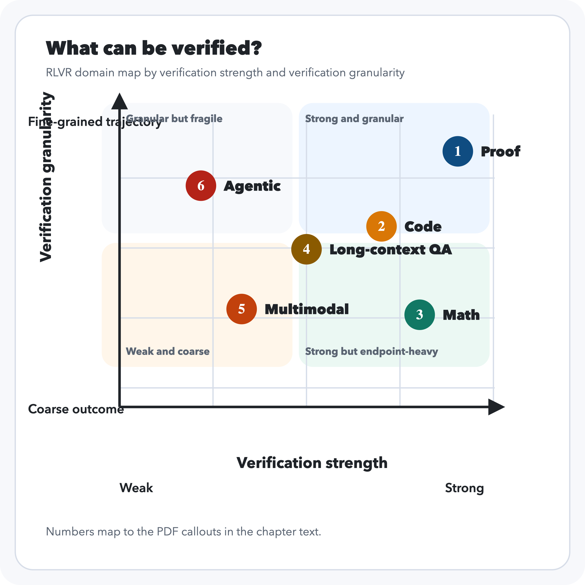

# Introduction

## Chapter Map

- Define RLVR as learning from verifiable reward signals and explain which tasks admit them.
- Explain why RLVR became central to reasoning models and preview the structure of the book.

## What RLVR Is

RLVR is reinforcement learning on tasks where the reward does not need to be guessed from preference comparisons alone because some meaningful part of correctness can be checked directly. Sometimes that check is exact, as in symbolic math or formal proof. Sometimes it is executable, as in code generation with tests. Sometimes it is partial, as in grounded question answering or tool-using agents where only some parts of the trajectory can be reliably scored. The unifying idea is not a specific optimizer. It is the availability of a notion of task success. Once a task can expose useful correctness signals, reinforcement learning can optimize against them, search can exploit them at inference time, and systems can often improve far beyond what static supervised fine-tuning alone would produce.

::: {#fig-verifier-stack}
{.light-content}

{.dark-content}

RLVR is defined by learning from verifiable reward signals; the optimizer can vary.
:::

## Origins of RLVR

In one sense RLVR is the oldest paradigm in reinforcement learning, since it learns from direct reward rather than preference comparison; what is new is its explicit application to language models through verifiers that can check answers, code, proofs, and traces.

I personally reflect back on the advent of reasoning models and reinforcement learning through a strange amnesia of an idea so simple with hindsight, but which took two years after ChatGPT to discover. This assessment, however, is unfair in the sense that the idea to make models think step by step long predates the 2024 reasoning-model wave.[^ch1-step-by-step] The broader prompting paradigm emerged across late 2021 and early 2022: scratchpads for intermediate computation appeared first, chain-of-thought prompting then formalized the use of intermediate reasoning traces, and the exact zero-shot prompt "Let's think step by step" was popularized a few months later.

Before the reasoning-model wave of 2024, code generation had already explored reinforcement learning against executable verifiers: CodeRL (July 5, 2022), PPOCoder (January 31, 2023), and RLTF (July 10, 2023) all trained language models using unit tests or execution feedback as objective reward signals.[^ch1-code-priors]

DeepSeekMath, published on February 5, 2024, was the first major open paper to apply this verifier-driven RL pattern to mathematical reasoning at LLM scale via GRPO.

Things heated up in September 2024, when OpenAI published "Learning to Reason with LLMs", indicating that they had used a train-time and test-time compute strategy to enhance model reasoning through reinforcement learning in math, and coding tasks.[^ch1-openai-o1] The name "Reinforcement Learning with Verifiable Rewards" (RLVR) was coined in the Tulu 3 paper, submitted on November 22, 2024.[^ch1-deepseekmath-rlvr-name] Finally, there was DeepSeek-R1, which demonstrated the full verifier-driven RL formula for bootstrapping reasoning models.[^ch1-deepseek-r1] To quote someone describing the atmosphere at Meta after R1 launched, “Engineers are moving frantically to dissect DeepSeek and copy anything and everything we can from it.” and according to Fortune, there were war rooms assembled to understand how a Chinese lab with substantially less resources was beating them.[^ch1-meta-reaction]

The trend we can extract from this short history is that model improvement increasingly depended on checkable interfaces.

## What Kinds of Tasks Admit Verifiable Rewards
Tasks admit verifiable rewards when they expose an interface that can separate better behavior from worse behavior at acceptable cost. The strongest cases are the familiar ones. Math problems often allow answer checking up to normalization. Code can be run against visible and hidden tests. Formal proof systems can accept or reject proof states under explicit rules. These domains became central not because they exhaust the meaning of reasoning, but because they expose unusually clean signals.

Other tasks are weaker but still useful. Long-context question answering may permit citation checks, evidence matching, or entailment-style grading. Tool-using agents may expose environment transitions, task completion criteria, or execution traces. These signals are often noisier, more expensive, and easier to exploit, but they can still support learning if the reward channel is informative enough.

The practical lesson is that RLVR does not apply uniformly across all tasks. It is strongest where correctness is legible and weakest where the reward channel is sparse, ambiguous, or only loosely coupled to the capability we want.

A useful way to see the space is as a domain map. One axis is verification strength: how cleanly the checker separates better behavior from worse behavior. The other is verification granularity: whether the checked object is a coarse final artifact, a partially grounded intermediate object, or a fine-grained trajectory. The placements in Figure @fig-domain-map are a schematic synthesis of current verifier interfaces rather than a single measured benchmark score.[@shao2024deepseekmath; @liu2023rltf; @xin2024deepseekproverv15; @zhang2024longcite; @lu2023mathvista; @zhou2023webarena; @xie2024osworld]

::: {#fig-domain-map}
::: {.content-visible when-format="html"}
```{=html}
<div class="rlvr-domain-map-widget" data-default-domain="math">
  <div class="rlvr-domain-map-header">
    <div>
      <p class="rlvr-domain-map-kicker">Domain map</p>
      <h4>What can be verified?</h4>
    </div>
    <p class="rlvr-domain-map-hint">Hover, focus, or click a domain to reveal the checked object, main attack surface, and blind spot.</p>
  </div>

  <svg viewBox="0 0 960 580" role="img" aria-labelledby="domain-map-title domain-map-desc">
    <title id="domain-map-title">RLVR domain map by verification strength and verification granularity</title>
    <desc id="domain-map-desc">Six domains are plotted on a two-axis map. Verification strength runs from weak to strong on the horizontal axis. Verification granularity runs from coarse outcome checks to fine-grained trajectory checks on the vertical axis.</desc>

    <defs>
      <linearGradient id="domain-map-bg" x1="0%" y1="0%" x2="100%" y2="100%">
        <stop offset="0%" stop-color="var(--rlvr-domain-bg-1)" />
        <stop offset="100%" stop-color="var(--rlvr-domain-bg-2)" />
      </linearGradient>
    </defs>

    <rect x="80" y="40" width="800" height="420" rx="28" fill="url(#domain-map-bg)" />

    <rect x="130" y="80" width="330" height="170" rx="22" fill="var(--rlvr-domain-quadrant-a)" />
    <rect x="470" y="80" width="330" height="170" rx="22" fill="var(--rlvr-domain-quadrant-b)" />
    <rect x="130" y="260" width="330" height="150" rx="22" fill="var(--rlvr-domain-quadrant-c)" />
    <rect x="470" y="260" width="330" height="150" rx="22" fill="var(--rlvr-domain-quadrant-d)" />

    <g class="rlvr-domain-map-grid" stroke="var(--rlvr-domain-grid)" stroke-width="1.5">
      <line x1="160" y1="410" x2="780" y2="410" />
      <line x1="160" y1="330" x2="780" y2="330" />
      <line x1="160" y1="250" x2="780" y2="250" />
      <line x1="160" y1="170" x2="780" y2="170" />
      <line x1="160" y1="110" x2="160" y2="430" />
      <line x1="315" y1="110" x2="315" y2="430" />
      <line x1="470" y1="110" x2="470" y2="430" />
      <line x1="625" y1="110" x2="625" y2="430" />
      <line x1="780" y1="110" x2="780" y2="430" />
    </g>

    <g class="rlvr-domain-map-axis">
      <line x1="160" y1="430" x2="790" y2="430" />
      <polygon points="790,430 776,423 776,437" fill="var(--rlvr-domain-axis)" />
      <line x1="160" y1="430" x2="160" y2="95" />
      <polygon points="160,95 153,109 167,109" fill="var(--rlvr-domain-axis)" />
    </g>

    <g class="rlvr-domain-map-text rlvr-domain-map-axis-labels">
      <text x="474" y="505">Verification strength</text>
      <text x="160" y="530">Weak</text>
      <text x="730" y="530">Strong</text>
      <text x="38" y="270" transform="rotate(-90 38 270)">Verification granularity</text>
      <text x="22" y="435">Coarse outcome</text>
      <text x="22" y="115">Fine-grained trajectory</text>
    </g>

    <g class="rlvr-domain-map-text rlvr-domain-map-quadrant-labels">
      <text x="166" y="116">Granular but fragile</text>
      <text x="476" y="116">Strong and granular</text>
      <text x="166" y="394">Weak and coarse</text>
      <text x="476" y="394">Strong but endpoint-heavy</text>
    </g>

    <g class="domain-point" data-domain="proof" tabindex="0" role="button" aria-label="Proof">
      <circle class="domain-point-halo" cx="742" cy="148" r="30"></circle>
      <circle class="domain-point-core" cx="742" cy="148" r="18"></circle>
      <text class="domain-point-label" x="765" y="153">Proof</text>
    </g>

    <g class="domain-point" data-domain="agentic" tabindex="0" role="button" aria-label="Agentic settings">
      <circle class="domain-point-halo" cx="278" cy="184" r="30"></circle>
      <circle class="domain-point-core" cx="278" cy="184" r="18"></circle>
      <text class="domain-point-label" x="302" y="189">Agentic</text>
    </g>

    <g class="domain-point" data-domain="code" tabindex="0" role="button" aria-label="Code">
      <circle class="domain-point-halo" cx="638" cy="240" r="30"></circle>
      <circle class="domain-point-core" cx="638" cy="240" r="18"></circle>
      <text class="domain-point-label" x="661" y="245">Code</text>
    </g>

    <g class="domain-point" data-domain="long_context_qa" tabindex="0" role="button" aria-label="Long-context QA">
      <circle class="domain-point-halo" cx="468" cy="262" r="30"></circle>
      <circle class="domain-point-core" cx="468" cy="262" r="18"></circle>
      <text class="domain-point-label" x="492" y="267">Long-context QA</text>
    </g>

    <g class="domain-point" data-domain="multimodal" tabindex="0" role="button" aria-label="Multimodal tasks">
      <circle class="domain-point-halo" cx="356" cy="324" r="30"></circle>
      <circle class="domain-point-core" cx="356" cy="324" r="18"></circle>
      <text class="domain-point-label" x="380" y="329">Multimodal</text>
    </g>

    <g class="domain-point" data-domain="math" tabindex="0" role="button" aria-label="Math">
      <circle class="domain-point-halo" cx="672" cy="342" r="30"></circle>
      <circle class="domain-point-core" cx="672" cy="342" r="18"></circle>
      <text class="domain-point-label" x="695" y="347">Math</text>
    </g>
  </svg>

  <div class="rlvr-domain-map-detail" aria-live="polite">
    <div class="rlvr-domain-map-detail-top">
      <div>
        <p class="rlvr-domain-map-kicker js-domain-tier">Strong verification, coarse granularity</p>
        <h5 class="js-domain-title">Math</h5>
      </div>
      <span class="rlvr-domain-chip js-domain-chip">Normalized answer object</span>
    </div>
    <p class="rlvr-domain-summary js-domain-summary"></p>
    <dl class="rlvr-domain-map-facts">
      <dt>Checked object</dt>
      <dd class="js-domain-checked"></dd>
      <dt>Attack surface</dt>
      <dd class="js-domain-attack"></dd>
      <dt>Blind spot</dt>
      <dd class="js-domain-blind"></dd>
    </dl>
  </div>
</div>

<script>
(() => {
  const domainData = {
    math: {
      tier: "Strong verification, coarse granularity",
      title: "Math",
      chip: "Normalized answer object",
      summary: "Exact symbolic normalization makes math unusually verifier-friendly, but most production rewards still score the endpoint rather than the reasoning path.",
      checked: "A final answer, normalized expression, or equivalence class such as a set, number, boxed value, or symbolic form.",
      attack: "Brittle extraction, formatting hacks, alternate-but-parse-breaking forms, and benchmark leakage.",
      blind: "Whether the reasoning was faithful, reusable, or causally responsible for the final answer."
    },
    code: {
      tier: "Strong verification, medium granularity",
      title: "Code",
      chip: "Executable program behavior",
      summary: "Execution against tests gives sharper feedback than most language tasks, but the verifier only sees behavior on the covered cases and environments.",
      checked: "Program outputs, execution traces, unit-test outcomes, and sometimes compiler/runtime signals.",
      attack: "Overfitting to the visible suite, hard-coded answers, environment quirks, and reward through shallow patches that satisfy narrow tests.",
      blind: "Untested behaviors, reliability under distribution shift, efficiency, security, and maintainability outside the harness."
    },
    proof: {
      tier: "Very strong verification, fine granularity",
      title: "Proof",
      chip: "Formally accepted proof state",
      summary: "Proof assistants offer the cleanest verifier in the map because each step is checked against a formal system rather than a soft proxy.",
      checked: "A theorem statement, a sequence of proof states, and a final proof object accepted by Lean, Coq, or a similar assistant.",
      attack: "Mis-specified theorems, unsafe assumptions, helper-lemma leakage, and search that exploits automation without broader generality.",
      blind: "Informal explanatory value, theorem selection, and whether the proof strategy transfers outside the exact formalization."
    },
    long_context_qa: {
      tier: "Moderate verification, medium granularity",
      title: "Long-context QA",
      chip: "Answer plus evidence alignment",
      summary: "Citation-aware QA makes more of the answer checkable, but support is still partial because evidence presence does not guarantee faithful synthesis.",
      checked: "Sentence-level citations, retrieved spans, support sets, and answer-evidence alignment over long documents.",
      attack: "Citation stuffing, irrelevant but plausible evidence, sentence-boundary mismatch, and answers that borrow support without using it faithfully.",
      blind: "Hidden hallucinations between supported sentences, causal use of evidence, and global consistency across a long answer."
    },
    multimodal: {
      tier: "Mixed verification, coarse-to-medium granularity",
      title: "Multimodal tasks",
      chip: "Answer with partial grounding",
      summary: "Multimodal benchmarks often expose exact answers or structured annotations, but perception ambiguity keeps the checker weaker than in symbolic domains.",
      checked: "A final answer and sometimes auxiliary structure such as boxes, chart values, OCR strings, or grounded references.",
      attack: "Answer priors, shortcut cues, OCR artifacts, annotation ambiguity, and reward on the text output without enough pressure on visual grounding.",
      blind: "Whether the model truly used the visual evidence and whether failures came from perception, grounding, or reasoning."
    },
    agentic: {
      tier: "Weak-to-moderate verification, high granularity",
      title: "Agentic settings",
      chip: "Trajectory and task completion",
      summary: "Agents expose rich trajectories and execution feedback, but the overall success signal is brittle because environments are open-ended and easy to game.",
      checked: "Tool calls, environment transitions, intermediate state changes, and task completion scripts over long horizons.",
      attack: "Reward hacking, simulator exploits, degenerate loops, brittle heuristics, and policies that succeed in the sandbox but not in realistic use.",
      blind: "Side effects, robustness, safety, human acceptability, and transfer from benchmark scripts to real tasks."
    }
  };

  const initDomainMap = (root) => {
    const points = [...root.querySelectorAll(".domain-point")];
    const title = root.querySelector(".js-domain-title");
    const tier = root.querySelector(".js-domain-tier");
    const chip = root.querySelector(".js-domain-chip");
    const summary = root.querySelector(".js-domain-summary");
    const checked = root.querySelector(".js-domain-checked");
    const attack = root.querySelector(".js-domain-attack");
    const blind = root.querySelector(".js-domain-blind");

    const activate = (name) => {
      const payload = domainData[name];
      if (!payload) return;

      points.forEach((point) => {
        point.classList.toggle("is-active", point.dataset.domain === name);
      });

      tier.textContent = payload.tier;
      title.textContent = payload.title;
      chip.textContent = payload.chip;
      summary.textContent = payload.summary;
      checked.textContent = payload.checked;
      attack.textContent = payload.attack;
      blind.textContent = payload.blind;
    };

    points.forEach((point) => {
      const name = point.dataset.domain;
      point.addEventListener("mouseenter", () => activate(name));
      point.addEventListener("focus", () => activate(name));
      point.addEventListener("click", () => activate(name));
      point.addEventListener("keydown", (event) => {
        if (event.key === "Enter" || event.key === " ") {
          event.preventDefault();
          activate(name);
        }
      });
    });

    activate(root.dataset.defaultDomain || "math");
  };

  const boot = () => {
    document.querySelectorAll(".rlvr-domain-map-widget").forEach(initDomainMap);
  };

  if (document.readyState === "loading") {
    document.addEventListener("DOMContentLoaded", boot, { once: true });
  } else {
    boot();
  }
})();
</script>
```
:::

::: {.content-visible when-format="pdf"}


1. **Proof**: checked object is a formally accepted proof state or proof object; main attack surface is theorem mis-specification or automation abuse; main blind spot is informal usefulness and transfer outside the formalization.
2. **Code**: checked object is program behavior under tests; main attack surface is test overfitting or harness exploitation; main blind spot is behavior outside the covered suite.
3. **Math**: checked object is a normalized final answer; main attack surface is parser brittleness and format gaming; main blind spot is faithfulness of the reasoning path.
4. **Long-context QA**: checked object is an answer plus sentence-level evidence alignment; main attack surface is citation stuffing or answer-evidence mismatch; main blind spot is faithful synthesis across the whole answer.
5. **Multimodal tasks**: checked object is a final answer with partial grounding structure; main attack surface is shortcut visual cues and annotation ambiguity; main blind spot is whether the model actually grounded on the image.
6. **Agentic settings**: checked object is a long-horizon trajectory plus task completion status; main attack surface is reward hacking and simulator exploits; main blind spot is robustness, side effects, and real-world transfer.
:::

What can be verified? A schematic domain map of RLVR by verification strength and verification granularity. The axes summarize common verifier interfaces in current practice rather than a single benchmark-derived score.
:::

## Why RLVR Became Central to Reasoning Models

RLVR and reasoning go hand in hand, but they are different. The former is a training paradigm, and the latter is a capability: multi-step breakdown, search, planning, tool use, etc. The marriage between the two occurs because the most successful reasoning domains are exactly the ones with strong verifiers: math, code, proofs, some grounded QA. That combination is rare. It means the same domains that demand search, decomposition, and iterative refinement are also the domains where reinforcement learning has the cleanest chance to work.

This is also why RLVR and reasoning are easy to conflate, and the overlap is large because verifier-friendly domains have been the best places to scale reasoning performance. The result is that some of the most important progress in reasoning models has come from learning against verifiable rewards.

## Verifiable Does Not Mean Complete

Even strong reward signals remain proxies. A math reward may depend on brittle extraction. A code harness may miss behaviors outside the test suite. A proof system may validate a derivation without telling us whether the model's decomposition was insightful or robust. A grounded QA reward may verify some citations without guaranteeing that the answer used evidence faithfully.

That is not a criticism of RLVR so much as a statement of its operating conditions. The important questions are always: what is being checked, what is being missed, how expensive the check is, and how easily the signal can be gamed. Much of the rest of the book is about that gap between a usable reward signal and the fuller competence we actually want.

## What This Book Covers

The next chapters move from the general paradigm to the main reward regimes in practice. Chapters 2 through 4 cover outcome rewards, process rewards, and learned or hybrid verification pipelines. Chapter 5 asks when a check becomes useful learning signal rather than merely a filter. Chapter 6 turns to search and test-time verification, since RLVR in modern systems is inseparable from inference-time compute. Chapters 7 and 8 focus on the main failure modes: reward hacking, proxy misspecification, faithfulness, confidence, and the limits of what verification can certify. Chapters 9 and 10 compare the paradigm across its strongest and most difficult domains. Chapter 11 closes with the open problems.

[^ch1-step-by-step]: A useful compressed lineage runs from scratchpads in late 2021, to chain-of-thought prompting in January 2022, to the exact zero-shot prompt "Let's think step by step" in May 2022 [@nye2021show; @wei2022chain; @kojima2022zeroshot].
[^ch1-code-priors]: CodeRL was submitted on July 5, 2022 and used unit tests and a critic model to guide program synthesis [@le2022coderl]. PPOCoder was submitted on January 31, 2023 and used execution-based feedback with PPO [@shojaee2023ppocoder]. RLTF was submitted on July 10, 2023 and used online unit-test feedback of multiple granularities for code LLMs [@liu2023rltf].
[^ch1-deepseekmath-rlvr-name]: DeepSeekMath introduced GRPO and used RL to improve mathematical reasoning in an open model [@shao2024deepseekmath]. Tulu 3 later introduced the name "Reinforcement Learning with Verifiable Rewards (RLVR)" for this broader training pattern [@lambert2024tulu3].
[^ch1-openai-o1]: OpenAI's writeup states that `o1` performance improved with both more reinforcement learning, which they describe as train-time compute, and more time spent thinking at test time [@openai2024o1].
[^ch1-deepseek-r1]: DeepSeek-R1 argues that reasoning abilities can be incentivized through pure reinforcement learning on verifiable tasks such as mathematics, coding competitions, and STEM fields [@deepseekai2025r1].
[^ch1-meta-reaction]: The quoted line was reported as an anonymous Teamblind post summarized by TMTPOST, while the claim that Meta created four "war rooms" was reported by Fortune, citing The Information [@tmtpost2025deepseek; @quirozgutierrez2025warrooms].

## References

::: {#refs}
:::
