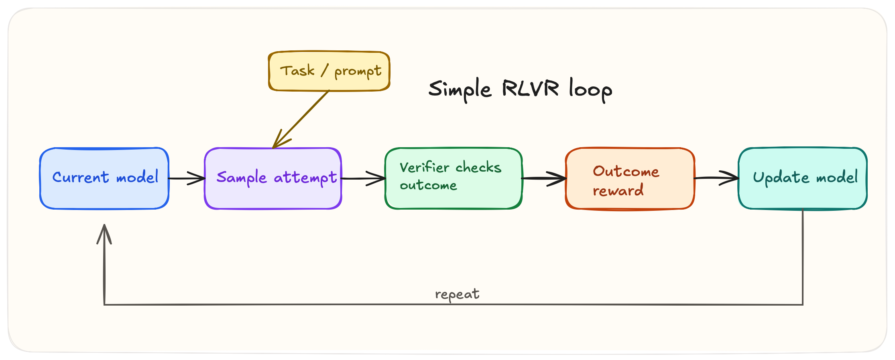
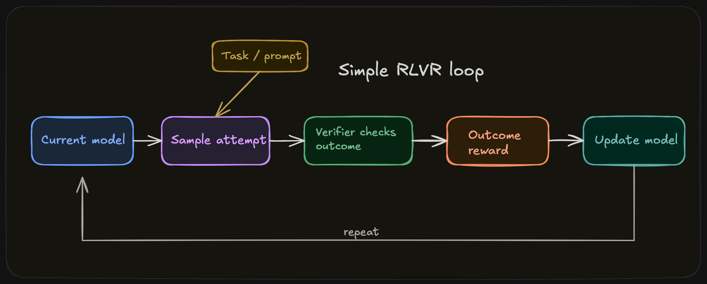

# Introduction

{width="80%" fig-align="center"}

## Chapter Map

- Define RLVR as learning from verifiable reward signals and explain verifiable tasks.
- Analyze why RLVR became central to reasoning models and preview the structure of the book.

## What RLVR Is

RLVR is reinforcement learning on tasks where the reward does not need to be guessed from preference comparisons alone because some meaningful part of correctness can be checked directly. Sometimes that check is exact, as in symbolic math or formal proof. Sometimes it is executable, as in unit tests. It can be partial, i.e. grounded question answering or tool-using agents where only some parts of the trajectory can be reliably scored. The unifying idea is the availability of a success notion. Once a task exposes useful correctness signals, reinforcement learning can optimize against them, search can exploit them at test time, and systems can improve far beyond what static supervised fine-tuning alone produces.

> Terminology note. This book uses *verifier* as the default term for the mechanism that checks output and produces a signal, related terms include *checker*, *scorer*, and sometimes *judge*.

::: {#fig-verifier-stack}

::: {.content-visible when-format="html"}
{.light-content}

{.dark-content}
:::

::: {.content-visible when-format="pdf"}

:::

RLVR is defined by learning from verifiable reward signals; the optimizer can vary.
:::

## Origins of RLVR

In one sense RLVR is the oldest paradigm in reinforcement learning, since it learns from direct reward rather than preference comparison, just like the classic RL environemnts, e.g. cartpole; what is new is the application to LLMs through verifiers that can check answers, code, proofs, and traces.

I personally reflect back on the advent of reasoning models and reinforcement learning through a strange amnesia of an idea so simple with hindsight, but which took two years after ChatGPT to discover. This assessment, however, is unfair in the sense that the idea to make models think step by step long predates the 2024 reasoning-model wave.[^ch1-step-by-step] The broader prompting paradigm emerged across late 2021 and early 2022: scratchpads for intermediate computation appeared first, chain-of-thought prompting then formalized the use of intermediate reasoning traces, and the exact prompt "Let's think step by step" was popularized a few months later.

Before the reasoning-model wave of 2024, code generation had already explored reinforcement learning against executable verifiers: CodeRL (July 5, 2022), PPOCoder (January 31, 2023), and RLTF (July 10, 2023) all trained language models using unit tests or execution feedback as objective reward signals.[^ch1-code-priors]

DeepSeekMath, published on February 5, 2024, was the first major open paper to apply verifier-driven RL to mathematical reasoning at LLM scale via the introduction of GRPO.

Things heated up in September 2024, when OpenAI published "Learning to Reason with LLMs" (o1), indicating that they had used a train-time and test time compute strategy to enhance model reasoning through reinforcement learning in math, and coding tasks.[^ch1-openai-o1] The name "Reinforcement Learning with Verifiable Rewards" (RLVR) was coined in the Tulu 3 paper from November 22, 2024.[^ch1-deepseekmath-rlvr-name] Finally, there was DeepSeek-R1 at the start of 2025, which demonstrated the full verifier-driven RL formula for bootstrapping reasoning models.[^ch1-deepseek-r1] To quote someone describing the atmosphere at Meta after R1 launched, “Engineers are moving frantically to dissect DeepSeek and copy anything and everything we can from it,” and according to Fortune, there were war rooms assembled at Meta to understand how a Chinese lab with substantially less resources was beating them.[^ch1-meta-reaction]

The trend we can extract from this short history is that model improvement increasingly depended on checkable interfaces.

## What Kinds of Tasks Admit Verifiable Rewards
Tasks admit verifiable rewards when there is an interface to separate better behavior from worse behavior at acceptable cost. Math problems allow answer checking up to normalization. Code can be run against visible and hidden tests. Formal proof systems can accept or reject proof states under explicit rules. These domains became central not because they expose unusually clean signals.

Other tasks are weaker but still useful. Long-context question answering may permit citation checks, evidence matching, or entailment-style grading. Tool-using agents have environment transitions, task completion criteria, or execution traces. These signals are often noisier, more expensive, and easier to exploit, but they can still support learning if the reward channel is informative enough.

The takeaway is that there isn't a uniform notion of determining correctness across all conceivable tasks. It is strongest where correctness is legible and weakest where the reward channel is sparse, ambiguous, or only loosely coupled to the capabilities we want.

A useful way to see the space is as a domain map. One axis is verification strength: how cleanly the checker separates better behavior from worse behavior. The other is verification granularity: whether the checked object is a coarse final artifact, a partially grounded intermediate object, or a fine-grained trajectory.[@shao2024deepseekmath; @liu2023rltf; @xin2024deepseekproverv15; @zhang2024longcite; @lu2023mathvista; @zhou2023webarena; @xie2024osworld]

::: {#fig-domain-map}
::: {.content-visible when-format="html"}
```{=html}
<div class="dm">
  <p class="dm-hint">Hover over a domain to see what its verifier checks, where it can be gamed, and what it misses.</p>

  <svg class="dm-svg" viewBox="0 0 700 420" aria-label="RLVR domain map: six domains plotted by verification strength and granularity.">
    <rect class="dm-bg" x="80" y="10" width="590" height="370" rx="6" />

    <g class="dm-grid">
      <line x1="80" y1="103" x2="670" y2="103" />
      <line x1="80" y1="196" x2="670" y2="196" />
      <line x1="80" y1="289" x2="670" y2="289" />
      <line x1="277" y1="10" x2="277" y2="380" />
      <line x1="473" y1="10" x2="473" y2="380" />
    </g>

    <g class="dm-axes">
      <line x1="80" y1="380" x2="670" y2="380" />
      <line x1="80" y1="380" x2="80" y2="10" />
    </g>

    <g class="dm-labels">
      <text x="375" y="410" text-anchor="middle">Verification strength</text>
      <text x="110" y="400">Weak</text>
      <text x="630" y="400">Strong</text>
      <text x="28" y="200" transform="rotate(-90 28 200)">Verification granularity</text>
      <text x="72" y="375" text-anchor="end" class="dm-tick">Coarse</text>
      <text x="72" y="20" text-anchor="end" class="dm-tick">Fine</text>
    </g>

    <g class="dm-point" data-domain="proof" tabindex="0" role="button" aria-label="Proof">
      <circle class="dm-halo" cx="610" cy="55" r="28" />
      <circle class="dm-dot dm-c-proof" cx="610" cy="55" r="14" />
      <text class="dm-name" x="610" y="90" text-anchor="middle">Proof</text>
    </g>
    <g class="dm-point" data-domain="agentic" tabindex="0" role="button" aria-label="Agentic">
      <circle class="dm-halo" cx="210" cy="100" r="28" />
      <circle class="dm-dot dm-c-agentic" cx="210" cy="100" r="14" />
      <text class="dm-name" x="210" y="135" text-anchor="middle">Agentic</text>
    </g>
    <g class="dm-point" data-domain="code" tabindex="0" role="button" aria-label="Code">
      <circle class="dm-halo" cx="540" cy="185" r="28" />
      <circle class="dm-dot dm-c-code" cx="540" cy="185" r="14" />
      <text class="dm-name" x="540" y="220" text-anchor="middle">Code</text>
    </g>
    <g class="dm-point" data-domain="long_context_qa" tabindex="0" role="button" aria-label="Long-context QA">
      <circle class="dm-halo" cx="370" cy="225" r="28" />
      <circle class="dm-dot dm-c-lcqa" cx="370" cy="225" r="14" />
      <text class="dm-name" x="370" y="260" text-anchor="middle">Long-context QA</text>
    </g>
    <g class="dm-point" data-domain="multimodal" tabindex="0" role="button" aria-label="Multimodal">
      <circle class="dm-halo" cx="270" cy="280" r="28" />
      <circle class="dm-dot dm-c-multi" cx="270" cy="280" r="14" />
      <text class="dm-name" x="270" y="315" text-anchor="middle">Multimodal</text>
    </g>
    <g class="dm-point" data-domain="math" tabindex="0" role="button" aria-label="Math">
      <circle class="dm-halo" cx="570" cy="330" r="28" />
      <circle class="dm-dot dm-c-math" cx="570" cy="330" r="14" />
      <text class="dm-name" x="570" y="365" text-anchor="middle">Math</text>
    </g>
  </svg>

  <div class="dm-detail is-empty" aria-live="polite">
    <h5 class="js-dm-title">Hover over a domain</h5>
    <dl class="dm-facts">
      <dt>Summary</dt>         <dd class="dm-summary js-dm-summary">The detail panel updates as you move around the map.</dd>
      <dt>Verifiable</dt>      <dd class="js-dm-verifiable"></dd>
      <dt>Common failure</dt>  <dd class="js-dm-failure"></dd>
      <dt>What it misses</dt>  <dd class="js-dm-misses"></dd>
    </dl>
  </div>
</div>

<script>
(() => {
  const D = {
    math: {
      title: "Math",
      summary: "Strong endpoint check, weak process check.",
      verifiable: "Normalized or equivalent final answer.",
      failure: "Parser brittleness, format hacks, leakage.",
      misses: "Reasoning faithfulness."
    },
    code: {
      title: "Code",
      summary: "Strong on covered behavior, weak off-suite.",
      verifiable: "Outputs, traces, and test results.",
      failure: "Suite overfitting and hard-coded fixes.",
      misses: "Untested behavior, security, efficiency."
    },
    proof: {
      title: "Proof",
      summary: "Kernel-checked steps, not soft proxies.",
      verifiable: "Proof states and final proof object.",
      failure: "Bad theorem specs and automation shortcuts.",
      misses: "Informal insight and transfer."
    },
    long_context_qa: {
      title: "Long-context QA",
      summary: "Evidence can be checked; synthesis usually cannot.",
      verifiable: "Citations, spans, answer-evidence alignment.",
      failure: "Citation stuffing and irrelevant support.",
      misses: "Faithful use of evidence."
    },
    multimodal: {
      title: "Multimodal",
      summary: "Answers are checkable; grounding stays noisy.",
      verifiable: "Answer plus partial grounding signals.",
      failure: "Shortcut cues, OCR noise, label ambiguity.",
      misses: "Whether vision drove the answer."
    },
    agentic: {
      title: "Agentic",
      summary: "Rich traces, brittle success checks.",
      verifiable: "Tool calls, state changes, completion scripts.",
      failure: "Reward hacking and simulator exploits.",
      misses: "Side effects, safety, real-world transfer."
    }
  };

  document.querySelectorAll(".dm").forEach(root => {
    const pts = [...root.querySelectorAll(".dm-point")];
    const detail = root.querySelector(".dm-detail");
    const el = (s) => root.querySelector(s);

    const show = (name) => {
      const d = D[name]; if (!d) return;
      detail.classList.remove("is-empty");
      el(".js-dm-title").textContent = d.title;
      el(".js-dm-summary").textContent = d.summary;
      el(".js-dm-verifiable").textContent = d.verifiable;
      el(".js-dm-failure").textContent = d.failure;
      el(".js-dm-misses").textContent = d.misses;
    };

    const reset = () => {
      detail.classList.add("is-empty");
      el(".js-dm-title").textContent = "Hover over a domain";
      el(".js-dm-summary").textContent = "The detail panel updates as you move around the map.";
      el(".js-dm-verifiable").textContent = "";
      el(".js-dm-failure").textContent = "";
      el(".js-dm-misses").textContent = "";
    };

    pts.forEach(p => {
      const n = p.dataset.domain;
      p.addEventListener("mouseenter", () => show(n));
      p.addEventListener("mouseleave", reset);
      p.addEventListener("focus", () => show(n));
      p.addEventListener("blur", reset);
      p.addEventListener("click", () => show(n));
    });

    reset();
  });
})();
</script>
```
:::

::: {.content-visible when-format="pdf"}
The six domains, from strongest to weakest verification signal: **Proof** (verifiable: formally accepted proof state; common failure: theorem mis-specification; misses: informal usefulness). **Code** (verifiable: execution against tests; common failure: suite overfitting; misses: untested behavior). **Math** (verifiable: normalized final answer; common failure: parser brittleness; misses: reasoning faithfulness). **Long-context QA** (verifiable: answer plus evidence alignment; common failure: citation stuffing; misses: faithful synthesis). **Multimodal** (verifiable: answer with partial grounding; common failure: shortcut cues; misses: visual grounding). **Agentic** (verifiable: trajectory plus task completion; common failure: reward hacking; misses: real-world transfer).
:::

What can be verified? A schematic domain map of RLVR by verification strength and verification granularity.
:::

## Why RLVR Became Central to Reasoning Models

RLVR and reasoning go hand in hand, but they are different. The former is a training paradigm, and the latter is a downstream capability/artefact, e.g. multi-step breakdown, search, planning, tool use, etc. The marriage between the two occurs because the most successful reasoning domains are exactly the ones with strong verifiers: math, code, proofs, some grounded QA. The result is that some of the most important progress in reasoning models has come from learning against verifiable rewards. It's therefore understandble that RLVR and reasoning are conflated, since verifier-friendly domains are the best places to scale reasoning performance. 

## Verifiable Does Not Mean Complete

Even strong reward signals remain proxies, if we reuse our three core domain examples:
1. A code evaluator may miss behaviors outside the test suite.
2. A math reward may depend on brittle extraction. 
3. A proof system may validate a derivation without telling us whether the model's decomposition was insightful or robust.

These examples raise important questions to consider when applying RLVR: what is being checked, what is being missed, how expensive is the check, and how easily the signal can be gamed. We will dissect the gap between a usable reward signal and the outcome we want in the rest of the book. 

## What This Book Covers

The next chapters move from the general paradigm to the main reward regimes in practice. Chapters 2 through 4 cover outcome rewards, process rewards, programmatic, learned and hybrid verification pipelines. Chapter 5 demonstrates turning a verifier into a learning signal. Chapter 6 turns to search and test time verification, since RLVR in modern systems is inseparable from test time compute. Chapters 7 and 8 focus on the main failure modes: reward hacking, proxy misspecification, faithfulness, confidence, and the limits of what verification can certify. Chapter 9 compares the paradigm across its strongest and most difficult domains. Chapter 10 closes with the open problems.

[^ch1-step-by-step]: A useful compressed lineage runs from scratchpads in late 2021, to chain-of-thought prompting in January 2022, to the exact zero-shot prompt "Let's think step by step" in May 2022 [@nye2021show; @wei2022chain; @kojima2022zeroshot].
[^ch1-code-priors]: CodeRL was submitted on July 5, 2022 and used unit tests and a critic model to guide program synthesis [@le2022coderl]. PPOCoder was submitted on January 31, 2023 and used execution-based feedback with PPO [@shojaee2023ppocoder]. RLTF was submitted on July 10, 2023 and used online unit-test feedback of multiple granularities for code LLMs [@liu2023rltf].
[^ch1-deepseekmath-rlvr-name]: DeepSeekMath introduced GRPO and used RL to improve mathematical reasoning in an open model [@shao2024deepseekmath]. Tulu 3 later introduced the name "Reinforcement Learning with Verifiable Rewards (RLVR)" for this broader training pattern [@lambert2024tulu3].
[^ch1-openai-o1]: OpenAI's writeup states that `o1` performance improved with both more reinforcement learning, which they describe as train-time compute, and more time spent thinking at test time [@openai2024o1].
[^ch1-deepseek-r1]: DeepSeek-R1 argues that reasoning abilities can be incentivized through pure reinforcement learning on verifiable tasks such as mathematics, coding competitions, and STEM fields [@deepseekai2025r1].
[^ch1-meta-reaction]: The quoted line was reported as an anonymous Teamblind post summarized by TMTPOST, while the claim that Meta created four "war rooms" was reported by Fortune, citing The Information [@tmtpost2025deepseek; @quirozgutierrez2025warrooms].
