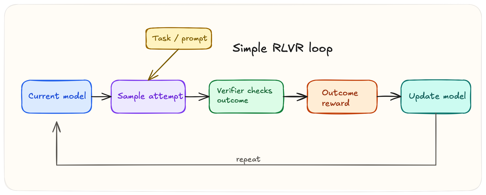
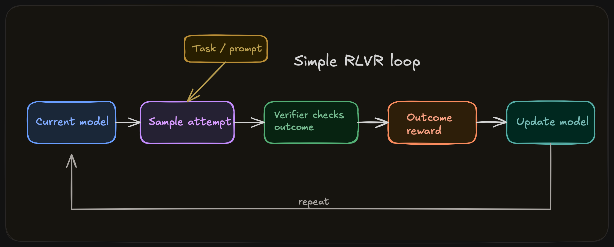

# Foundations

{width="80%" fig-align="center"}

## Chapter map

- Define RLVR as learning from verifiable reward signals and explain verifiable tasks.
- Analyze why RLVR became ubiquitous in reasoning models and preview the structure of the book.

## What RLVR is

RLVR is reinforcement learning on tasks where some meaningful part of correctness can be checked directly. The check you implement can be exact, as in symbolic math or formal proof, or the result of an executable, as in unit tests. It can be partial, i.e. grounded question answering or tool-using agents where only some parts of the trajectory can be reliably scored. The unifying idea is the availability of a success notion, because a task/environment possessing useful correctness signals can be used to improve search at test time, or RL'd against to optimize a model, resulting in systems that improve far beyond what static supervised fine-tuning alone produces.[^ch1-superhuman]

> We use *verifier* as the default term for the mechanism that checks output and produces a signal; related terms include *checker*, *scorer*, and sometimes *judge*.

::: {#fig-verifier-stack}

::: {.content-visible when-format="html"}
{.light-content}

{.dark-content}
:::

::: {.content-visible when-format="pdf"}

:::

RLVR is defined by learning from verifiable reward signals; the optimizer can vary.
:::

## Origins of RLVR

In some sense RLVR is akin to the "OG" reinforcement learning paradigm, since it learns from direct reward rather than preference comparison (the basis of reinforcement learning from human feedback, or RLHF), just like the classic RL environments, e.g. CartPole; what is new is the application to LLMs through verifiers that can check answers, code, proofs, and traces.

I personally reflect back on the advent of reasoning models and reinforcement learning through a strange amnesia of an idea so simple with hindsight, but which took two years after ChatGPT to discover. This assessment, however, is unfair in the sense that the idea to make models think step by step long predates the 2024 reasoning-model wave.[^ch1-step-by-step] The broader prompting paradigm emerged across late 2021 and early 2022: scratchpads for intermediate computation appeared first, chain-of-thought prompting then formalized the use of intermediate reasoning traces, and the exact prompt "Let's think step by step" was popularized a few months later.

Before the reasoning-model wave of 2024, code generation had already explored reinforcement learning against executable verifiers: CodeRL (July 5, 2022), PPOCoder (January 31, 2023), and RLTF (July 10, 2023) all trained language models using unit tests or execution feedback as objective reward signals.[^ch1-code-priors]

Math-Shepherd was a landmark mathematical-reasoning RL paper, using a learned process reward model to train language models with step-by-step PPO [@wang2024mathshepherd]. DeepSeekMath introduced GRPO and was published on February 5, 2024; it stands as the first paper to apply critic-free RL to mathematical reasoning at LLM scale.

Things heated up in September 2024, when OpenAI published *Learning to Reason with LLMs* (o1), indicating that they had used a train-time and test-time compute strategy to enhance model reasoning through reinforcement learning in math and coding tasks.[^ch1-openai-o1] The name "Reinforcement Learning with Verifiable Rewards" (RLVR) was coined in the Tulu 3 paper from November 22, 2024.[^ch1-deepseekmath-rlvr-name] Finally, there was DeepSeek-R1 at the start of 2025, which demonstrated the full verifier-driven RL formula for bootstrapping reasoning models [@deepseekai2025r1]. To quote someone describing the atmosphere at Meta after R1 launched, “Engineers are moving frantically to dissect DeepSeek and copy anything and everything we can from it,” and according to Fortune, there were war rooms assembled at Meta to understand how a Chinese lab with substantially fewer resources was beating them.[^ch1-meta-reaction]

## Verifiable tasks

Verifiable tasks separate better behavior from worse behavior and, to be practical, do so at acceptable cost. Math, code, and formal proof became central to RLVR because the notion of correctness is tractable. For a math problem, one might normalize an answer and compare it with a reference answer, while code and formal proof use programs to verify correctness [@shao2024deepseekmath; @liu2023rltf; @xin2024deepseekproverv15]. MathVista applies answer-based evaluation to mathematical questions about images [@lu2023mathvista].

Long-context question answering can use citation checks, evidence matching, or entailment-style grading[^ch1-entailment] to grade answers [@zhang2024longcite]. Tool-using agents have environment transitions, task completion criteria, or execution traces [@zhou2023webarena; @xie2024osworld].

## RLVR and reasoning

RLVR is a training paradigm, and reasoning is a downstream capability/artefact, e.g. multi-step breakdown, search, planning, tool use, etc. The marriage between the two occurs because the most successful reasoning domains are the ones which leverage strong verifiers. It's therefore understandable that RLVR and reasoning are conflated, since verifier-friendly domains are the best places to scale reasoning performance.

## Verifiable versus Complete

Even verifiers are susceptible to becoming proxies, from our three core domain examples:

1. A code evaluator may miss behaviors outside the test suite.
2. A math reward may depend on brittle extraction. 
3. A proof system may validate a derivation without telling us whether the model's decomposition was insightful or robust.

These examples raise important questions to consider in applying RLVR:

- what is being checked, 
- what is being missed,
- how expensive is the check, and 
- how easily the signal can be gamed.
 
We will dissect the gap between a usable reward signal and the outcome we want in the rest of the book. 

## What we cover

The next chapters move from the general paradigm to the main reward regimes in practice. Chapters 2 through 4 cover outcome rewards, process rewards, programmatic, learned and hybrid verification pipelines. Chapter 5 demonstrates turning a verifier into a learning signal. Chapter 6 turns to search and test-time verification, and Chapter 7 covers reward hacking. Chapter 8 documents the 2026 incidents in which models from four frontier labs reached real systems outside their sandboxes, in large part due to the optimization pressure in scaling RLVR. Chapters 9-11 discuss real frontier RLVR recipes, agents, RL environments, and open problems.

[^ch1-superhuman]: Whereas supervised fine-tuning is bottlenecked by the quality of its training data, an RLVR environment that is robust and difficult in interesting ways can support superhuman performance on well-specified tasks, which is an important paradigm shift.
[^ch1-step-by-step]: A useful compressed lineage runs from scratchpads in late 2021, to chain-of-thought prompting in January 2022, to the exact zero-shot prompt "Let's think step by step" in May 2022 [@nye2021show; @wei2022chain; @kojima2022zeroshot].
[^ch1-code-priors]: CodeRL was submitted on July 5, 2022 and used unit tests and a critic model to guide program synthesis [@le2022coderl]. PPOCoder was submitted on January 31, 2023 and used execution-based feedback with PPO [@shojaee2023ppocoder]. RLTF was submitted on July 10, 2023 and used online unit-test feedback of multiple granularities for code LLMs [@liu2023rltf].
[^ch1-deepseekmath-rlvr-name]: DeepSeekMath introduced GRPO and used RL to improve mathematical reasoning in an open model [@shao2024deepseekmath]. Tulu 3 later introduced the name "Reinforcement Learning with Verifiable Rewards (RLVR)" for this broader training pattern [@lambert2024tulu3].
[^ch1-openai-o1]: OpenAI's writeup states that `o1` performance improved with both more reinforcement learning, which they describe as train-time compute, and more time spent thinking at test time [@openai2024o1].
[^ch1-meta-reaction]: The quoted line was reported as an anonymous Teamblind post summarized by TMTPOST, while the claim that Meta created four "war rooms" was reported by Fortune, citing The Information [@tmtpost2025deepseek; @quirozgutierrez2025warrooms].
[^ch1-entailment]: In natural-language inference, entailment means that a hypothesis follows from a premise. Here, entailment-style grading asks whether a model's answer is supported by a reference answer or its cited evidence.
