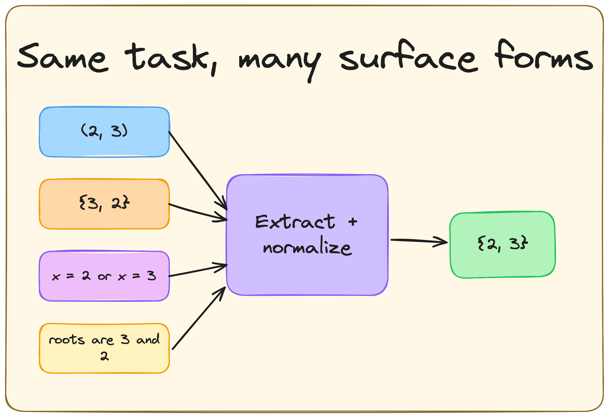
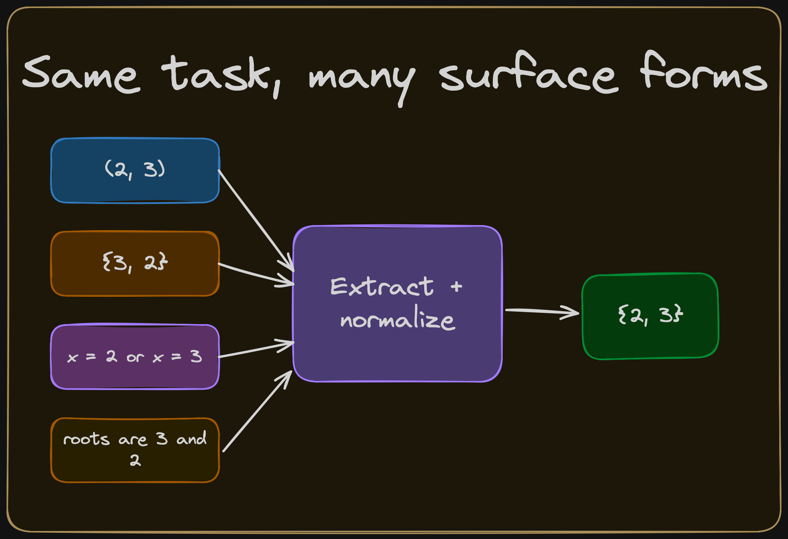

# Outcome Rewards

{width="80%" fig-align="center"}

## Chapter Map

- Explain how strong outcome verifiers are built.
- Show why answer extraction, canonicalization, and hidden brittleness matter.

## A Rollout

A rollout is a sample from the current policy on a prompt: the model receives an input, generates a completion or trajectory, and that sampled output is what the verifier scores.

**Prompt**

Solve the equation: $x^2-5x+6=0$.

**Completion**

```text
<think>
We can factor the quadratic: x^2 - 5x + 6 = (x-2)(x-3).
Set each factor to zero:
x - 2 = 0 -> x = 2
x - 3 = 0 -> x = 3
The final answer is the ordered tuple (2,3).
</think>

<answer>
(2,3)
</answer>
```

**Outcome reward check (for RLVR).**

The verifier reads the checked artifact from `<answer>...</answer>`, normalizes to standard form (canonicalizes) the task's answer representation, and checks it against the ground-truth set.[^ch2-deepseek-r1-template]

$$
r(x,y)=
\begin{cases}
1 & \text{if } \operatorname{canon}\!\bigl(\operatorname{extract}_{\mathrm{ans}}(y)\bigr)=\{2,3\},\\
0 & \text{otherwise.}
\end{cases}
$$ {#eq-ch2-binary-check}

If the model fails the output contract (for example, omits `<answer>...</answer>`, changes surface form in a way the canonicalizer does not handle, or adds extraneous text that breaks parsing), the verifier can assign an incorrect reward even when the underlying solution is algebraically correct.

## How outcome verifiers are implemented

A useful abstraction of outcome-verification pipelines is in three steps:

1. **Extract.** Parse the model's raw text to isolate the checked artifact. This depends on the output contract: the `<answer>` tags in our scaffold, `\boxed{}` in many math benchmarks, the final code block in a generation task, or the proof term in a formal system.

2. **Canonicalize.** Map the extracted artifact to a representation that is stable under harmless surface variation. In math this can mean parsing `(2,3)`, `{3,2}`, and `x=2, x=3` into the same set object.

3. **Reward.** Assign a reward value. The simplest version is binary: 1 if correct, 0 otherwise. Partial credit for passing some but not all tests, or a continuous score from a symbolic similarity metric are possible too.

Current RLVR libraries do not have an agreed upon `extract -> canonicalize -> reward` interface. In practice, one usually writes or selects a task-specific reward function: in Transformer Reinforcement Learning (TRL), a `reward_func`; in veRL (Volcano Engine Reinforcement Learning for LLMs), a scoring function or reward manager.[@vonwerra2020trl; @sheng2024hybridflow] For math-style tasks, those reward functions often delegate most of the work to answer-verification libraries such as Math-Verify, whose documented grading architecture is explicit: answer extraction, conversion to a common representation, and gold comparison.[@kydlicek2025mathverify]

A useful abstraction of what these implementations do is:

$$
\begin{aligned}
a(y) &= \operatorname{extract}(y),\\
\tilde{a}(y) &= \operatorname{canon}\!\bigl(a(y)\bigr),\\
r(x,y) &= \operatorname{reward}\!\bigl(\tilde{a}(y), g(x)\bigr),
\end{aligned}
$$ {#eq-ch2-pipeline}

## A minimal outcome verifier

A toy math verifier for the quadratic example looks like this:

```python
import re

ANSWER_RE = re.compile(r"<answer>\s*(.*?)\s*</answer>", re.DOTALL)

def extract_answer(completion: str) -> str | None:
    match = ANSWER_RE.search(completion)
    return None if match is None else match.group(1).strip()

def canonicalize_answer(answer: str) -> tuple[str, ...]:
    text = answer.strip()
    for ch in "{}()":
        text = text.replace(ch, "")
    pieces = []
    for raw in text.split(","):
        piece = raw.strip().replace("x =", "").replace("x=", "")
        if piece:
            pieces.append(piece)
    return tuple(sorted(pieces))

def outcome_reward(completion: str, gold: tuple[str, ...] = ("2", "3")) -> float:
    answer = extract_answer(completion)
    if answer is None:
        return 0.0
    candidate = canonicalize_answer(answer)
    return float(candidate == gold)
```

::: {#fig-answer-normalization}

::: {.content-visible when-format="html"}
{.light-content}

{.dark-content}
:::

::: {.content-visible when-format="pdf"}

:::

If canonicalization fails, algebraically correct answers can receive the wrong reward. The practical work is to parse the answer region, strip surface variation, and canonicalize set structure or ordering before verification.
:::

Where the engineering difficulty concentrates is strongly domain-dependent. In math-style RLVR, verifier design often hinges on answer-format contracts and canonicalization for deterministic parsing; in code, correctness depends heavily on the quality and coverage of the test suite; in formal proof, the core acceptance check is delegated to the proof assistant.[^ch2-domain-bottlenecks]

## Outcome check, full-trajectory update

Although verifiers only consider the outcome, the optimizer updates the entire trajectory. In REINFORCE-style algorithms (including GRPO), the scalar reward (or an advantage dervied from it) from the outcome check is used to upweight or downweight the log-probability of every token in the completion. If the answer is correct, the whole chain of reasoning that produced it becomes more likely. The converse is also true.

To quote Andrej Karpathy on his October 17, 2025 appearance on the Dwarkesh podcast [@patel2025karpathyagi]:

> Every single one of those incorrect things you did, as long as you got to the correct solution, will be up-weighted as do more of this. It's terrible. It's noise. You've done all this work only to find a single, at the end, you get a single number of like, oh, you did correct. And based on that, you weigh that entire trajectory as like up-weight or down-weight. And so the way I like to put it is you're sucking supervision through a straw because you've done all this work that could be a minute to roll out. And you're like sucking the bits of supervision of the final reward signal through a straw. And you're like putting it, you're like basically like, yeah, you're broadcasting that across the entire trajectory and using that to up or down with that trajectory. It's crazy. A human would never do this. Number one, a human would never do hundreds of roll outs. Right. Number two, when a person sort of finds a solution, they will have a pretty complicated process of review of like, okay, I think these parts that I did well, these parts I did not do that well. I should probably do this or that. And they think through things. There's nothing in current LLMs that does this. There's no equivalent of it. But I do see papers popping out that are trying to do this because it's obvious to everyone in the field.

This is the blunt instrument at the heart of outcome-based RLVR. The verifier has no opinion on individual tokens in the reasoning trace, it assigns one scalar per completion. The optimizer then spreads that number across all token-level decisions. This works surprisingly well in practice, because over many rollouts and many problems, tokens that consistently appear in correct trajectories get reinforced and tokens that appear in incorrect trajectories get suppressed. But it also means that outcome rewards cannot isolate a specific reasoning step as good or bad. That distinction is exactly what process rewards (Chapter 3) provide.

::: {#fig-ch2-outcome-full-trajectory-update fig-cap="Outcome verification checks only the extracted endpoint, but the update is applied across the entire sampled trajectory."}

::: {.content-visible when-format="html"}

```{=html}
<div class="ds-widget" id="ds-widget">
  <div class="ds-head">
    <p class="ds-hint">Each slot is one sampled token group. The verifier checks only the final slot, but the policy update moves the sampled option in every slot.</p>

    <div class="ds-controls">
      <div class="ds-tabs" role="tablist" aria-label="Outcome update examples">
        <button class="ds-tab ds-active" role="tab" aria-selected="true" data-mode="success">Success</button>
        <button class="ds-tab" role="tab" aria-selected="false" data-mode="failure">Failure</button>
      </div>
      <div class="ds-reward-badge" id="ds-reward-badge" aria-live="polite"></div>
    </div>
  </div>

  <div class="ds-chain" id="ds-chain"></div>

  <div class="ds-legend">
    <span class="ds-legend-item"><span class="ds-swatch ds-swatch-sampled"></span> sampled option</span>
    <span class="ds-legend-item"><span class="ds-swatch ds-swatch-other"></span> unsampled options</span>
  </div>

  <div class="ds-summary" id="ds-summary" aria-live="polite"></div>
</div>

<script>
(() => {
  const states = {
    success: {
      rewardText: "Reward = 1",
      rewardClass: "ds-reward-success",
      direction: "up",
      summary: "The sampled option in every token group is pushed up together.",
      slots: [
        { title: "1. factor", sampled: "(x-2)(x-3)", sampledIndex: 3, probs: [0.12, 0.10, 0.15, 0.63] },
        { title: "2. first root", sampled: "x = 2", sampledIndex: 0, probs: [0.61, 0.12, 0.14, 0.13] },
        { title: "3. second root", sampled: "x = 3", sampledIndex: 2, probs: [0.14, 0.11, 0.60, 0.15] },
        { title: "4. collect", sampled: "{2,3}", sampledIndex: 1, probs: [0.16, 0.58, 0.11, 0.15] },
        { title: "5. answer", sampled: "<answer>{2,3}</answer>", sampledIndex: 0, probs: [0.63, 0.12, 0.13, 0.12], checked: true }
      ]
    },
    failure: {
      rewardText: "Reward = 0",
      rewardClass: "ds-reward-failure",
      direction: "down",
      summary: "The sampled option in every token group is pushed down together, including earlier groups that may have been locally good.",
      slots: [
        { title: "1. factor", sampled: "(x-2)(x-3)", sampledIndex: 3, probs: [0.18, 0.17, 0.21, 0.44] },
        { title: "2. first root", sampled: "x = 2", sampledIndex: 0, probs: [0.41, 0.19, 0.21, 0.19] },
        { title: "3. second root", sampled: "x = 3", sampledIndex: 2, probs: [0.20, 0.18, 0.41, 0.21] },
        { title: "4. collect", sampled: "{2,3}", sampledIndex: 1, probs: [0.19, 0.45, 0.17, 0.19] },
        { title: "5. answer", sampled: "<answer>x = 2</answer>", sampledIndex: 1, probs: [0.19, 0.45, 0.18, 0.18], checked: true }
      ]
    }
  };

  const chain = document.getElementById("ds-chain");
  const slotEls = [];

  states.success.slots.forEach(() => {
    const slot = document.createElement("div");
    slot.className = "ds-slot";

    const title = document.createElement("div");
    title.className = "ds-slot-title";

    const chart = document.createElement("div");
    chart.className = "ds-chart";

    const checkLabel = document.createElement("div");
    checkLabel.className = "ds-check-label";
    checkLabel.textContent = "Verifier";
    chart.appendChild(checkLabel);

    const barsWrap = document.createElement("div");
    barsWrap.className = "ds-bars";
    const bars = [];
    for (let i = 0; i < 4; i += 1) {
      const bar = document.createElement("div");
      bar.className = "ds-bar";
      barsWrap.appendChild(bar);
      bars.push(bar);
    }
    chart.appendChild(barsWrap);

    const sampledRow = document.createElement("div");
    sampledRow.className = "ds-sampled-row";

    const arrow = document.createElement("div");
    arrow.className = "ds-update-arrow";

    const sampledLabel = document.createElement("div");
    sampledLabel.className = "ds-sampled-label";

    sampledRow.appendChild(arrow);
    sampledRow.appendChild(sampledLabel);

    const note = document.createElement("div");
    note.className = "ds-slot-note";

    slot.appendChild(title);
    slot.appendChild(chart);
    slot.appendChild(sampledRow);
    slot.appendChild(note);
    chain.appendChild(slot);

    slotEls.push({ slot, title, bars, sampledLabel, arrow, note, checkLabel });
  });

  function render(mode) {
    const state = states[mode];
    slotEls.forEach((slotEl, idx) => {
      const slot = state.slots[idx];
      slotEl.title.textContent = slot.title;
      slotEl.sampledLabel.textContent = slot.sampled;
      slotEl.arrow.textContent = state.direction === "up" ? "↑" : "↓";
      slotEl.arrow.className = "ds-update-arrow " + (state.direction === "up" ? "ds-update-up" : "ds-update-down");
      slotEl.note.textContent = slot.checked ? "checked by verifier" : "updated, not checked directly";
      slotEl.slot.classList.toggle("ds-checked", Boolean(slot.checked));
      slotEl.checkLabel.style.display = slot.checked ? "inline-flex" : "none";

      slotEl.bars.forEach((bar, barIdx) => {
        bar.style.height = `${slot.probs[barIdx] * 100}%`;
        bar.classList.toggle("is-sampled", barIdx === slot.sampledIndex);
        bar.style.opacity = barIdx === slot.sampledIndex ? "1" : "0.72";
        bar.style.transform = barIdx === slot.sampledIndex ? "translateY(-1px)" : "none";
      });
    });

    const badge = document.getElementById("ds-reward-badge");
    badge.textContent = state.rewardText;
    badge.className = "ds-reward-badge " + state.rewardClass;

    document.getElementById("ds-summary").innerHTML = state.summary;

    document.querySelectorAll(".ds-tab").forEach((button) => {
      const active = button.dataset.mode === mode;
      button.classList.toggle("ds-active", active);
      button.setAttribute("aria-selected", active ? "true" : "false");
    });
  }

  document.querySelectorAll(".ds-tab").forEach((button) => {
    button.addEventListener("click", () => render(button.dataset.mode));
  });

  render("success");
})();
</script>
```
:::

::: {.content-visible when-format="pdf"}

```text
Successful trajectory
factor as (x-2)(x-3)
  -> set x = 2
  -> set x = 3
  -> collect {2,3}
  -> <answer>{2,3}</answer>
checked artifact: PASS
update over sampled token groups:  ↑  ↑  ↑  ↑  ↑

Unsuccessful trajectory
factor as (x-2)(x-3)
  -> set x = 2
  -> set x = 3
  -> collect {2,3}
  -> <answer>x = 2</answer>
checked artifact: FAIL
update over sampled token groups:  ↓  ↓  ↓  ↓  ↓
```
:::

:::

## Domain specific considerations

The verifier structure in @eq-ch2-pipeline is the same across the main RLVR domains. Let's discuss the domain-dependent difficulties:

| Domain | Checked object | Typical verifier | Main bottleneck |
|---|---|---|---|
| Math | Final answer or structured mathematical object | Answer extraction, canonicalization, symbolic equivalence, or reference comparison [@shao2024deepseekmath; @deepseekai2025r1] | Output contracts and normalization |
| Code | Program, patch, or execution result | Sandboxed tests, hidden tests, timeouts, and optional static checks [@le2022coderl; @shojaee2023ppocoder; @liu2023rltf] | Test coverage and flaky infrastructure |
| Formal proof | Proof term, tactic trace, or proof state | Proof-assistant kernel acceptance [@xin2024deepseekprover; @xin2024deepseekproverv15] | Search, decomposition, and formalization burden |

In math, `(2,3)`, `{3,2}`, and `x \in \{2,3\}` should receive the same reward when the task asks for the solution set. In code, limited suites can certify incorrect programs and richer suites can change model rankings substantially.[@liu2023evalplus] In formal proof, final acceptance is strong, but the difficulty shifts toward theorem selection, search, decomposition, and interaction with the formal environment.

## Brittleness

Despite their simplicity, outcome rewards still have failure modes:

- An extractor can reward obedience to formatting conventions more than correctness.
- A canonicalizer can fail to merge equivalent answers or merge distinct answers into one canonical form.
- A verifier can evaluate the wrong capability because the benchmark itself admits shortcuts.
- If the reward is non-binary, the model can optimize partial credit in ways that do not track the underlying task.
  - In code, that can mean passing easy visible tests while failing edge cases.

## Open questions

- When is binary scoring enough, and when does graded outcome feedback improve learning enough to justify the extra exploit surface it creates?
- How should hidden tests and evaluation setups be designed so that repeated training does not simply overfit to a static benchmark?
- Which output contracts and normalization schemes remain stable across model families, prompting styles, and generations of post-trained models?
- When should equivalence be defined syntactically for reproducibility, and when is semantic comparison worth the added complexity?

[^ch2-deepseek-r1-template]: DeepSeek-R1 uses `<think>`/`<answer>` separators and applies task-specific response-shape constraints for reward parsing, including boxed final outputs when useful for deterministic math verification.[@deepseekai2025r1]
[^ch2-domain-bottlenecks]: This point is best supported domain by domain rather than as a single universal statistic. DeepSeek-R1 uses task-specific output-shape constraints for deterministic reward parsing in math-style reasoning tasks [@deepseekai2025r1]. EvalPlus shows that limited test suites can miss substantial amounts of incorrect code and even mis-rank models, making test quality and coverage central to code verification [@liu2023evalplus]. For formal theorem proving, DeepSeek-Prover describes proof assistants such as Lean as providing high-accuracy, reliable proof verification, which shifts the engineering difficulty away from the final acceptance check itself [@xin2024deepseekprover].
