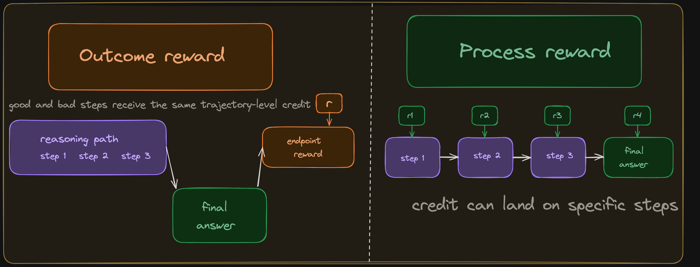

# Process Rewards

{width="80%" fig-align="center"}

## Chapter Map

- Explain when intermediate verification improves credit assignment.
- Show that process rewards improve credit assignment only by introducing a new proxy: step labels that can be expensive, noisy, or misspecified.

## The credit assignment problem

Chapter 2 elucidated that the optimizer spreads a single scalar across every token in a trajectory; the verifier has no opinion about which steps helped. Let's consider two ways the quadratic example from Chapter 2 can blur credit assignment:

| Step | Reasoning | Label |
|:-----|:----------|:-----:|
| 1 | Recognize the quadratic and decide to factor: $x^2 - 5x + 6 = (x-2)(x-3)$ | $\checkmark$ |
| 2 | Set first factor to zero: $x - 2 = 0 \implies x = 2$ | $\checkmark$ |
| 3 | Set second factor to zero: $x - 3 = 0 \implies x = 3$ | $\checkmark$ |
| 4 | Collect the full solution set: $\{2, 3\}$ | $\checkmark$ |
| 5 | Report the final artifact as `<answer>x = 2</answer>` | $\times$ |

: A trajectory whose internal reasoning is correct but whose final reported artifact is incomplete. A process reward can still preserve positive signal on the earlier correct steps. {#tbl-ch3-correct-rollout}

| Step | Reasoning | Label |
|:-----|:----------|:-----:|
| 1 | Recognize the quadratic and attempt to factor: $x^2 - 5x + 6 = (x-1)(x-6)$ | $\times$ |
| 2 | Expand to check: $(x-1)(x-6) = x^2 - 7x + 6$, so this branch cannot be right | $\checkmark$ |
| 3 | Restart and correctly factor as $(x-2)(x-3)$ | $\checkmark$ |
| 4 | Solve to get $\{2, 3\}$ | $\checkmark$ |

: A trajectory where step 1 is incorrect but the model explicitly detects the mismatch and recovers. A process reward labels the initial factoring move as wrong while preserving positive signal for the diagnostic and recovery steps. {#tbl-ch3-flawed-rollout}

Both scenarios compress distinct kinds of signal. The second is a false negative: correct reasoning is suppressed because the final reported answer is incomplete. The first contains exactly the kind of self-correction we may want the model to learn. However, outcome reward still reinforces the failed factoring attempt and the successful recovery together, even though they should not receive the same effective update. This is one of the main motivations for process supervision. Uesato et al. found that process-based feedback produced substantially cleaner reasoning traces than outcome-based feedback even when final-answer accuracy was similar, and Lightman et al. later showed that process reward models outperform outcome-only reward models on harder math reasoning tasks.[@uesato2022solving; @lightman2023letsverify]

Instead of scoring only the final artifact, a process reward assigns a label or score to each intermediate step. The hope is that denser feedback gives the optimizer better information about which parts of a trajectory to reinforce and which to suppress. To this end the intermediate steps must be in a form the verifier can read, and the notion of a "correct step" must carry enough fidelity to be useful.

## What a process reward model computes

An outcome reward model (ORM) is a function of the complete trajectory:

$$
\text{ORM}(x, y)
$$ {#eq-ch3-orm}

A process reward model (PRM) is defined at the level of steps. Given a prompt $x$ and a stepwise solution with segments $s_1,\dots,s_K$, a PRM outputs a score for each step boundary:

$$
\text{PRM}(s_t \mid x, s_{<t})
$$ {#eq-ch3-prm}

The steps can be as granular as tokens; this chapter focuses on the step-level formulation, since the main PRM setups discussed here supervise explicit intermediate steps rather than every token. Lightman et al. formalize PRM training as step-level classification with labels such as positive, negative, and neutral.[@lightman2023letsverify] When used to train a policy, these scores tell the system where the reasoning went right and wrong. The optimizer no longer has to guess which parts of a rewarded trajectory were actually responsible for the reward.

## How step labels are obtained

The next question is where these step-level signals come from, and there are four regimes.

### Human annotation

Lightman et al. collected PRM800K: approximately 800,000 step-level human labels on model-generated math solutions.[@lightman2023letsverify] Annotators judged each step as positive (mathematically valid), negative (contains an error), or neutral (ambiguous or uncheckable). PRM800K was feasible for competition-math-level problems where each solution has 5–15 steps. For longer trajectories (agentic tasks with hundreds of steps) or faster-moving domains (code with evolving APIs), human annotation does not scale.

### Monte Carlo rollout estimation

Wang et al. introduced an automated alternative in Math-Shepherd.[@wang2024mathshepherd] The idea: to estimate whether step $t$ is correct, complete the trajectory from step $t$ many times (using the model itself) and measure what fraction of completions reach the correct final answer. If most completions from step $t$ succeed, the step is probably correct. If most fail, the step probably introduced an error.

$$
\hat{P}(\text{step } t \text{ correct}) \approx \frac{1}{K} \sum_{k=1}^{K} \mathbb{I}\bigl[\text{rollout}_k(y_{1:t}) \text{ reaches correct answer}\bigr]
$$ {#eq-ch3-mc-estimate}

This is elegant because it only requires an outcome verifier and the ability to generate completions. But a step can be labeled "correct" because the model is good at recovering from errors downstream, or "incorrect" because the remaining steps are hard even from a correct intermediate state. The signal reflects the model's completion ability as much as the step's logical validity.

```python
def estimate_step_value(model, prefix_steps, gold_answer, K) -> float:
    successes = 0
    for _ in range(K):
        completion = model.complete_from(prefix_steps)
        if outcome_reward(completion, gold_answer) == 1.0:
            successes += 1
    return successes / K
```

rollout-estimated process supervision sits between outcome and process reward. The final check is still outcome-based; what changes is that the outcome verifier is applied to many continuations from a partial solution rather than once at the end of a complete trajectory.

### Outcome-propagated pseudo-labels

Sun et al. study this regime directly in FreePRM: start from trajectory-level outcome labels, propagate them to the steps inside the trajectory, and then debias the resulting pseudo-labels under a weak-supervision framework.[@sun2025freeprm]

### Formal step checking

In proof assistants such as Lean and Coq, each step is checked by the kernel. This is purest process verification possible, and it costs nothing beyond the kernel call.[@xin2024deepseekproverv15] Of course, formal step checking only works when the reasoning is expressed in a formal language with a validity criterion per step.

| Method | Label quality | Cost per step | Domain scope |
|:-------|:-------------|:-------------|:------------|
| Human annotation | High | High | Any domain humans can judge |
| MC rollout estimation | Medium | Medium | Any domain with an outcome verifier |
| Outcome-propagated pseudo-labels | Low to medium | Low | Any domain with trajectory-level correctness labels |
| Formal step checking | Exact | Near zero | Formal systems only |

: Method trade-offs in process verification. {#tbl-ch3-annotation-tradeoff}

## ORM vs PRM

When comparing these paradigms, we should be asking whether the granular information from process rewards translates into measurably better models, given the cost of obtaining step-level labels.

::: {#fig-ch3-process-vs-outcome-orm-vs-prm}

::: {.content-visible when-format="html"}
{.light-content}

{.dark-content}
:::

::: {.content-visible when-format="pdf"}

:::

The question is whether extra granularity improves learning enough to justify its cost.
:::

Uesato et al. published the first systematic comparison in November 2022.[@uesato2022solving] Their finding was surprising: outcome-based and process-based feedback achieved similar final-answer accuracy on GSM8K. But process supervision dramatically reduced trace-level errors — from 14.0% to 3.4%. In other words, both methods got the right answer at similar rates, but the process-supervised model was far more likely to get the right answer for the right reasons. Although capabilities are the same, this distinction matters for robustness, interpretability, and downstream trust.

## Limitations

Process verification adressess the sparse credit assignment through steps which, in turn, can be gamed, misspecified, or noisy.

**Rewarding reasoning shape over reasoning substance.** A PRM trained on labeled "good steps" can learn what correct reasoning looks like in its training distribution rather than what actually makes a solution correct. Not all good reasoning follows the annotated step structure. A model that skips two intermediate steps because it recognizes a pattern is penalized by a strict process reward that expects those steps to be present.

**Annotation noise compounds.** MC rollout estimates are noisy: a step can look "correct" because the model is good at recovering later, or "incorrect" because the remaining steps are hard even from a valid state. Human annotators also disagree, especially on steps that are mathematically sound but poorly justified. A model trained on noisy step labels can learn to exploit that noise rather than improve the underlying reasoning.

**PRM ambiguitity.** Yuan et al. show that an ORM trained with a log-likelihood-ratio parameterization contains an implicit PRM that can be extracted without step-level labels, and that this implicit PRM outperforms Math-Shepherd with far less data.[@yuan2024free] Sullivan and Koller go further, proving that GRPO with an ORM is mathematically equivalent to a PRM-aware RL objective with an implicit Monte Carlo PRM.[@sullivan2025grpo]

The boundary between outcome and process verification is blurrier than the early literature suggested. Outcome rewards already contain some implicit step-level signal; process rewards add new proxies and new annotation problems. When neither regime is sufficient on its own, the next move is to combine them, learn the verifier itself, or build layered verification stacks. That is the subject of Chapter 4.

## Open questions

- Which tasks admit stable step-level labels without excessive annotation overhead, and how can we identify them before investing in annotation infrastructure?
- How do process rewards interact with hidden reasoning or compressed internal computation that the model does not externalize?
- When should process checks be strict (hard correctness labels that gate the reward) versus advisory (soft preferences that nudge the policy)?
- Given the implicit-PRM results, when is explicit process supervision worth the marginal cost over well-designed outcome supervision with sufficient rollout diversity?
- Can process rewards be designed to reward strategic value rather than only logical validity, and what would the labeling scheme look like?
