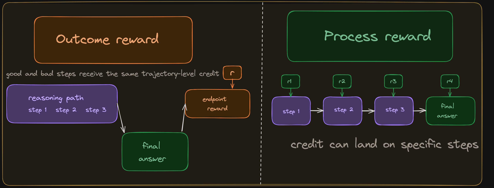

# Process Rewards

{width="80%" fig-align="center"}

## Chapter Map

- Explain when intermediate verification improves credit assignment.
- Show that process rewards improve credit assignment but step labels can be expensive, noisy, or misspecified.

## The credit assignment problem

Chapter 2 elucidated that outcome-based RLVR means the optimizer spreads one scalar across every token in a trajectory; let's consider two ways the quadratic example from Chapter 2 can blur credit assignment:

| Step | Reasoning | Local validity |
|:-----|:----------|:--------------:|
| 1 | Recognize the quadratic and decide to factor: $x^2 - 5x + 6 = (x-2)(x-3)$ | $\checkmark$ |
| 2 | Set first factor to zero: $x - 2 = 0 \implies x = 2$ | $\checkmark$ |
| 3 | Set second factor to zero: $x - 3 = 0 \implies x = 3$ | $\checkmark$ |
| 4 | Collect the full solution set: $\{2, 3\}$ | $\checkmark$ |
| 5 | Report the final artifact as `<answer>x = 2</answer>` | $\times$ |

: A trajectory whose internal reasoning is correct but whose final reported artifact is incomplete. {#tbl-ch3-correct-rollout}

| Step | Reasoning | Local validity |
|:-----|:----------|:--------------:|
| 1 | Recognize the quadratic and attempt to factor: $x^2 - 5x + 6 = (x-1)(x-6)$ | $\times$ |
| 2 | Expand to check: $(x-1)(x-6) = x^2 - 7x + 6$, so this branch cannot be right | $\checkmark$ |
| 3 | Restart and correctly factor as $(x-2)(x-3)$ | $\checkmark$ |
| 4 | Solve to get $\{2, 3\}$ | $\checkmark$ |

: A trajectory where step 1 is incorrect but the model explicitly detects the mismatch and recovers. {#tbl-ch3-flawed-rollout}

In both scenarios, the outcome score correctly evaluates the final artifact but does not identify which intermediate steps were useful or harmful. The latter contains exactly the kind of self-correction we want the model to learn; however, outcome reward still reinforces the failed factoring attempt and the successful recovery together, even though, intuitively, they should not receive the same effective update.

Instead of scoring only the final artifact, a process reward assigns a label or score to each intermediate step. The hope is that denser feedback gives the optimizer better information about which parts of a trajectory to reinforce and which to suppress. To this end, the intermediate steps must be in a form the verifier can read, and the notion of a "correct step" must carry enough fidelity to be useful.

## What a process reward model computes

A process reward model (PRM) is defined at the level of steps. Given a prompt $x$ and a stepwise solution with segments $s_1,\dots,s_K$, a PRM outputs a score for each step boundary:

$$
\text{PRM}(s_t \mid x, s_{<t})
$$ {#eq-ch3-prm}

The steps can be as granular as tokens; this chapter focuses on the step-level formulation, since most PRM work discussed here segments explicit intermediate steps rather than every token. Lightman et al. formalize PRM training as step-level classification with labels such as positive, negative, and neutral [@lightman2023letsverify]. When used to train a policy, these scores tell the system where the reasoning went right and wrong.

## How step labels are obtained

The next question is where these step-level signals come from, and there are four regimes.

### Human annotation

Lightman et al. collected PRM800K: approximately 800,000 step-level human labels on model-generated math solutions [@lightman2023letsverify]. Annotators judged each step as positive (mathematically valid), negative (contains an error), or neutral (ambiguous or uncheckable). PRM800K was feasible for competition-math-level problems where each solution has 5–15 steps. For longer trajectories (agentic tasks with hundreds of steps) or faster-moving domains (code with evolving APIs), human annotation does not scale.

### Monte Carlo rollout estimation

Wang et al. introduced an automated alternative in Math-Shepherd [@wang2024mathshepherd]. The core idea is to estimate whether step $t$ is correct by complete the trajectory many times from step $t$ (using the model itself) and measure what fraction of completions reach the correct final answer. If most completions from step $t$ succeed, the step is probably correct. If most fail, the step probably introduced an error.

$$
\widehat V^{\mu}(x,s_{\le t})
= \frac{1}{N} \sum_{n=1}^{N}
\mathbb{I}\bigl[\text{continuation } n \text{ from } (x,s_{\le t}) \text{ reaches the correct answer}\bigr].
$$ {#eq-ch3-mc-estimate}

This is elegant because it only requires an outcome verifier and the ability to generate completions. But a step can be labeled "correct" because the model is good at recovering from errors downstream, or "incorrect" because the remaining steps are hard even from a correct intermediate state. The signal reflects the model's completion ability as much as the step's logical validity.

```python
def estimate_step_value(model, prefix_steps, gold_answer, K) -> float:
    successes = 0
    for _ in range(K):
        completion = model.complete_from(prefix_steps)
        if outcome_reward(completion, gold_answer) == 1.0:
            successes += 1
    return successes / K
```

Since the final check is still outcome-based, rollout-estimated process supervision sits between outcome and process reward; what changes is that the outcome verifier is applied to many continuations from a partial solution rather than once at the end of a trajectory.

### Outcome-propagated pseudo-labels

Sun et al. train FreePRM by giving every step the same label as the final answer: correct if the answer is correct, incorrect otherwise. This can mislabel a mistake that is later repaired, or a valid step in a solution that eventually fails. The model also predicts a third category, "buffer," which lets it express uncertainty about a step and reduces the influence of noisy labels during training [@sun2025freeprm].

### Formal step checking

Lean can provide a process-level signal when a proof is generated as a sequence of tactics. Kim and Yun parse each proof attempt into tactics and use Lean's elaboration output to identify locally sound tactics and the earliest failing tactic, then convert those signals into tactic-level rewards during RL [@kim2026processverified]. The guarantee is local: an accepted tactic is valid in the current proof state, but it may leave the prover no closer to completing the theorem.

| Method | Quantity estimated | Main failure mode | Domain scope |
|:-------|:-------------------|:------------------|:-------------|
| Human annotation | Human judgment of step correctness | Cost and annotator disagreement | Any domain humans can judge |
| MC rollout estimation | Continuation success from a prefix | Depends on the completion policy | Any domain with an outcome verifier |
| Outcome-propagated pseudo-labels | Trajectory outcome copied to each step | One outcome can mislabel many steps | Any domain with trajectory-level correctness labels |
| Lean tactic checking | Local validity and the first failing tactic | A valid tactic need not advance the proof | Lean tactic proofs |

: Method trade-offs in process verification. {#tbl-ch3-annotation-tradeoff}

## ORM vs PRM

When comparing these paradigms, we should be asking whether the granular information from process rewards translates into measurably better models, given the cost of obtaining step-level labels.

::: {#fig-ch3-process-vs-outcome-orm-vs-prm}

::: {.content-visible when-format="html"}
{.light-content fig-alt="Outcome reward assigns one endpoint score to a complete reasoning path, while process reward assigns separate scores to individual steps."}

{.dark-content fig-alt="Outcome reward assigns one endpoint score to a complete reasoning path, while process reward assigns separate scores to individual steps."}
:::

::: {.content-visible when-format="pdf"}
{fig-alt="Outcome reward assigns one endpoint score to a complete reasoning path, while process reward assigns separate scores to individual steps."}
:::

The question is whether extra granularity improves learning enough to justify its cost.
:::

Uesato et al. published the first systematic comparison in November 2022 [@uesato2022solving]. Their finding was surprising: outcome-based and process-based feedback achieved similar final-answer accuracy on GSM8K. Among solutions with correct final answers, the best SFT+ORM-RL and SFT+PRM-RL systems also had similar trace-level error rates: 3.4% and 3.8%, respectively.

## Limitations

Process verification addresses the sparse credit assignment through steps which, in turn, can be gamed, misspecified, or noisy.

**Rewarding reasoning shape over reasoning substance.** A PRM trained on labeled "good steps" can learn what correct reasoning looks like in its training distribution rather than what actually makes a solution correct. Not all good reasoning follows the annotated step structure. A model that skips two intermediate steps because it recognizes a pattern is penalized by a strict process reward that expects those steps to be present.

**Annotation noise compounds.** MC rollout estimates are noisy: a step can look "correct" because the model is good at recovering later, or "incorrect" because the remaining steps are hard even from a valid state. Human annotators also disagree, especially on steps that are mathematically sound but poorly justified. A model trained on noisy step labels can learn to exploit that noise rather than improve the underlying reasoning.

**PRM ambiguity.** Yuan et al. show that an ORM trained with a log-likelihood-ratio parameterization contains an implicit PRM that can be extracted without step-level labels, and that this implicit PRM outperforms their Math-Shepherd baseline in best-of-N answer selection on MATH-500 with lower data-collection and training overhead [@yuan2024free]. Sullivan and Koller show that, with token-level normalization and one update per batch, GRPO with outcome rewards is mathematically equivalent to a PRM-aware RL objective whose implicit Monte Carlo rewards are derived from shared prefixes among sampled completions [@sullivan2025grpo].

The boundary between outcome and process verification is blurrier than the early literature suggested. Outcome rewards already contain some implicit step-level signal; process rewards add new proxies and new annotation problems. When neither regime is sufficient on its own, the next move is to combine them, learn the verifier itself, or build layered verification stacks. That is the subject of Chapter 4.

## Open questions

- Which tasks admit step-level labels with the least annotation overhead?
- How do process rewards interact with hidden reasoning or compressed internal computation?
- When is explicit process supervision worth the marginal cost over well-designed outcome supervision?
- When do progress-based process rewards remain useful as the policy improves or the task distribution changes?
