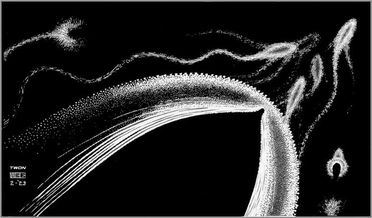

# Learned, Programmatic, and Hybrid Verifiers

{width="80%" fig-align="center"}

## Chapter Map

- Explain how to build verifier stacks when a single hard-coded checker is not enough.
- Show the main risk: combining imperfect signals without understanding where their errors compound.

## The implementation spectrum

Chapters 2 and 3 presented verification as a single function call. The outcome verifier scores the endpoint; the process verifier scores intermediate steps. In both cases, the exposition assumed a single checker. In practice, most production RLVR systems use a stack: multiple verifier components layered together, each covering a different part of the correctness question.

The reason is straightforward. No single verifier handles every output a model can produce. A symbolic math checker handles exact-match answers but returns nothing useful when the model's output is unparseable. A unit-test harness checks functional correctness but says nothing about code security or readability. A proof kernel accepts or rejects a formal proof term but cannot evaluate whether the theorem was worth proving. Each verifier has a checkable core — the set of inputs on which it produces a reliable signal — and a residual, the complement where it is silent or unreliable. Stacking verifiers is the attempt to shrink the residual.

Three regimes sit along the implementation spectrum.

**Programmatic verifiers** are deterministic, auditable, and brittle. They include regex-based answer extraction, symbolic equivalence checking (as in Math-Verify), unit-test execution in a sandbox, static analysis and linting, proof-kernel acceptance, and format-validation rules.[@kydlicek2025mathverify] When a programmatic verifier fires, you know exactly why. When it fails — when the input falls outside its checkable core — it fails silently. Chapters 2 and 3 already covered the main instances: outcome extraction pipelines, formal step checking, and test-suite execution.

**Learned verifiers** are flexible, soft-scored, and opaque. A model — often an LLM — evaluates the target model's output and produces a judgment: a scalar score, a classification, or a natural-language critique. Learned verifiers can handle ambiguity, open-ended domains, and edge cases that no programmatic rule anticipates. But they inherit the biases and blind spots of the judge model, and their scores are not calibrated probabilities of correctness.

**Hybrid stacks** layer programmatic and learned components together. The programmatic layer handles what it can check cheaply and exactly. The learned layer handles some or all of the residual. An arbitration function decides when to trust each component, when to defer, and how to aggregate their signals into a single reward.

The design problem in a hybrid stack is not "which verifier is best." It is: where does each component's checkable core end, what does the arbitration logic do on the boundary, and how do the failure modes of different components interact when they are composed?

## Programmatic verifiers: where determinism is enough

This section is brief because Chapters 2 and 3 already covered the main programmatic verifiers in detail. The purpose here is to frame them as stack components rather than standalone systems.

A programmatic verifier is any checker whose logic is fully specified by code rather than learned from data. The key examples, organized by domain:

| Domain | Programmatic checks | Checkable core |
|:-------|:-------------------|:--------------|
| Math | Answer extraction, canonicalization, symbolic equivalence | Closed-form answers with known ground truth |
| Code | Sandbox execution, test suites, linters, static analysis | Functional behavior covered by tests |
| Proof | Kernel acceptance (Lean, Coq, Isabelle) | Formal validity of each tactic or proof term |
| Format | Regex, XML schema, JSON schema, tag-structure validation | Output-contract compliance |

: Programmatic verifiers by domain. Each has a well-defined checkable core and a residual it cannot address. {#tbl-ch4-programmatic}

The shared property: programmatic verifiers never hallucinate. Their failure modes are enumerable, because the code that implements them is auditable. A symbolic equivalence checker either recognizes two expressions as equal or it does not; it never invents a spurious equivalence. A test suite either passes or fails; it never fabricates a test result.

The shared limitation: programmatic verifiers only cover the checkable core of a task. The Math-Verify pipeline from Chapter 2 handles answers it can parse and canonicalize, but it returns no signal on malformed outputs, open-ended explanations, or problems whose answer format was not anticipated.[@kydlicek2025mathverify] A test suite checks the behaviors the test author thought to specify, but it misses edge cases, security vulnerabilities, and correctness properties that no test covers.[@liu2023evalplus] A proof kernel checks formal validity, but it says nothing about whether the proof is elegant, readable, or useful.

This is why programmatic verifiers are foundations rather than complete solutions. They anchor the stack with high-precision, low-cost signals. The question is what to do about the residual.

## Learned verifiers: when a model judges a model

When a programmatic verifier cannot produce a signal — when the output falls outside the checkable core, or the task is too open-ended for any rule-based check — the alternative is to use a model as a judge. A learned verifier is trained (or prompted) to evaluate another model's output and produce a score or critique.

### LLM-as-Judge

The simplest form of learned verification is prompting a strong LLM to evaluate a weaker model's output. Zheng et al. formalized this as the LLM-as-Judge paradigm.[@zheng2023judging] The setup is direct: give a capable model (such as GPT-4) the prompt and the candidate response, ask it to rate the response on a scale or compare two responses, and use the result as a reward signal or selection criterion.

The headline result is that strong LLM judges agree with human preferences over 80% of the time, matching the rate at which human annotators agree with each other. This makes LLM-as-Judge viable as a scalable approximation to human evaluation in domains where programmatic checking is impossible.

But the agreement rate hides systematic biases. Zheng et al. identify four: position bias (the judge prefers whichever response appears first), verbosity bias (longer responses are rated higher regardless of quality), self-enhancement bias (a model rates its own outputs higher than a different model's outputs of equal quality), and limited mathematical reasoning (the judge makes errors when evaluating mathematical correctness that a symbolic checker would catch trivially). These are not random noise; they are structured error patterns that a policy can learn to exploit.

### Generative verifiers

Hosseini et al. introduced GenRM, a verifier trained with next-token prediction rather than discriminative classification.[@hosseini2024genrm] The key insight: a generative verifier can produce chain-of-thought reasoning before making its judgment, and it can be sampled multiple times to get a majority vote over verification attempts. This is verification-time compute applied to the verifier itself.

The empirical gains are substantial. On GSM8K in a best-of-16 setting, GenRM pushes accuracy from 73% to 93.4%. On harder math tasks (easy-to-hard transfer on MATH), it nearly doubles the discriminative baseline. The generative framing lets the verifier reason about why a solution is wrong, rather than just scoring it. It also means the verifier can improve with more samples at inference time, just as a policy can improve with more rollouts.

The limitation is cost. Each verification sample is a full forward pass through a large model, and majority voting requires multiple samples. GenRM is most practical when verification is done over a small set of candidates (best-of-$N$ selection) rather than over every token in a training run.

### CriticGPT

McAleese et al. took a different approach: instead of scoring outputs, train a model to write natural-language critiques.[@mcaleese2024criticgpt] CriticGPT was trained via RLHF to identify bugs in code, producing free-form critiques that explain what is wrong and where.

The results are instructive for verifier-stack design. CriticGPT critiques were preferred over human critiques 63% of the time on naturally occurring code bugs. Human-machine teams using CriticGPT caught more bugs than either humans or the model alone. But the model also hallucinated bugs — producing confident critiques of code that was actually correct. The practical lesson: a learned critic is more useful as a component in a stack (where its output can be cross-checked) than as a standalone verifier (where its hallucinations go unchallenged).

### The calibration problem

Learned verifiers produce scores, but those scores are not calibrated probabilities of correctness. A judge that outputs 0.8 does not mean the solution has an 80% chance of being correct; it means 0.8 is the number the judge's training objective learned to assign to solutions with that surface profile. Lambert et al. documented this systematically in RewardBench, showing that reward models exhibit large accuracy gaps across domains — performing well on chat-style evaluation but poorly on reasoning and safety tasks — and that different training methods (classifier-based, DPO-based, generative) have different calibration profiles.[@lambert2024rewardbench]

For verifier-stack design, the calibration gap means that raw scores from a learned component cannot be compared directly to outputs from a programmatic component. If a symbolic checker returns "match" (effectively certainty) and a learned judge returns 0.7, the arbitration logic must account for the fact that 0.7 from the judge does not carry the same epistemic weight as a deterministic pass from the checker. Treating both as commensurable scalars and averaging them is a common mistake that dilutes the programmatic signal.

### The running example, judged

Return to the quadratic from Chapter 2. The model solves $x^2 - 5x + 6 = 0$ and writes the answer in `<answer>` tags.

Consider the trajectory from Chapter 3 where the model reasons correctly through every step but writes only `<answer>x = 2</answer>` instead of the full solution set $\{2, 3\}$. A programmatic checker that parses the answer tag and compares against the ground truth returns $r = 0$: the extracted answer does not match. A learned judge, given the full reasoning trace, can recognize that the derivation is correct and the error is only in the final reporting step. It might return a high score on reasoning quality and a low score on answer completeness, distinguishing the two failure modes.

Now consider a trajectory where every step looks plausible but step 3 contains a subtle sign error that happens to cancel out by step 5, producing the correct final answer. The programmatic checker returns $r = 1$: the answer matches. A learned judge, if it reasons carefully, might catch the sign error — but it might also miss it, especially if the error is in a domain (algebra) where LLM judges are known to be unreliable. Worse, the judge might hallucinate an error that is not there, flagging a correct step as wrong because of its own limited mathematical reasoning.

This is the core tension: learned judges extend coverage beyond the programmatic checkable core, but they introduce a new class of errors — hallucinated verdicts — that programmatic checkers never produce.

## Hybrid stacks: combining programmatic and learned verification

A hybrid verifier stack layers programmatic and learned components and defines arbitration logic to combine their outputs. The design question is not which single verifier to use, but how to partition the verification problem across components and how to handle disagreements.

### Architecture: programmatic-first, learned fallback

The simplest and most common architecture runs the programmatic layer first and invokes the learned layer only on the residual — the inputs where the programmatic layer cannot produce a verdict.

In a math setting, the stack works as follows. The extraction and canonicalization pipeline from Chapter 2 attempts to parse the model's answer and check it against the ground truth. If the pipeline returns a definitive match or mismatch, that verdict is used directly. If the pipeline cannot parse the answer (malformed output, unexpected format, open-ended explanation), the input is routed to a learned judge that scores the response against the reference. The arbitration rule: trust the programmatic layer when it fires; invoke the judge only on the residual.

In a code setting, the programmatic layer is richer. Test execution provides pass/fail signals on covered behaviors. A linter flags style violations and potential bugs. Static analysis catches type errors, null-pointer risks, and known vulnerability patterns. The learned layer reviews aspects that the programmatic tools cannot check: correctness beyond the test suite, security properties not covered by static rules, and design quality. The arbitration rule: execution results are hard constraints (a failing test overrides any judge score); linter and analysis results are medium-confidence signals; judge scores are soft signals used only when the other layers are silent.[@le2022coderl; @liu2023evalplus]

In a long-context QA setting, the stack is layered sequentially. A citation checker verifies that referenced spans actually exist in the source document. A retrieval consistency check verifies that the cited spans are relevant to the claim. A learned entailment model scores whether the cited evidence actually supports the answer.[@zhang2024longcite] Each layer filters before the next: if the citation does not exist, there is no point checking entailment.

### Formalization

A verifier stack with $K$ components can be written as:

$$
r_{\text{stack}}(x, y) = \operatorname{Arb}\bigl(v_1(x, y),\, v_2(x, y),\, \ldots,\, v_K(x, y)\bigr)
$$ {#eq-ch4-stack}

where each $v_i$ is a verifier component that may return a score, a categorical verdict, or a null (indicating it has no opinion), and $\operatorname{Arb}$ is the arbitration function. The formalization is deliberately minimal because the interesting design choices are in the arbitration logic, not in the equation.

Common arbitration patterns include:

- **Priority cascade**: check $v_1$ first; if it returns a verdict, use it; otherwise check $v_2$, and so on. This is the programmatic-first architecture above.
- **Weighted aggregation**: compute $r = \sum_i w_i \, v_i(x, y)$ for learned weights $w_i$. This treats the stack as an ensemble but requires that the component scores are commensurable, which (as noted above) is often false.
- **Gated routing**: a classifier decides which component to invoke based on input features. This avoids running all components on every input but introduces a routing model that is itself a potential failure point.
- **Unanimous agreement**: require all components to agree before assigning a positive reward. Conservative but expensive, and it can suppress correct outputs that only one component recognizes.

The choice of arbitration pattern determines the stack's effective false-positive and false-negative rates. Priority cascade is biased toward the first component's failure modes. Weighted aggregation can dilute strong signals with weak ones. Gated routing's errors depend on the routing model. There is no universally correct choice; the right pattern depends on the domain, the relative reliability of the components, and the cost budget.

## Outcome, process, and hybrid: the same trajectory, three ways

The three verification regimes from Chapters 2, 3, and this chapter are best compared on the same trajectory. Return to the quadratic $x^2 - 5x + 6 = 0$. Consider a trajectory where the model factors correctly, solves correctly, but writes only the first root in the answer tag.

::: {#fig-ch4-outcome-process-hybrid}

::: {.content-visible when-format="html"}

```{=html}
<div class="oph-widget" id="oph-widget">
  <p class="oph-hint">Click a tab to see how each verification regime scores the same trajectory.</p>

  <div class="oph-tabs" role="tablist">
    <button class="oph-tab oph-active" role="tab" aria-selected="true" data-mode="outcome">Outcome</button>
    <button class="oph-tab" role="tab" aria-selected="false" data-mode="process">Process</button>
    <button class="oph-tab" role="tab" aria-selected="false" data-mode="hybrid">Hybrid Stack</button>
  </div>

  <table class="oph-table">
    <thead>
      <tr>
        <th style="width:8%">Step</th>
        <th style="width:62%">Reasoning</th>
        <th style="width:15%" class="oph-score-col">Score</th>
        <th style="width:15%" class="oph-source-col">Source</th>
      </tr>
    </thead>
    <tbody id="oph-body">
    </tbody>
  </table>

  <div class="oph-summary" id="oph-summary" aria-live="polite"></div>
</div>

<style>
.oph-widget { max-width: 720px; margin: 1.2em auto; font-family: var(--bs-body-font-family, system-ui, sans-serif); }
.oph-hint { font-size: 0.88em; color: var(--bs-secondary-color, #6c757d); margin-bottom: 0.5em; }
.oph-tabs { display: flex; gap: 0; border-bottom: 2px solid var(--bs-border-color, #dee2e6); margin-bottom: 0; }
.oph-tab { background: none; border: none; padding: 0.55em 1.2em; cursor: pointer;
  font-size: 0.92em; font-weight: 500; color: var(--bs-body-color, #212529);
  border-bottom: 2px solid transparent; margin-bottom: -2px; transition: all 0.15s; }
.oph-tab:hover { color: var(--bs-primary, #2c7be5); }
.oph-tab.oph-active { color: var(--bs-primary, #2c7be5); border-bottom-color: var(--bs-primary, #2c7be5); }
.oph-table { width: 100%; border-collapse: collapse; margin-top: 0; }
.oph-table th, .oph-table td { padding: 0.5em 0.6em; border-bottom: 1px solid var(--bs-border-color, #dee2e6);
  font-size: 0.9em; text-align: left; vertical-align: top; }
.oph-table th { font-weight: 600; background: var(--bs-tertiary-bg, #f8f9fa); }
.oph-score-col, .oph-source-col { text-align: center; }
td.oph-score-col, td.oph-source-col { text-align: center; }
.oph-pass { color: #198754; font-weight: 600; }
.oph-fail { color: #dc3545; font-weight: 600; }
.oph-na { color: var(--bs-secondary-color, #999); }
.oph-soft { color: #d97706; font-weight: 600; }
.oph-summary { margin-top: 0.7em; padding: 0.7em 0.9em; border-radius: 6px;
  background: var(--bs-tertiary-bg, #f8f9fa); font-size: 0.9em; line-height: 1.5; }
</style>

<script>
(() => {
  const steps = [
    { id: 1, text: "Factor: x\u00B2 \u2212 5x + 6 = (x\u22122)(x\u22123)", correct: true },
    { id: 2, text: "Set first factor to zero: x = 2", correct: true },
    { id: 3, text: "Set second factor to zero: x = 3", correct: true },
    { id: 4, text: "Collect solution set: {2, 3}", correct: true },
    { id: 5, text: "Report: \u27E8answer\u27E9x = 2\u27E8/answer\u27E9", correct: false }
  ];

  const modes = {
    outcome: {
      scores: [
        { s: "\u2014", c: "oph-na", src: "\u2014" },
        { s: "\u2014", c: "oph-na", src: "\u2014" },
        { s: "\u2014", c: "oph-na", src: "\u2014" },
        { s: "\u2014", c: "oph-na", src: "\u2014" },
        { s: "r = 0", c: "oph-fail", src: "Symbolic" }
      ],
      summary: "<strong>Outcome only.</strong> The verifier checks the final answer against the ground truth. It returns r\u00A0=\u00A00 because the extracted answer is incomplete. Five correct reasoning steps receive no credit."
    },
    process: {
      scores: [
        { s: "\u2713", c: "oph-pass", src: "PRM" },
        { s: "\u2713", c: "oph-pass", src: "PRM" },
        { s: "\u2713", c: "oph-pass", src: "PRM" },
        { s: "\u2713", c: "oph-pass", src: "PRM" },
        { s: "\u2717", c: "oph-fail", src: "PRM" }
      ],
      summary: "<strong>Process only.</strong> A PRM scores each step. Steps 1\u20134 receive positive labels. Step 5 is penalized. But every label comes from the same learned model, so if the PRM has a blind spot on reporting errors, it may miss step 5 entirely."
    },
    hybrid: {
      scores: [
        { s: "\u2713", c: "oph-pass", src: "PRM" },
        { s: "\u2713", c: "oph-pass", src: "PRM" },
        { s: "\u2713", c: "oph-pass", src: "PRM" },
        { s: "\u2713", c: "oph-pass", src: "PRM" },
        { s: "r = 0", c: "oph-fail", src: "Symbolic + Judge" }
      ],
      summary: "<strong>Hybrid stack.</strong> The programmatic checker catches the incomplete answer (r\u00A0=\u00A00). The PRM preserves credit on steps 1\u20134. A learned judge, invoked because the programmatic and process signals disagree on the trajectory\u2019s overall quality, confirms that the reasoning is sound but the reporting failed. The stack produces a richer signal than either component alone."
    }
  };

  function render(mode) {
    const m = modes[mode];
    const tbody = document.getElementById("oph-body");
    tbody.innerHTML = "";
    steps.forEach((step, i) => {
      const sc = m.scores[i];
      const tr = document.createElement("tr");
      tr.innerHTML =
        "<td>" + step.id + "</td>" +
        "<td>" + step.text + "</td>" +
        '<td class="oph-score-col ' + sc.c + '">' + sc.s + "</td>" +
        '<td class="oph-source-col">' + sc.src + "</td>";
      tbody.appendChild(tr);
    });
    document.getElementById("oph-summary").innerHTML = m.summary;
  }

  document.querySelectorAll(".oph-tab").forEach(tab => {
    tab.addEventListener("click", () => {
      document.querySelectorAll(".oph-tab").forEach(t => { t.classList.remove("oph-active"); t.setAttribute("aria-selected", "false"); });
      tab.classList.add("oph-active");
      tab.setAttribute("aria-selected", "true");
      render(tab.dataset.mode);
    });
  });

  render("outcome");
})();
</script>
```
:::

::: {.content-visible when-format="pdf"}

| Step | Reasoning | Outcome | Process | Hybrid |
|:-----|:----------|:-------:|:-------:|:------:|
| 1 | Factor: $x^2-5x+6=(x-2)(x-3)$ | --- | $\checkmark$ (PRM) | $\checkmark$ (PRM) |
| 2 | $x-2=0 \implies x=2$ | --- | $\checkmark$ (PRM) | $\checkmark$ (PRM) |
| 3 | $x-3=0 \implies x=3$ | --- | $\checkmark$ (PRM) | $\checkmark$ (PRM) |
| 4 | Solution set: $\{2,3\}$ | --- | $\checkmark$ (PRM) | $\checkmark$ (PRM) |
| 5 | Report: `<answer>x = 2</answer>` | $r=0$ | $\times$ (PRM) | $r=0$ (Symbolic + Judge) |

: Outcome verification scores only the endpoint and suppresses the entire trajectory. Process verification labels each step but relies on a single learned model. The hybrid stack uses a programmatic checker for the endpoint, a PRM for intermediate steps, and a learned judge to reconcile the disagreement.

:::

The same trajectory scored by three verification regimes. The hybrid stack produces a richer signal than either pure regime.
:::

## Error compounding and the stack's attack surface

Adding components to a verifier stack does not always improve the effective reward signal. Each layer introduces its own error distribution, and the interaction between layers can amplify errors rather than cancel them.

**Silent disagreement.** Two stack components can return conflicting verdicts on the same input. If the arbitration logic always trusts one component over the other, the overridden component's correct judgments are wasted. If the logic averages or votes, it can produce a moderate-confidence score on an input where one component is certain and the other is hallucinating. The failure is worst when the disagreement is not surfaced — when the stack returns a single scalar and the designer never sees that the components disagreed.

**Correlated failures.** If the programmatic layer has a false-negative rate $\epsilon_1$ and the learned layer has an error rate $\epsilon_2$ on the residual, the effective stack error is not $\epsilon_1 \cdot \epsilon_2$. That product would hold only if the errors were independent. In practice, the errors are often correlated: the same inputs that are hard for a symbolic checker (unusual formats, ambiguous phrasing) are also hard for a learned judge (because they fall outside typical training distributions). Correlated failures mean the stack's worst-case error rate can be close to the worse of the two components, not the product.

**Learned judges inheriting training artifacts.** A judge trained on one distribution of model outputs may learn to reward surface patterns — verbosity, hedging phrases, "Let me think step by step" prefixes, confident-sounding conclusions — that correlate with quality in the training data but do not cause quality in the target distribution. When this judge is used as a stack component, its biases flow into the reward signal. The policy learns to produce outputs that satisfy both the programmatic checker and the judge's stylistic preferences, even when those preferences are artifacts.

**Excessive complexity.** Every layer adds debugging surface. When a hybrid stack produces an incorrect reward, identifying which component failed requires tracing through the full pipeline: did the extractor mispase? Did the canonicalizer collapse distinct answers? Did the learned judge hallucinate? Did the arbitration logic pick the wrong signal? The practical cost of stack complexity is not just compute; it is the human audit burden. CriticGPT illustrates this directly: human-machine teams caught more bugs than either alone, but they also produced more hallucinated bug reports.[@mcaleese2024criticgpt] Adding a component can make the system better on average and harder to debug on failure.

## Ensembles and self-consistency as lightweight stacks

Not all hybrid verification requires mixing different modalities. The simplest stacks combine multiple instances of the same verifier type.

**Self-consistency.** Wang et al. showed that sampling multiple reasoning paths from the same model and taking a majority vote over their final answers substantially improves accuracy — a 17.9% gain on GSM8K, with no additional training or external verifier.[@wang2022selfconsistency] Self-consistency is a verification strategy disguised as a decoding strategy: the "verifier" is the agreement pattern across samples. If many independent reasoning paths converge on the same answer, that answer is more likely correct.

The connection to verifier stacks is direct. Self-consistency is a stack of $N$ outcome verifiers (each one being "does this sample agree with the majority?") with a majority-vote arbitration function. It inherits the strengths of ensemble methods — diversity reduces variance — and the weaknesses: if the model has a systematic bias toward a particular wrong answer, all samples may converge on it.

**Reward model ensembles.** Coste et al. studied ensembles of reward models for RLHF and found that they mitigate but do not eliminate reward hacking.[@coste2023rewardensemble] Ensembles that differ in pretraining seeds generalize better than those that differ only in fine-tuning seeds, because the former have more diverse internal representations. But when all models in the ensemble share the same blind spot — the same class of inputs they systematically misjudge — the ensemble fails as a unit. This is the correlated-failure problem from the previous section, applied to homogeneous stacks.

The lesson: ensembles and self-consistency are the simplest hybrid stacks, combining multiple judgments without layering different verification modalities. They improve reliability when errors are uncorrelated and provide little benefit when errors are systematic. For stronger guarantees, a stack must combine verifiers that check different aspects of the output — which is why the heterogeneous stacks (programmatic plus learned) remain the more interesting design problem.

## What the verifier stack sees and misses

The stack's visibility is the union of its components' visibilities. A programmatic checker sees the extracted artifact and its structure. A learned judge sees the full response text and whatever context it is given. A test harness sees execution traces and output values. Together, the stack sees more than any single component.

It still misses three things.

First, behavior that never enters the instrumented pipeline. If the model performs internal computation that is not externalized in the response — latent reasoning, compressed heuristics, pattern recognition that skips intermediate steps — no stack component can evaluate it. This is the same latent-cognition gap identified in Chapter 3, and adding more verifier layers does not close it.

Second, systematic blind spots shared across components. If the programmatic checker and the learned judge both fail on the same class of inputs — say, problems that require spatial reasoning, or answers in a language the judge was not trained on — the stack fails as a unit. The union of visibilities only helps when the components' blind spots are different.

Third, the distinction between "all components agree" and "the answer is actually correct." Unanimous agreement among stack components is evidence, not proof. If every component in the stack shares a particular bias or limitation, they can all agree on a wrong answer. The stack's confidence is bounded by the diversity and independence of its components' judgments.

## Open questions

- When should learned judges be first-class stack components that score every output, rather than fallbacks invoked only on the programmatic residual?
- What are the right interfaces for appeals and verifier arbitration — when should a model be allowed to contest a verifier's judgment, and how should the stack handle that contestation?
- How can verifier-stack audits remain tractable as systems grow more layered? Is there a practical ceiling on stack depth beyond which debugging costs exceed the gains?
- Can the marginal value of each stack component be quantified before deployment, or must it be measured empirically on the target task distribution?
- What is the right training regime for a learned judge that will be used inside a hybrid stack — should it be trained on the distribution of inputs the programmatic layer cannot resolve, rather than on the full distribution?

The verifier stack defines what gets checked and how. It does not yet define how those checks become training signal. A stack that returns binary pass/fail verdicts, a stack that returns graded scores, and a stack that returns step-level annotations will produce very different learning dynamics even if they agree on which outputs are correct. The signal-design choices that transform a verifier stack's outputs into something an optimizer can use — binary versus graded scoring, filtering, curriculum, and reward shaping — are the subject of Chapter 5.
