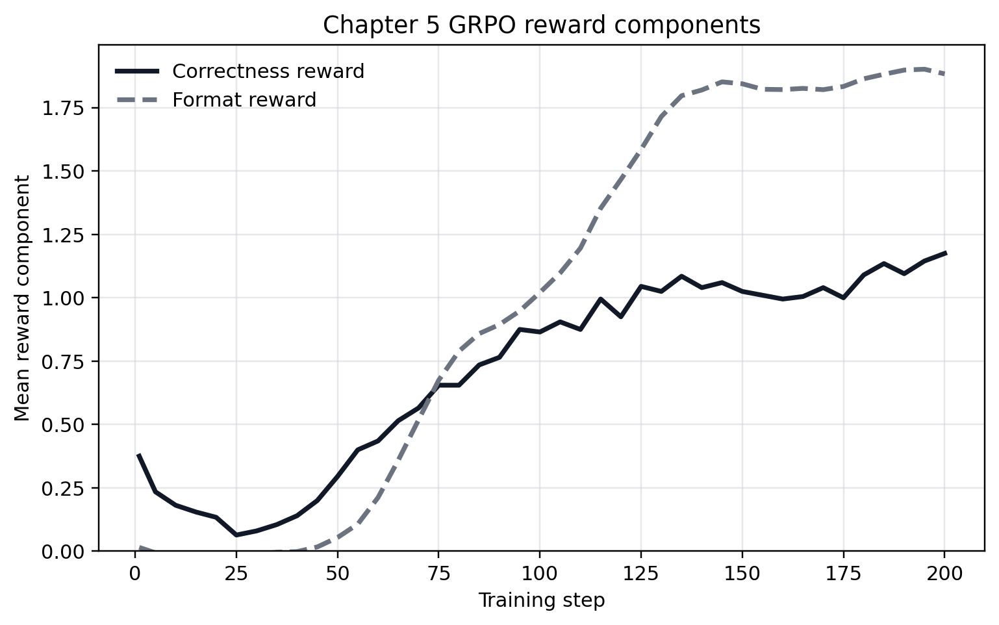
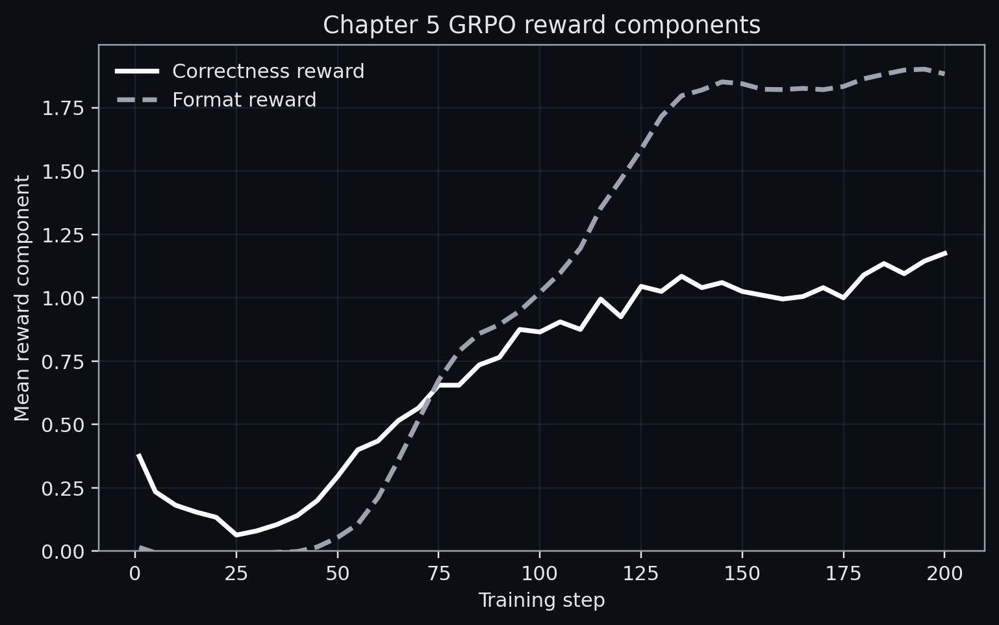
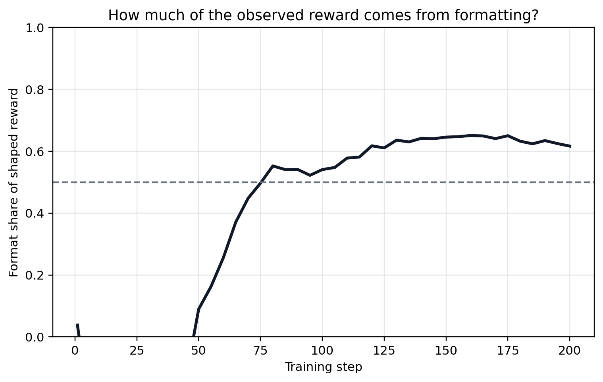
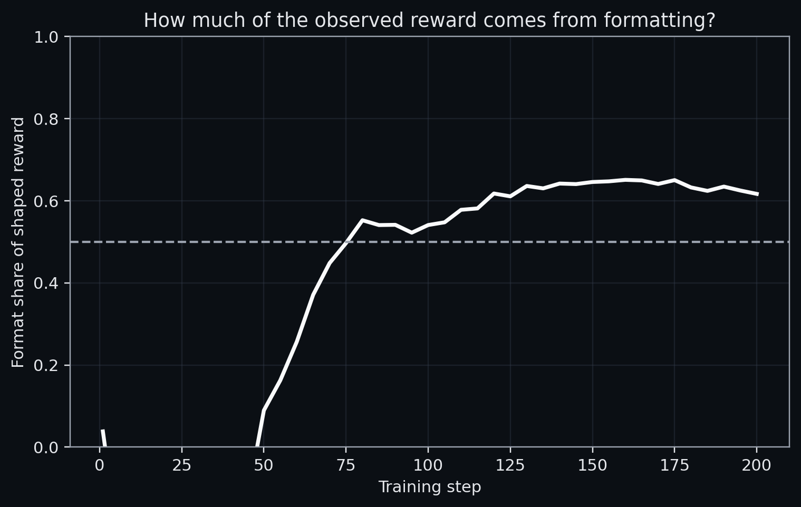
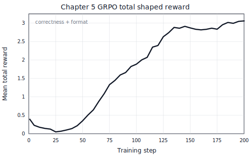
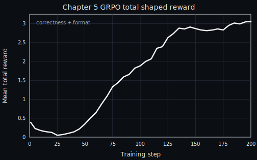

# Turning Checks into Training Signal

{width="80%" fig-align="center"}

## Chapter Map

- A complete outcome-RLVR training loop, annotated line by line, to show how verifier verdicts become parameter updates.
- Reward shaping, task filtering, rollout budget, and baseline design demonstrate that a poorly shaped reward produces bad training under any optimizer.

## A compact outcome-RLVR training script

[Will Brown's](https://x.com/willccbb/status/1886788410351796232) GRPO script shows the smallest complete loop from verifiable check on outcome rewards to parameter update on a 1.5B model.[^ch5-brown-grpo-150line]

```py
import re
import torch
from datasets import load_dataset, Dataset
from transformers import AutoTokenizer, AutoModelForCausalLM
from peft import LoraConfig
from trl import GRPOConfig, GRPOTrainer
```

::: {.column-margin}
Importing the relevant packages, including Hugging Face Transformer Reinforcement Learning, Transformers and parameter efficient fine tuning.
:::

```py
SYSTEM_PROMPT = """
Respond in the following format:

<reasoning>
...
</reasoning>
<answer>
...
</answer>
"""

XML_COT_FORMAT = """\
<reasoning>
{reasoning}
</reasoning>
<answer>
{answer}
</answer>
"""
```

::: {.column-margin}
System prompt and XML (for downstream format rewards) with templating.
:::

```py
def extract_xml_answer(text: str) -> str:
    answer = text.split("<answer>")[-1]
    answer = answer.split("</answer>")[0]
    return answer.strip()

def extract_hash_answer(text: str) -> str | None:
    if "####" not in text:
        return None
    return text.split("####")[1].strip().replace(",", "").replace("$", "")
```

::: {.column-margin}
These two functions:

1. Extract XML from the CoT format used by `extract_xml_answer`
2. Extract the text succeeding `####`
:::


```py
def get_gsm8k_questions(split = "train") -> Dataset:
    data = load_dataset('openai/gsm8k', 'main')[split] # type: ignore
    data = data.map(lambda x: {
        'prompt': [
            {'role': 'system', 'content': SYSTEM_PROMPT},
            {'role': 'user', 'content': x['question']}
        ],
        'answer': extract_hash_answer(x['answer'])
    }) # type: ignore
    return data # type: ignore

dataset = get_gsm8k_questions()
```
::: {.column-margin}
A lambda function to load our Grade School Math 8K (GSM8K, a benchmark of math word problems for grade school arithmetic) dataset into the corresponding question and answer fields on the train split of the dataset, along with the system prompt.
:::

```py
def correctness_reward_func(prompts, completions, answer, **kwargs) -> list[float]:
    responses = [completion[0]['content'] for completion in completions]
    extracted_responses = [extract_xml_answer(r) for r in responses]
    return [2.0 if r == a else 0.0 for r, a in zip(extracted_responses, answer)]

def int_reward_func(completions, **kwargs) -> list[float]:
    responses = [completion[0]['content'] for completion in completions]
    extracted_responses = [extract_xml_answer(r) for r in responses]
    return [0.5 if r.isdigit() else 0.0 for r in extracted_responses]
```
::: {.column-margin}
`correctness_reward_func` checks whether the language model gets the correct answer, using the Extract XML answer function. Notice the function checks for exact matching, whereas `int_reward_func` checks only for digit presence. Both of these are binary outcome rewards, and rewarding `2.0` versus `0.5` is a design choice.
:::

```py
def strict_format_reward_func(completions, **kwargs) -> list[float]:
    pattern = r"^<reasoning>\n.*?\n</reasoning>\n<answer>\n.*?\n</answer>\n$"
    responses = [completion[0]["content"] for completion in completions]
    matches = [re.match(pattern, r, flags=re.DOTALL) for r in responses]
    return [0.5 if match else 0.0 for match in matches]

def soft_format_reward_func(completions, **kwargs) -> list[float]:
    pattern = r"<reasoning>.*?</reasoning>\s*<answer>.*?</answer>"
    responses = [completion[0]["content"] for completion in completions]
    matches = [re.match(pattern, r, flags=re.DOTALL) for r in responses]
    return [0.5 if match else 0.0 for match in matches]
```
::: {.column-margin}
These reward functions are concerned with whether the models used the reasoning and answer tags correctly. There is both a strict and a soft format function. The strict function uses the caret sign `^` at the beginning of the pattern, enforcing that the string begins with the reasoning tag. Furthermore, the strict function demands `\n` between the tags. Finally, we have the anchor tag `$` at the end of the strict reward function regex matching pattern, which means that there should be nothing after the final answer tag.
:::

```py
def count_xml(text) -> float:
    count = 0.0
    if text.count("<reasoning>\n") == 1:
        count += 0.125
    if text.count("\n</reasoning>\n") == 1:
        count += 0.125
    if text.count("\n<answer>\n") == 1:
        count += 0.125
        count -= len(text.split("\n</answer>\n")[-1]) * 0.001
    if text.count("\n</answer>") == 1:
        count += 0.125
        count -= (len(text.split("\n</answer>")[-1]) - 1) * 0.001
    return count

def xmlcount_reward_func(completions, **kwargs) -> list[float]:
    contents = [completion[0]["content"] for completion in completions]
    return [count_xml(c) for c in contents]
```
::: {.column-margin}
Counts over reasoning and answer tags within the response. The only nuance is the subtraction statement in both of the answer conditional statements, which gives a negative reward proportional to extraneous tokens after the closing answer tag. One must be careful with the reward for format rewards, lest they distract from correctness.
:::

```py
model_name = "Qwen/Qwen2.5-1.5B-Instruct"
output_dir = "outputs/Qwen-1.5B-GRPO"
run_name = "Qwen-1.5B-GRPO-gsm8k"

training_args = GRPOConfig(
    output_dir=output_dir,
    run_name=run_name,
    learning_rate=5e-6,
    adam_beta1 = 0.9,
    adam_beta2 = 0.99,
    weight_decay = 0.1,
    warmup_ratio = 0.1,
    lr_scheduler_type='cosine',
    logging_steps=1,
    bf16=True,
    per_device_train_batch_size=1,
    gradient_accumulation_steps=4,
    num_generations=16,
    max_completion_length=786,
    num_train_epochs=1,
    save_steps=100,
    max_grad_norm=0.1,
    report_to="wandb",
    log_on_each_node=False,
)

peft_config = LoraConfig(
    r=16,
    lora_alpha=64,
    target_modules=["q_proj", "k_proj", "v_proj", "o_proj", "up_proj", "down_proj", "gate_proj"],
    task_type="CAUSAL_LM",
    lora_dropout=0.05,
)
```
::: {.column-margin}
LLM selection and configurtion of the GRPO optimizer with the applicable learning rate, weight decay, data formats, etc., as well as our Lora config, which is the adapter trained on top of the language model. For this chapter, the most important choices are `num_generations=16`, which sets the rollout budget and therefore the variance-compute tradeoff. `max_grad_norm=0.1`, helps control policy drift.
:::

```py
model = AutoModelForCausalLM.from_pretrained(
    model_name,
    torch_dtype=torch.bfloat16,
    attn_implementation="flash_attention_2",
    device_map=None
).to("cuda")

tokenizer = AutoTokenizer.from_pretrained(model_name)
tokenizer.pad_token = tokenizer.eos_token

trainer = GRPOTrainer(
    model=model,
    processing_class=tokenizer,
    reward_funcs=[
        xmlcount_reward_func,
        soft_format_reward_func,
        strict_format_reward_func,
        int_reward_func,
        correctness_reward_func],
    args=training_args,
    train_dataset=dataset,
    peft_config=peft_config
)

trainer.train()
```
::: {.column-margin}
Tokenizer and Model initialization with Hugging Face Transformers and Flash Attention. Trainer instantiation with the `GRPOTrainer` class with the reward functions, and finally run `trainer.train()`.
:::

## Reward engineering

### Binary versus graded reward

`correctness_reward_func` is a binary outcome reward of 2.0 for exact match and 0.0 otherwise, in opposition to a partial reward for partial solution. DeepSeek-R1 used binary correctness reward throughout training and achieved state-of-the-art results, demonstrating that binary reward plus sufficient rollout diversity can substitute for graded scoring.[@deepseekai2025r1]

### Reward decomposition and weighting

The script passes five reward functions to `GRPOTrainer`, which sums their outputs. The correctness function returns up to 2.0, and each of the four format functions returns up to 0.5, meaning correctness and formatting have equal weight at the ceiling. Since GRPO normalizes rewards within the group of 16 trajectories, an incorrect response with good formatting can land close to the group mean and receive near-zero gradient, which is counterproductive.

@tbl-ch5-reward-comparison demonstrates this edge case with eight rollouts scored under two regimes for a single prompt having three correct and five incorrect outcomes.

::: {#tbl-ch5-reward-comparison}
::: {.content-visible when-format="html"}

<div class="rsp-widget" id="rsp-widget">
<div class="rsp-tabs" role="tablist">
<button class="rsp-tab rsp-tab-active" role="tab" data-tab="binary" aria-selected="true">Correctness</button>
<button class="rsp-tab" role="tab" data-tab="format" aria-selected="false">Correctness + format</button>
</div>
<table class="rsp-table">
<thead><tr><th>#</th><th>Correctness</th><th>Format</th><th>Reward</th><th>Advantage</th><th class="rsp-signal-col">Signal</th></tr></thead>
<tbody id="rsp-body"></tbody>
</table>
<div class="rsp-summary" id="rsp-summary" aria-live="polite"></div>
</div>
<script>
(function(){
  var data={
    binary:{
      rows:[
        {id:1,correctness:'\u2713',format:'N/A',reward:'2.0',adv:1.29},
        {id:2,correctness:'\u2713',format:'N/A',reward:'2.0',adv:1.29},
        {id:3,correctness:'\u2713',format:'N/A',reward:'2.0',adv:1.29},
        {id:4,correctness:'\u2717',format:'N/A',reward:'0.0',adv:-0.77},
        {id:5,correctness:'\u2717',format:'N/A',reward:'0.0',adv:-0.77},
        {id:6,correctness:'\u2717',format:'N/A',reward:'0.0',adv:-0.77},
        {id:7,correctness:'\u2717',format:'N/A',reward:'0.0',adv:-0.77},
        {id:8,correctness:'\u2717',format:'N/A',reward:'0.0',adv:-0.77}
      ],
      mean:0.75,
      summary:'Group mean: 0.75. Advantage sign matches correctness for every rollout.'
    },
    format:{
      rows:[
        {id:1,correctness:'\u2713',format:'\u2713',reward:'3.8',adv:1.43},
        {id:2,correctness:'\u2713',format:'\u2713',reward:'3.5',adv:1.21},
        {id:3,correctness:'\u2713',format:'~',reward:'3.0',adv:0.84},
        {id:4,correctness:'\u2717',format:'\u2713',reward:'1.8',adv:-0.04},
        {id:5,correctness:'\u2717',format:'\u2713',reward:'1.5',adv:-0.26},
        {id:6,correctness:'\u2717',format:'~',reward:'1.0',adv:-0.62},
        {id:7,correctness:'\u2717',format:'\u2717',reward:'0.2',adv:-1.21},
        {id:8,correctness:'\u2717',format:'\u2717',reward:'0.0',adv:-1.36}
      ],
      mean:1.85,
      summary:'Group mean: 1.85. Rollout 4 is incorrect but barely suppressed.'
    }
  };
  var maxMag=1.5;
  var body=document.getElementById('rsp-body');
  var summaryEl=document.getElementById('rsp-summary');
  function render(tab){
    var d=data[tab];
    body.innerHTML='';
    d.rows.forEach(function(r){
      var tr=document.createElement('tr');
      var mag=Math.min(Math.abs(r.adv)/maxMag,1)*100;
      var cls=r.adv>0.1?'rsp-bar-pos':r.adv<-0.1?'rsp-bar-neg':'rsp-bar-warn';
      var sign=r.adv>0?'+':'';
      tr.innerHTML='<td>'+r.id+'</td><td>'+r.correctness+'</td><td>'+r.format+'</td><td>'+r.reward+'</td><td>'+sign+r.adv.toFixed(2)+'</td><td class="rsp-bar-cell"><div class="rsp-bar '+cls+'" style="width:'+mag+'%"></div></td>';
      body.appendChild(tr);
    });
    summaryEl.innerHTML='<strong>Group mean:</strong> '+d.mean.toFixed(2)+' &middot; '+d.summary;
  }
  document.querySelectorAll('.rsp-tab').forEach(function(btn){
    btn.addEventListener('click',function(){
      document.querySelectorAll('.rsp-tab').forEach(function(b){b.classList.remove('rsp-tab-active');b.setAttribute('aria-selected','false');});
      btn.classList.add('rsp-tab-active');
      btn.setAttribute('aria-selected','true');
      render(btn.dataset.tab);
    });
  });
  render('binary');
})();
</script>

:::

::: {.content-visible when-format="pdf"}

**Correctness only** (3 correct, 5 incorrect out of 8 rollouts):

| Rollout | Correctness | Format | Reward | Advantage |
|---------|-------------|--------|--------|-----------|
| 1–3     | Correct     | N/A    | 2.0    | +1.29     |
| 4–8     | Wrong       | N/A    | 0.0    | −0.77     |

Group mean: 0.75. Advantage sign matches correctness for every rollout.

**Correctness + format rewards** (same eight rollouts):

| Rollout | Correctness | Format | Reward | Advantage |
|---------|-------------|--------|--------|-----------|
| 1       | Correct     | ✓      | 3.8    | +1.43     |
| 2       | Correct     | ✓      | 3.5    | +1.21     |
| 3       | Correct     | ~      | 3.0    | +0.84     |
| 4       | Wrong       | ✓      | 1.8    | **−0.04** |
| 5       | Wrong       | ✓      | 1.5    | −0.26     |
| 6       | Wrong       | ~      | 1.0    | −0.62     |
| 7       | Wrong       | ✗      | 0.2    | −1.21     |
| 8       | Wrong       | ✗      | 0.0    | −1.36     |

Group mean: 1.85. Rollout 4 is incorrect but barely suppressed.

:::

Comparison of eight rollouts under correctness versus correctness & format design.
:::

The correctness component should dominate such that auxiliary rewards do not determine the advantage sign for incorrect rollouts. The script we covered sits at the boundary (2.0 vs 2.0). @fig-ch5-grpo-reward-components, @fig-ch5-grpo-format-reward-share, and @fig-ch5-grpo-total-reward show the result of a 200-step run of the same GRPO script, where the format reward does in fact dominate.

:::: {#fig-ch5-grpo-reward-components fig-cap="Mean reward of correctness vs format over time."}

::: {.content-visible when-format="html"}
{.light-content}

{.dark-content}
:::

::: {.content-visible when-format="pdf"}

:::

::::

:::: {#fig-ch5-grpo-format-reward-share fig-cap="Format reward becomes more than half of the observed shaped reward."}

::: {.content-visible when-format="html"}
{.light-content}

{.dark-content}
:::

::: {.content-visible when-format="pdf"}

:::

::::

:::: {#fig-ch5-grpo-total-reward fig-cap="Total shaped reward rises as correctness and format reward improve together."}

::: {.content-visible when-format="html"}
{.light-content}

{.dark-content}
:::

::: {.content-visible when-format="pdf"}

:::

::::

### Task filtering and the competence band

The script calls `get_gsm8k_questions()` and trains on every problem in the split without filtering or a curriculum.

This works for GSM8K only when the model and dataset happen to land in the right competence range: the model solves some problems but not most, so reward variance across rollouts is high enough to produce informative gradients. That match between model size, prompt distribution, and rollout budget is not a general property.

If the model already solves 95% of training tasks, most rollout groups will be all-correct. After group normalization, advantages are determined by format differences alone, so we are effectively training on formatting. Conversely, a model that can only solve 5% of problems produces groups where most rollouts are incorrect, giving a weak learning signal.

The optimal regime in RL is the band where the solve rate is roughly 20–80% per prompt. DeepSeek-R1 and DeepSeekMath both filter tasks through rejection sampling to maintain this band.[^ch5-rejection-sampling][@shao2024deepseekmath; @deepseekai2025r1] Adaptive filtering keeps reward variance high, but because curriculum learning deliberately reweights the training distribution over time, gains should be checked on the original difficulty range rather than only on the moving band used for training.[@bengio2009curriculum]

### Group normalization versus KL penalty

The script uses `GRPOConfig`, which implements group relative policy optimization from DeepSeekMath.[@shao2024deepseekmath] Instead of training a value function $V(s)$ to estimate expected reward (as in PPO), GRPO estimates the baseline from the current batch. The advantage of rollout $i$ in a group is:

$$\hat{A}_i = \frac{r_i - \mu_{\text{group}}}{\sigma_{\text{group}}}$$

This eliminates the value model, and in fact, Ahmadian et al. showed that REINFORCE-style methods (no learned value function) match PPO when reward design and hyperparameters are tuned carefully.[@ahmadian2024back] The drawback here is no explicit constraint on policy drift. PPO's clipped surrogate or KL penalty keeps the policy close to a reference. GRPO uses gradient clipping, a constrained LoRA adapter update, and group normalization to this end.

### Rollout budget and variance

The script sets `num_generations=16`: sixteen rollouts per prompt. GRPO computes the group-relative advantage from the mean and standard deviation of rewards within this group. The rollout budget controls the quality of that estimate.

If we consider the extremes, with $N = 2$, the group baseline is the mean of the two rollout rewards: $\mu = (r_1 + r_2)/2$. This gives extreme variance since the unnormalized advantages are $A_1 = r_1 - \mu$ and $A_2 = r_2 - \mu$, each determined almost entirely by its difference from the other rollout rather than by a stable estimate of expected reward for the given prompt. As $N \to \infty$, the group baseline approaches a more stable estimate, but with diminishing returns in estimate quality at linear scaling in compute cost.

If the model's solve rate on a prompt is 10%, then in a group of 16, on average 1.6 are correct. This implies that groups with no correct trajectories contribute no useful correctness gradient, and those with only one correct rollout concentrate the entire positive advantage on a single sample. Higher $N$ tolerates lower solve rates by increasing the chance that at least some rollouts in every group succeed, but good task filtering means a moderate $N$ like 16 is sufficient.

## Case study

Dwarkesh Patel frames training efficiency as bits per FLOP.[@patel2025bitspersample]

$$
\frac{\mathrm{bits}}{\mathrm{FLOP}}
=
\frac{\mathrm{samples}}{\mathrm{FLOP}}
\cdot
\frac{\mathrm{bits}}{\mathrm{sample}}.
$$ {#eq-ch5-bits-per-flop}

Consider one prompt, one correct one-token answer, and a policy that puts probability $p$ on that answer. In supervised learning, the trainer gives the correct label. The surprisal of that label is:

$$
I_{\mathrm{SL}}(p)
=
-\log_2 p.
$$ {#eq-ch5-supervised-surprisal}

If the model assigns probability $10^{-5}$ to the correct token, the label gives about $16.6$ bits of information, i.e. low probability makes the label more informative. Outcome RLVR gives the trainer a pass/fail bit for the sampled answer. You can upper-bound that outcome by the entropy of a Bernoulli variable, where information peaks at one bit when $p=0.5$ and collapses near both edges. Tiny $p$ gives mostly failures. $p$ near one gives mostly passes.

$$
H_2(p)
=
-p\log_2 p
-
(1-p)\log_2(1-p).
$$ {#eq-ch5-binary-reward-entropy}


| Pass rate $p$ | Supervised label information $-\log_2 p$ | Binary reward entropy $H_2(p)$ |
|---:|---:|---:|
| $10^{-5}$ | 16.61 bits | 0.00018 bits |
| $0.01$ | 6.64 bits | 0.081 bits |
| $0.10$ | 3.32 bits | 0.469 bits |
| $0.50$ | 1.00 bit | 1.000 bit |
| $0.90$ | 0.15 bits | 0.469 bits |

: Comparing the information in a revealed supervised label with the entropy of a binary outcome. {#tbl-ch5-bits-per-sample}

The trainer spends most of its work before the useful band if each order-of-magnitude pass-rate gain costs comparable training work. Moving from $10^{-5}$ to $10^{-4}$, then to $10^{-3}$, then to $10^{-2}$ can consume several comparable chunks of compute while the binary reward remains almost always zero. These numbers tellus why task filtering, rollout budget, and shaping are not important in achieving a high-information regime:

- Filtering tries to choose prompts with mixed outcomes.
- Larger rollout groups increase the chance that rare correct traces appear at all.
- Curriculum keeps the prompt distribution near the current model's competence band.
- Process rewards and intermediate checks add signal before the terminal reward.

RLVR needs a capable starting policy in the sparse-reward regime. If the pretrained model cannot sample a useful trace with nontrivial probability, binary outcome RL has low bits per sample and high gradient variance. Pretraining, distillation, inference scaling, rejection sampling, and curriculum move the policy into the region where the verifier can teach.

## Open questions

- Is there a principled way to set reward weights, or is it always empirical search on a held-out set?
- How should adaptive task filtering be evaluated so that a curriculum tracking the model's competence improves the target distribution rather than overfitting to the moving filter?
- Is there a compute-optimal $N$ analogous to scaling laws for model size?
- Should format rewards phase out as training progresses, or does removing them cause regression?

## What comes next

This chapter is concerned with the training loop, but the same verifier that scores training rollouts can also improve outputs at test time without parameter updates, which is the subject of Chapter 6.

[^ch5-brown-grpo-150line]: Brown's compact GRPO implementation is a practical reference for outcome-RLVR training with explicit parsing and reward components.[@brown2025grpo]
[^ch5-rejection-sampling]: Rejection sampling means sampling candidate problems or candidate rollouts, scoring them with the verifier, and keeping only the ones that meet a target criterion, e.g. example prompts whose rollouts are sometimes but not always correct.
