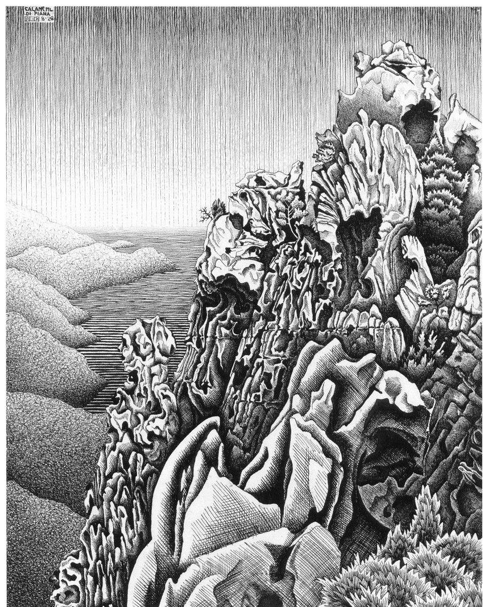

# Search and Test Time Verification

{width="80%" fig-align="center"}

## Chapter Map

- A verifier can improve a system without parameter updates.
- Disambiguating test vs train time compute.

## Test time

Chapters 2 through 5 treated the verifier as a source of training signal. Test time verifiers, in contrast, work at inference time to either: filter between candidates (selection), or steer generation (search). Let's start with selection.

## Selection

| Technique | Decision rule | Verifier use | Best when | Main limitation |
| --- | --- | --- | --- | --- |
| Best-of-$N$ with an ORM [@cobbe2021training] | Score each candidate and return the top one | Post-hoc scoring over full outputs | Cheap parallel reranking is enough | No Exploration |
| Best-of-$N$ with a PRM [@lightman2023letsverify] | Rank candidates by process rather than outcome | Step-level or intermediate scoring folded into a final rank | Harder problems where reasoning quality matters | Higher scoring cost |
| Self-consistency [@wang2022selfconsistency] | Sample multiple paths and vote or cluster by agreement | No external verifier; agreement acts as the signal | Available verifiers suck | Correlated errors |

When a PRM is used to rank complete solutions, the stepwise outputs must be reduced to one solution-level score:

$$
\text{Score}(x, y) = \operatorname{Agg}\bigl(\text{PRM}(s_1 \mid x), \ldots, \text{PRM}(s_K \mid x, s_{<K})\bigr).
$$

Lightman et al. showed why this reduction matters at test time: on the MATH benchmark, PRM-based reranking in a best-of-$N$ setting outperformed ORM-based reranking, with the gap widening as the number of candidates increased [@lightman2023letsverify].

The remaining design choice is how to collapse step scores into a trajectory score. Math-Shepherd uses the minimum step score when reranking full solutions, based on the intuition that one invalid step can ruin a plausible derivation (only strong as the weakest link) [@wang2024mathshepherd].

Let's go through the basic arithmetic behind best-of-$N$ (we assume a perfect verifier so that the calculations are clean): Let $p$ be the probability that a single sample is correct; therefore, a single sample is wrong with probability $1 - p$. If we assume sample independence, the probability that all $N$ samples are wrong is the product of those failure probabilities: $(1 - p)^N$; we can write the complement, which is at least one correct sample, as:
$$
1 - (1 - p)^N.
$$ {#eq-ch6-pass-n-idealized}
Sampling more candidates helps because repeated draws compound failure probability downward. Even a weak policy with $p = 0.1$ has
$$
1 - 0.9^{10} \approx 0.65
$$
chance of producing at least one correct solution among $N = 10$ samples, and
$$
1 - 0.9^{20} \approx 0.88
$$
among $N = 20$. Real model samples are not truly independent if one considers mode collapse: a model often repeats the same answer to a prompt, so $p$ sits near zero on some prompts and near one on others. The formula is therefore an idealization rather than an exact law, but it captures the core reason best-of-$N$ can buy large gains from modest per-sample competence.

::: {.column-margin}
A perfect verifier accepts a sample exactly when it is correct: it never accepts a wrong sample and never rejects a right one.
:::

### pass@$k$

Chen et al. defined pass@$k$: the probability that at least one of $k$ samples passes all tests [@chen2021codex]. pass@$k$ counts a problem as solved if any of the $k$ samples passes, as if a perfect verifier always picked the correct one. A deployed verifier must also pick from those same $k$ samples, so it can do no better, which makes pass@$k$ an upper bound on best-of-$k$. The gap between pass@1 and pass@$k$ shows how much the reported result depends on the evaluation protocol rather than the model. For example, the original Codex paper reported 28.8% pass@1 on HumanEval but 70.2% pass@100 from sampling alone [@chen2021codex]. If every problem had the same per-sample success rate, @eq-ch6-pass-n-idealized would put pass@100 above 99% for any rate of 5% or more. The gap to 70.2% comes from problems the model almost never solves.

::: {#fig-ch6-pass-at-k}

::: {.content-visible when-format="html"}

```{=html}
<div class="sva-widget" id="sva-widget">
  <div class="sva-controls">
    <div class="sva-slider-row">
      <span class="sva-label">Budget (candidates):</span>
      <input type="range" id="sva-budget" min="0" max="2" step="1" value="2">
      <span id="sva-budget-val" class="sva-label">16</span>
    </div>
  </div>

  <svg class="sva-svg" viewBox="0 0 600 360" aria-label="Search vs Amortization: accuracy as a function of test time compute budget.">
    <line x1="60" y1="20" x2="60" y2="300" stroke="var(--bs-border-color, #aaa)" stroke-width="1"/>
    <line x1="60" y1="300" x2="580" y2="300" stroke="var(--bs-border-color, #aaa)" stroke-width="1"/>

    <text x="30" y="165" text-anchor="middle" transform="rotate(-90,30,165)" fill="var(--bs-body-color, #333)" font-size="12">Accuracy (%)</text>
    <text x="320" y="345" text-anchor="middle" fill="var(--bs-body-color, #333)" font-size="12">Test time budget (candidates)</text>

    <g id="sva-yticks"></g>
    <g id="sva-xticks"></g>

    <polyline id="sva-base-line" fill="none" stroke="#dc2626" stroke-width="2.5" stroke-linecap="round" stroke-linejoin="round"/>
    <polyline id="sva-rl-line" fill="none" stroke="#2563eb" stroke-width="2.5" stroke-linecap="round" stroke-linejoin="round"/>

    <g id="sva-base-dots"></g>
    <g id="sva-rl-dots"></g>

    <g font-size="11" fill="var(--bs-body-color, #333)">
      <line x1="76" y1="34" x2="96" y2="34" stroke="#2563eb" stroke-width="2.5"/><text x="102" y="38">After RLVR</text>
      <line x1="76" y1="52" x2="96" y2="52" stroke="#dc2626" stroke-width="2.5"/><text x="102" y="56">Baseline model</text>
    </g>
  </svg>

  <div class="sva-summary" id="sva-summary" aria-live="polite"></div>
</div>

<script>
(() => {
  const budgets = [1, 8, 16];
  const baseAcc = [28.9, 53.6, 62.5];
  const rlAcc  = [40.0, 68.0, 70.0];

  const xMin = 60, xMax = 580, yMin = 20, yMax = 300;
  function xPos(i) { return xMin + (i / (budgets.length - 1)) * (xMax - xMin); }
  function yPos(v) { return yMax - ((v - 20) / 60) * (yMax - yMin); }

  function drawTicks() {
    let yt = document.getElementById("sva-yticks"); yt.innerHTML = "";
    for (let v = 20; v <= 80; v += 10) {
      const y = yPos(v);
      let t = document.createElementNS("http://www.w3.org/2000/svg","text");
      t.setAttribute("x", 55); t.setAttribute("y", y + 4);
      t.setAttribute("text-anchor","end"); t.setAttribute("font-size","10");
      t.setAttribute("fill","var(--bs-body-color,#555)"); t.textContent = v;
      yt.appendChild(t);
      let l = document.createElementNS("http://www.w3.org/2000/svg","line");
      l.setAttribute("x1", 58); l.setAttribute("x2", xMax);
      l.setAttribute("y1", y); l.setAttribute("y2", y);
      l.setAttribute("stroke","var(--bs-border-color,#e0e0e0)"); l.setAttribute("stroke-width","0.5");
      yt.appendChild(l);
    }
    let xt = document.getElementById("sva-xticks"); xt.innerHTML = "";
    budgets.forEach((b, i) => {
      const x = xPos(i);
      let t = document.createElementNS("http://www.w3.org/2000/svg","text");
      t.setAttribute("x", x); t.setAttribute("y", 318);
      t.setAttribute("text-anchor","middle"); t.setAttribute("font-size","10");
      t.setAttribute("fill","var(--bs-body-color,#555)"); t.textContent = b;
      xt.appendChild(t);
    });
  }

  function fmt(v) {
    return v.toFixed(1);
  }

  function render(maxIdx) {
    function pts(arr) {
      return arr.slice(0, maxIdx+1).map((v,i) => xPos(i)+","+yPos(v)).join(" ");
    }
    function dots(arr, gId, color) {
      const g = document.getElementById(gId); g.innerHTML = "";
      arr.slice(0, maxIdx+1).forEach((v,i) => {
        let c = document.createElementNS("http://www.w3.org/2000/svg","circle");
        c.setAttribute("cx", xPos(i)); c.setAttribute("cy", yPos(v));
        c.setAttribute("r", 4); c.setAttribute("fill", color);
        g.appendChild(c);
      });
    }
    document.getElementById("sva-base-line").setAttribute("points", pts(baseAcc));
    dots(baseAcc, "sva-base-dots", "#dc2626");
    document.getElementById("sva-rl-line").setAttribute("points", pts(rlAcc));
    dots(rlAcc, "sva-rl-dots", "#2563eb");

    const b = budgets[maxIdx];
    const ba = baseAcc[maxIdx], ra = rlAcc[maxIdx];
    document.getElementById("sva-budget-val").textContent = b;
    let s = "At budget\u00A0=\u00A0" + b + ": baseline " + fmt(ba) + "% (search gain +" +
      fmt(ba - baseAcc[0]) + "), RLVR-trained " + fmt(ra) + "% (search gain +" + fmt(ra - rlAcc[0]) +
      "). Training gain: +" + fmt(rlAcc[0] - baseAcc[0]) + " at pass@1 and +" + fmt(ra - ba) + " at this budget.";
    document.getElementById("sva-summary").textContent = s;
  }

  drawTicks();
  const slider = document.getElementById("sva-budget");
  function update() { render(parseInt(slider.value)); }
  slider.addEventListener("input", update);
  update();
})();
</script>
```
:::

::: {.content-visible when-format="pdf"}

| Budget (candidates) | Baseline model | RLVR-trained model | Training gain |
|:-------------------:|:----------:|:----------------:|:-------------:|
| 1 (pass@1) | 28.9% | 40.0% | +11.1 |
| 8 | 53.6% | 68.0% | +14.4 |
| 16 | 62.5% | 70.0% | +7.5 |

: Exact AIME24 pass@k values for DeepScaleR-1.5B-Preview before and after micro-budget RLVR. Both models improve with more candidates, but the RLVR-trained model starts higher at pass@1 and needs less help from additional search [@khan2026plasticity].

:::

Exact AIME24 pass@k values for DeepScaleR-1.5B-Preview before and after micro-budget RLVR [@khan2026plasticity].
:::
  
### Selection under verifier noise

@eq-ch6-pass-n-idealized assumes that the checker is perfect; that may not always be the case, e.g. a code patch that passes unit tests but removes input validation. This section models a verifier that answers yes or no and is sometimes wrong, and asks how often best-of-$N$ still returns a correct answer. Verifiers that output a score instead of yes or no fail in a similar way: they can rank a wrong answer above a right one.

Let $C \in \{0,1\}$ denote true correctness and $V \in \{0,1\}$ denote whether the verifier accepts a sample. If a single rollout has true success probability $p = \Pr(C=1)$, then the following are true:

- Verifier true-positive rate $\beta = \Pr(V=1 \mid C=1)$;
- Verifier false-positive rate $\alpha = \Pr(V=1 \mid C=0)$.

@eq-ch6-verifier-acceptance gives the chance that the verifier accepts at least one candidate after sampling $N$ times.

$$
\Pr(\exists i : V_i = 1)
= 1 - \bigl(1 - \beta p - \alpha(1-p)\bigr)^N.
$$ {#eq-ch6-verifier-acceptance}

The accepted pool contains both true positives and false positives. @eq-ch6-tail-precision gives the precision of the accepted pool, i.e. among accepted samples, what fraction are genuinely correct?

$$
\Pr(C=1 \mid V=1)
=
\frac{\beta p}{\beta p + \alpha(1-p)}
=
\frac{\text{TP}}{\text{TP} + \text{FP}}.
$$ {#eq-ch6-tail-precision}

Here $\text{TP} = \beta p$ is the probability that a sample is correct and accepted, and $\text{FP} = \alpha(1-p)$ is the probability that it is wrong and accepted.[^ch6-rates]

[^ch6-rates]: In case you're wondering why $\beta$ and $\alpha$ do not add to one, they describe different groups of samples. Each group's rates add to one on their own: $\Pr(V=1 \mid C=1) + \Pr(V=0 \mid C=1) = 1$, the true-positive rate plus the false-negative rate, and $\Pr(V=1 \mid C=0) + \Pr(V=0 \mid C=0) = 1$, the false-positive rate plus the true-negative rate.

If the unconditional probability, $p$, that a sampled rollout is actually correct before any verifier check is small, even a low false-positive rate can dominate the accepted set because most samples are incorrect. Therefore, a small leak in the checker can still pollute the accepted pool. For a hard problem with $p=0.05$ (5% base success), $\beta=0.9$ (90% true-positive rate), and $\alpha=0.01$ (1% false-positive rate), the accepted pool is only

$$
\frac{0.9 \cdot 0.05}{0.9 \cdot 0.05 + 0.01 \cdot 0.95}
\approx 0.83
$$

correct. If $\alpha$ rises to $0.05$, its precision drops to

$$
\frac{0.9 \cdot 0.05}{0.9 \cdot 0.05 + 0.05 \cdot 0.95}
\approx 0.49.
$$

Best-of-$N$ therefore depends on the verifier's precision on the accepted pool, not merely on its average accuracy. As $N$ grows, the chance that at least one candidate is accepted approaches one, so best-of-$N$ accuracy approaches this precision rather than one: about 0.83 or 0.49 in this example, however many samples are drawn. This bridges us to Chapter 7, where we discuss how more search increases both the chance of finding a correct sample and the surface area for finding a false positive that the verifier cannot reject.

### Compute-optimal selection

One question which naturally arises from verification is the exploration/exploitation argument, with exploration corresponding to more generations and exploitation corresponding to more time spent on verification. Snell et al. asked: given a fixed compute budget, how should you split it between generating more candidates and spending more on verification [@snell2024scaling]? Their conclusion is that the optimal allocation depends on problem difficulty. Allocating compute per prompt by difficulty can be 4x more efficient than naive best-of-$N$, and on problems where a smaller model already has non-trivial success, a smaller model with more search can match or exceed the performance of a 14x larger model at matched compute. On the hardest problems, however, more pretraining beats more test time compute.

## Search: verifier as controller

| Technique | Control loop | Verifier use | Best when | Main limitation |
| --- | --- | --- | --- | --- |
| PRM-guided beam search | Expand or prune partial branches online | Score intermediate states during generation | The verifier is fast enough to sit on the inner loop | Latency dominates if scoring is expensive |
| Draft-and-check loops | Generate, test, backtrack, retry | Gate progress with tests, compilation, or checkpoints | Code and agentic tasks allow cheap external checks | Retries can be slow and brittle |
| Tool-gated continuation | Call a tool, inspect the result, revise the next step | Treat tool outputs as live verification signals | Tool use grounds the next action | Behavior depends on tool quality and availability |
| MCTS with exact verification [@hubert2025alphaproof] | Search a tree of actions under verifier feedback | Check each step exactly with a formal system | A deployable step-level verifier exists | Mostly limited to formal domains |

The difference here from selection is that search changes the output distribution, while selection only filters. A model that uses a verifier to prune branches, backtrack, and redirect can explore parts of the solution space that a single sample would rarely reach. Search is more powerful, but also more expensive and more sensitive to verifier latency and accuracy.

For this chapter, only deployable test time verification counts. Test suites, proof kernels, live environments, and some learned judges can actually be run by the system at serving time [@chen2021codex; @liu2023evalplus; @xin2024deepseekprover; @xin2024deepseekproverv15; @hubert2025alphaproof]. Benchmark-only answer-key grading in math is useful for measuring proposal quality, but it is not a deployable verifier and should not be confused with real test time capability [@kydlicek2025mathverify; @shao2024deepseekmath; @deepseekai2025r1].

### Search as controlled verification

Selection can be written as

$$
y^\star = \arg\max_{y_i \sim \pi_\theta(\cdot \mid x)} v(x,y_i),
\qquad i = 1,\ldots,N,
$$

where the verifier only acts after the model has produced complete candidates. Nothing in this formulation changes the path mid-stream; it only ranks finished products. Verifier outputs in search alter the future trajectory. A simple abstraction is a history-dependent controller:

$$
h_t = (x, a_1, o_1, \ldots, a_{t-1}, o_{t-1}), \qquad
a_t \sim \pi_{\mathrm{search}}(\cdot \mid h_t).
$$

Here $h_t$ is the running record of what the system has tried and what the environment or verifier has said back so far. Observations $o_t$ can include compiler errors, unit-test failures, proof-state feedback, retrieved documents, or learned verifier scores.

Once the verifier is embedded in the loop, the objective is no longer "sample $N$ and choose the best." It is closer to "steer a sequence of actions toward high final utility while paying separately for generation and checking":

$$
\max_{\pi_{\mathrm{search}}}
\mathbb{E}\!\left[
U(s_T)
- \lambda_g \sum_{t=1}^{T} c_{\mathrm{gen}}(a_t)
- \lambda_v \sum_{t=1}^{T} c_{\mathrm{verify}}(o_t)
\right],
$$

where $U(s_T)$ is final utility, and the two costs represent generation and verification. This is why verifier latency matters. A verifier that is excellent but slow can be a good post-hoc ranker and a bad inner-loop controller, while a cheap noisy verifier can be useful for pruning but dangerous due to error compounding across steps.

## Amortization

If best-of-$N$ plus a test suite is so powerful, why bother with RL at all?

**Latency.** Search requires generating and scoring multiple candidates. An RL-trained model that has internalized the verified patterns produces a similar output with a single sample.

**Cost.** At deployment, compute is money. A model that has amortized search gains into its weights serves cheaper per query than one that requires $N$ candidates and $N$ verifier calls.

**Amortized transfer.** Search helps only when the verifier is available. A code model that learned robust patterns from RL on test-suite-verified tasks will generalize, at least partially, to coding tasks where no test suite exists; pure search cannot do this.

**Exploration.** Search over the current policy's sampling distribution can only find solutions the policy can already almost produce. RL reinforces strategies that lead to verified success and suppresses strategies that do not, shifting the model's probability mass toward better solutions. Whether this moves the model beyond what its base could already sample is contested: Yue et al. found that RLVR-trained models beat their base models at small $k$, but the base models reach higher pass@$k$ at large $k$ [@yue2025doesrl]. The training gain in @fig-ch6-pass-at-k also shrinks between eight and sixteen candidates.

## Reporting results

A fair model report makes the policy, the verifier, and the test time compute budget legible as separate sources of performance:

**Matched test time compute.** The fairest comparison is the RL-trained model at pass@1 against the base model with search at the same total FLOP budget, amortizing the RL model's training cost over all queries it will serve.

**Explicit verifier access.** State whether the reported result uses a verifier the deployed system could actually run at test time.

**Separation of gains.** Report pass@1 (no search), best-of-$N$ with the deployed verifier (selection), and search-guided results separately. This lets the reader see how much improvement comes from the policy, how much from selection, and how much from active search. A model with high pass@1 and modest pass@$N$ has internalized most of the capability. A model with low pass@1 and high pass@$N$ is leaning on search.

## Open questions

- How should test time compute budgets scale with problem difficulty, model size, and verifier cost?
- Can learned verifiers be made fast enough for online search?
- How should the field standardize reporting to separate training gains from search gains?
- When does test time search amplify reward hacking rather than competence?

## What comes next

Chapter 7 asks what happens when the verifier becomes the attack surface and optimization finds ways to satisfy the checker without solving the task.
