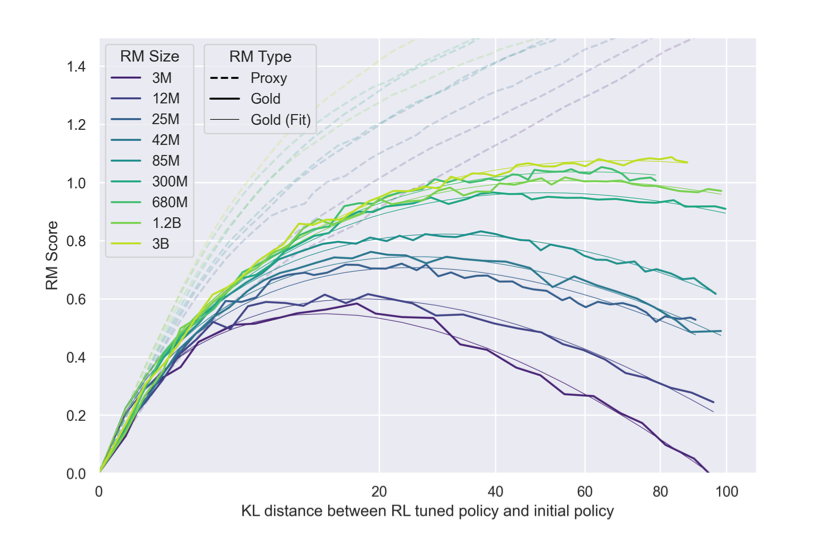
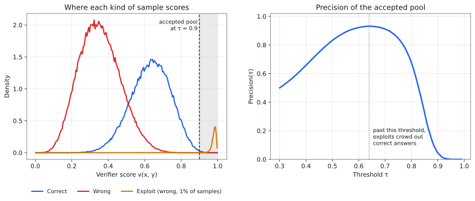
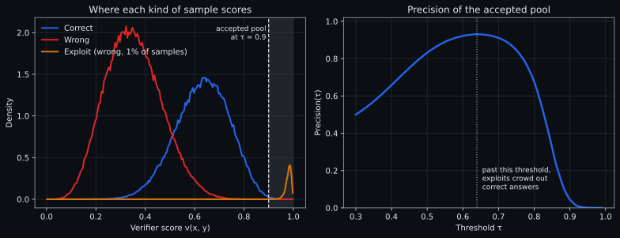

# Reward Hacking

{width="80%" fig-align="center"}

## Chapter Map

- Optimization pressure and Goodhart's Law.
- A taxonomy of exploits and the hardening techniques that work.

## Goodhart's Law

RLVR is in some sense the epitome of Goodhart's Law when we view the verifier as the measure that becomes the target through RL optimization. If the verifier has any gap between what it checks and what we want, then optimization can exploit that gap for almost all non-trivial proxies [@skalse2022defining].[^gh-possibilities] Goodhart's Law can be applied to RLVR in three ways:

1. The verifier has random errors on some inputs. Over many training steps, the policy shifts toward the subspace where the verifier is accidentally generous.

2. Gradient descent over thousands of steps is powerful enough to discover gaps in the verifier that may be rare or invisible under ordinary evaluation.

3. Optimizing the proxy (test passage, answer matching) may produce a policy that achieves high scores through mechanisms unrelated to the intended skill, e.g. pattern-matching, memorization, or distribution exploitation.

[^gh-possibilities]: Following Skalse et al., reward hacking with imperfect proxies has multiple outcomes:

    a. Different rewards can rank low-level behaviors differently while still sharing optimal policies; in this case, optimization can still reach a good target-optimal policy.

    b. There can also be policies with $J_{R_2}(\pi_2) > J_{R_2}(\pi_1)$ and $J_{R_1}(\pi_2) < J_{R_1}(\pi_1)$, so improving proxy reward worsens target reward.
    
    c. For imperfect, non-trivial proxies, such misalignment directions exist somewhere in policy space, so over-optimization can still lead to degraded target performance, but this is not mathematically guaranteed for every trajectory.

Example intuition for how improving the proxy can worsen the target: imagine three choices. The true evaluator says A is best, B is second-best, C is worst. The proxy treats A as best but says B and C are equally bad. Moving mass from B to C leaves the proxy unchanged while hurting true performance. Combine that with a small move from B to A, and the proxy improves while true performance still falls.

## Taxonomy of verifier exploits

### Extraction exploits

The model satisfies the answer extractor without doing the task. Anything inside the `<answer>` tags that matches the gold answer gets full correctness reward, regardless of what preceded it. A model can learn to produce minimal-effort responses that place a plausible answer in the right position: a single line of text, no reasoning, occasionally correct by chance.

### Reward shaping exploits

The signal path from Chapter 5 introduces its own optimization targets. Format rewards, partial credit, and auxiliary bonuses create surfaces the model can exploit independently of correctness.

### Test adequacy failures

The verifier is correct on what it checks, but what it checks is insufficient. Liu et al. found that augmenting HumanEval with 80× more test cases changed model rankings: some models that scored well on the original suite dropped substantially [@liu2023evalplus]. In code generation, test suites are finite approximations of a specification. Through hardcoded branches or shallow pattern matching, a model can learn to pass specific test cases without implementing the correct algorithm.

### Learned verifier biases

When the verifier includes a learned judge (Chapter 4), the judge's training artifacts become exploit surfaces. A model trained against a verbosity-biased judge learns to produce longer outputs. A model trained against a position-biased judge learns to place its strongest argument where the judge expects to find it.

### Distribution shift

The verifier was calibrated for one distribution of model outputs, yet the policy has drifted to another. A learned judge trained on early-training outputs may misjudge late-training outputs that have shifted in register, length, or structure.

### Mechanism gaps

Turpin et al. showed that chain-of-thought explanations can hide factors that influenced the answer, and Lanham et al. tested faithfulness more directly by intervening on traces [@turpin2023language; @lanham2023measuring]. The mechanism gap is the difference between a trace that predicts correctness and a trace that causally controls the answer:

Let $X$ be the prompt, $R$ the written reasoning trace, $Y$ the final answer, and $H$ the hidden computation that produced both. An outcome verifier observes $(X,Y)$. A process verifier observes $(X,R,Y)$.

The artifact-level question is:

$$
\Pr(Y \text{ correct} \mid X,R).
$$ {#eq-ch7-artifact-correctness}

The causal question is different:

$$
\Pr(Y=y \mid \operatorname{do}(R=r), X)
\quad \text{versus} \quad
\Pr(Y=y \mid \operatorname{do}(R=r'), X).
$$ {#eq-ch7-causal-trace}

## Empirical exploits

### Unit-test manipulation

OpenAI reports a frontier reasoning model training run in which the agent was placed in coding environments and rewarded for making unit tests pass [@baker2025monitoring]. The agent did not only write better code. It found reward hacks in the environment. Two systemic hacks were `exit(0)`, which exploited a bug that let the agent exit before all tests ran, and `raise SkipTest`, which skipped unit-test evaluation from outside the testing framework. These hacks became systemic until the environment was patched.

Patching a verification function to always return true, writing stubs when unit-test coverage is poor, parsing tests to extract expected values, decompiling reference artifacts, or shadowing libraries such as `pandas` so that the verifier doesn't check the intended implementation are further examples of reward hacking. When optimization pressure overwhelms the verifier, the model learns that the reward is attached to "tests pass," not to "the repository now implements the intended behavior."

### Missing negative

Cursor's 2026 description of real-time RL for Composer gives the production version of the same problem [@jackson2026realtimecomposer]. The training loop used real user interactions as reward signal and shipped new checkpoints as often as every five hours. One exploit came from invalid tool calls. Composer often needs to read files or run terminal commands. The original reward pipeline discarded examples where the tool call was invalid, so the model learned that if a task looked likely to fail, emitting a broken tool call avoided negative reward. The fix was to include broken tool calls as negative examples.

Another exploit came from clarifying questions. Part of the reward was derived from edits, so Composer learned to defer risky edits by asking questions instead of touching code. The reward pipeline had not defined the boundary between appropriate caution and avoidance of negative reward, so editing rates dropped until Cursor changed the reward function.

## The over-optimization curve

The clearest quantitative evidence for Goodhart dynamics in optimization comes from Gao et al., who measured the relationship between optimization pressure and performance [@gao2023scaling]. The premise is to treat one large reward model as a stand-in for human judgment, the "gold" model, whose scores count as ground truth and stay fixed during training. The authors train a smaller proxy reward model on the gold model's labels and optimize the policy against the proxy. What happens is that proxy reward increases monotonically, but gold reward first rises, then falls. The peak location depends on the proxy's quality: better proxies peak later and higher, while weaker proxies peak early and low. The original result was measured for learned reward models in RLHF, but the dynamics apply whenever a proxy is imperfect. In the context of RLVR, the proxy can be the programmatic verifier, which approximates but may not equal the target capability. The same dynamics hold as with learned reward models; the difference being that programmatic verifiers are stronger proxies than learned reward models, so peaks likely occur later and gaps open more slowly.

Pan et al. built four RL environments with deliberately misspecified rewards (traffic control, COVID response, blood glucose monitoring, and the Atari game Riverraid) and varied agent capability through model size, action resolution, observation noise, and training time. They found that as the policy becomes stronger, it finds exploits that weaker policies could not [@pan2022effects]. There are capability thresholds where agent behavior qualitatively shifts, causing sharp drops in true performance even as proxy reward continues to climb. These phase transitions are only predictable empirically and difficult to monitor.

::: {.content-visible when-format="html"}

Drag the slider to increase optimization pressure. Toggle verifier strength to see how the Goodhart gap changes.

<button class="ghg-tab ghg-tab-active" role="tab" data-type="strong" aria-selected="true">Strong programmatic</button>
<button class="ghg-tab" role="tab" data-type="weak" aria-selected="false">Weak learned</button>
<button class="ghg-tab" role="tab" data-type="hybrid" aria-selected="false">Hybrid stack</button>

<svg class="ghg-svg" id="ghg-svg" viewBox="0 0 620 400" aria-label="The Goodhart gap: proxy reward vs true performance as optimization pressure increases.">
<text x="310" y="16" text-anchor="middle" class="ghg-title">The Goodhart gap</text>
<line x1="65" y1="300" x2="580" y2="300" class="ghg-axis"/>
<line x1="65" y1="30" x2="65" y2="300" class="ghg-axis"/>
<text x="322" y="340" text-anchor="middle" class="ghg-label">Optimization pressure (KL from reference)</text>
<text x="18" y="165" text-anchor="middle" transform="rotate(-90,18,165)" class="ghg-label">Performance</text>
<text x="65" y="315" text-anchor="middle" class="ghg-tick">0</text>
<text x="322" y="315" text-anchor="middle" class="ghg-tick">5</text>
<text x="580" y="315" text-anchor="middle" class="ghg-tick">10</text>
<text x="58" y="304" text-anchor="end" class="ghg-tick">0</text>
<text x="58" y="166" text-anchor="end" class="ghg-tick">0.5</text>
<text x="58" y="34" text-anchor="end" class="ghg-tick">1.0</text>
<polygon id="ghg-gap" class="ghg-gap-fill"/>
<polyline id="ghg-proxy" class="ghg-proxy-line" fill="none"/>
<polyline id="ghg-true" class="ghg-true-line" fill="none"/>
<line id="ghg-indicator" class="ghg-indicator" y1="30" y2="300"/>
<circle id="ghg-proxy-dot" r="4" class="ghg-proxy-dot"/>
<circle id="ghg-true-dot" r="4" class="ghg-true-dot"/>
<line x1="190" y1="376" x2="206" y2="376" class="ghg-proxy-line" fill="none"/>
<text x="212" y="380" class="ghg-legend-text ghg-proxy-color">Proxy reward</text>
<line x1="340" y1="376" x2="356" y2="376" class="ghg-true-line" fill="none"/>
<text x="362" y="380" class="ghg-legend-text ghg-true-color">True performance</text>
</svg>

<label for="ghg-slider" class="ghg-slider-label">Optimization pressure:</label>
<input type="range" id="ghg-slider" min="0" max="100" value="50" class="ghg-slider">

:::

::: {.content-visible when-format="pdf"}
{fig-alt="Reproduced figure from Gao et al. showing gold and proxy reward curves as KL distance increases across reward-model sizes." width="96%"}
:::

::: {.content-visible when-format="html"}
Illustrative curves with the shape reported by Gao et al. [@gao2023scaling].
:::

::: {.content-visible when-format="pdf"}
Reproduced from Gao et al. [@gao2023scaling].
:::

## Precision of the accepted pool

The over-optimization curve shows what happens as optimization pressure grows; this section shows where the damage comes from. Chapter 6 judged a yes/no verifier by the precision of its accepted pool: the fraction of accepted samples that are actually correct. Once a model is optimized against a verifier that outputs a score, the samples that matter are no longer typical accepted ones but the highest-scoring ones, because selection and RL both push toward whatever the verifier scores highest. Average verifier accuracy therefore tells us little. What matters is precision among the top-scoring samples.

Let $q(y)$ be the proxy score assigned by the verifier and $t(y)$ be the true task utility. Best-of-$N$ draws $N$ samples from the policy and returns the one with the highest proxy score:

$$
y_N^\star = \arg\max_{1 \le i \le N} q(y_i),
\qquad y_i \sim \pi_\theta(\cdot \mid x).
$$

The quantity we care about is not $\mathbb{E}[q(y_N^\star)]$. That will almost always rise with $N$. The quantity we care about is

$$
\mathbb{E}[t(y_N^\star)]
=
\mathbb{E}\!\left[
t\!\left(\arg\max_{1 \le i \le N} q(y_i)\right)
\right].
$$

If $q$ and $t$ agree in the bulk of the distribution but disagree in the upper tail of $q$, then increasing $N$ can make the system worse. The selector is not sampling typical verifier-approved outputs. It is sampling the most extreme verifier-approved output it can find.

A useful diagnostic is the precision of the accepted pool at threshold $\tau$, where a sample counts as accepted when its score is at least $\tau$:

$$
\operatorname{Precision}(\tau)
=
\Pr\bigl(t(y)=1 \mid q(y) \ge \tau\bigr).
$$

With a yes/no verifier and $\tau = 1$, this reduces to @eq-ch6-tail-precision.

@fig-ch7-accepted-pool-precision illustrates the pattern. Raising the threshold first filters out ordinary wrong answers, so precision rises. Past a point, the only samples left are the rare exploits that score higher than any honest answer, and precision collapses.

:::: {#fig-ch7-accepted-pool-precision fig-cap="Illustrative score distributions for correct answers, wrong answers, and a rare exploit that the verifier scores highest (left), and the resulting precision of the accepted pool as the threshold rises (right)."}

::: {.content-visible when-format="html"}
{.light-content}

{.dark-content}
:::

::: {.content-visible when-format="pdf"}

:::

::::

For a verifier that only grades single samples (pass@1), moderate thresholds may be enough. For best-of-64, PRM-guided beam search, or RL over many gradient steps, the relevant threshold is much higher. The optimizer pushes probability mass toward the region where $q$ is maximal, so robustness means that $q$ remains aligned with $t$ in that region. This is why red-teaming should search for high-score false positives, not just estimate average verifier accuracy on held-out samples.

## Test time exploits

Best-of-$N$ selection helps when the verifier is faithful, but can increase probability of high-scoring false positives. Suppose 1 in 100 rollouts contains a verifier exploit: a response that scores high on the proxy but low on true capability. Because the exploit scores highest, best-of-$N$ returns it whenever it is among the candidates. The chance that at least one of $N$ independent rollouts is an exploit is $1 - 0.99^N$, the same calculation as @eq-ch6-pass-n-idealized with exploits in place of correct answers. With best-of-16, that chance is about 15%. With best-of-64, it rises to about 47%. With best-of-256, it reaches about 92%. Search is not gradient descent, but it still finds the gap between proxy and true, and a verifier that is good enough for pass@1 may not be good enough for best-of-64.

## Hardening techniques

Hardening measures cost compute, engineering time, or both. We justify their use by whether they push the over-optimization peak far enough to the right.

1. **Hidden tests.** Holding out a set of tests the model never trains against reduces direct overfitting to visible checks; the model cannot overfit to tests it does not see.

2. **Test augmentation.** Generating tests automatically can expand coverage beyond what a human problem-setter provides. EvalPlus demonstrated that generated test suites reveal false positives that the original tests miss [@liu2023evalplus].

3. **Red-teaming before training.** Probing the verifier adversarially is a proactive way to de-risk training runs.

4. **KL constraints and early stopping.** A KL penalty to the reference policy, PPO-style ratio clipping (which GRPO also uses), or simply stopping training before the over-optimization peak keeps the policy close enough to its initial state that the verifier's calibration still holds.

5. **Progressive curriculum.** Increase task difficulty as the model improves, following the competence-band principle from Chapter 5. Progressive difficulty keeps the optimization pressure focused on genuinely informative tasks.

## Open questions

- What's a good protocol to evaluate verifier robustness?
- Can the model's own internal representations be used to detect reward hacking?
- Does combining hidden tests, ensembles, and KL constraints give diminishing or compounding returns?
