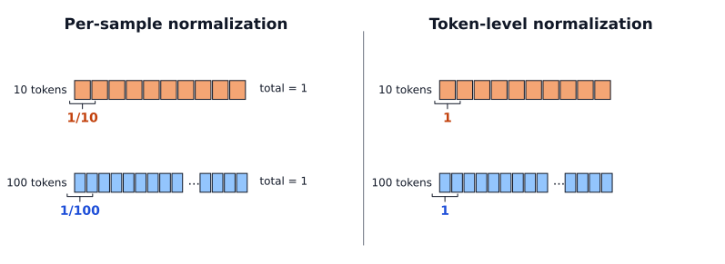
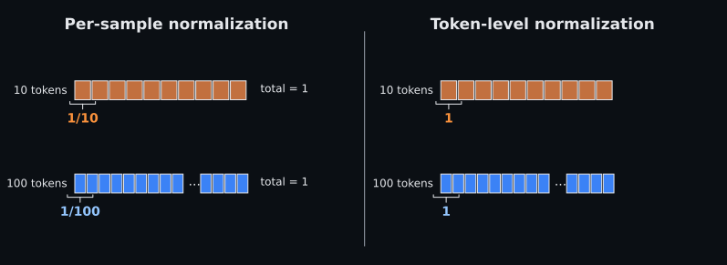
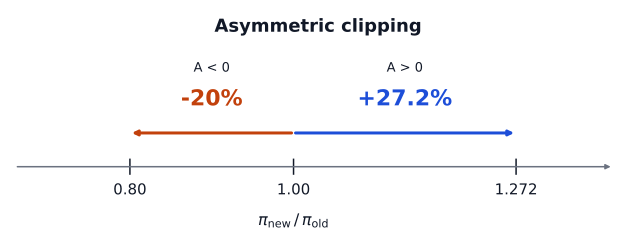
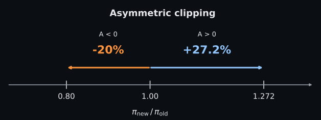
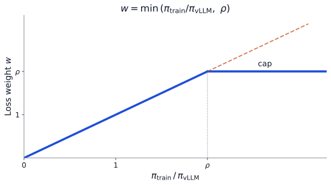
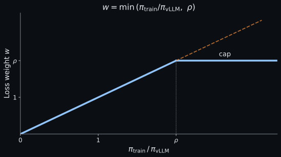

# A Frontier Recipe

{width="80%" fig-align="center"}

## Chapter Map

- Describe OLMo 3 Think's RLVR recipe, contrasted with Kimi K3 and DeepSeek-V4.1-Flash.
- Scope: a case study in hybrid frontier post-training, where RLVR is the final stage of an SFT, DPO, RLVR pipeline rather than a standalone recipe

## Setup

We pick OLMo 3, because it explains the complete pipeline of training frontier models. The starting point is from OLMo 3 Base. Ai2 trains that base model through pretraining on broad language, code, math, and knowledge domains. Midtraining adds a 100B-token capability-focused mix. There is then a long-context extension phase that lets the model handle contexts up to roughly 65K tokens, before Post-training [@teamolmo2025olmo3; @ai22025olmo3blog].

## Post-training

1. Think SFT trains the model to produce structured reasoning traces.
2. Think DPO tunes the model with contrastive preference data.
3. Think RLVR updates the model with outcome rewards from verifiers and LM judges.

If we zoom into the RLVR recipe specifically, we get the following sequence:

1. Initialize the policy from the Think DPO checkpoint.
2. Draw training prompts from the Dolci-Think-RL dataset.
3. Use asynchronous actor-learner infrastructure to sample long reasoning rollouts from the DPO-initialized policy.
4. Score each rollout with a domain-specific reward function.
5. Keep prompt groups with non-zero reward variation.
6. Update the policy with OlmoRL, Ai2's GRPO-based trainer, using each rollout's reward minus the same-prompt group mean as the advantage.

## GRPO

The following modifications are made to vanilla GRPO.

**Zero-gradient filtering.** Any group of rollouts where all samples have the same reward is removed to avoid training on samples that provide zero gradient.

**No KL loss.** There is no KL loss, to prevent restrictive policy updates.

**Token-level loss.** A token-level loss is used despite the reward being outcome based; the reason for this is to normalize the loss by the total number of tokens across the batch, rather than per sample, to avoid length bias. Suppose one model response is 10 tokens long and another is 100 tokens long. If you normalize loss per sample and both samples had the same reward, each response contributes equally in total, so each token of the longer response counts one-tenth as much as a token of the shorter one. With token-level normalization every token counts equally, as @fig-ch9-token-level-normalization shows.

:::: {#fig-ch9-token-level-normalization fig-cap="Per-sample normalization gives each response a total weight of one, so tokens in long responses count less; token-level normalization gives every token the same weight."}

::: {.content-visible when-format="html"}
{.light-content}

{.dark-content}
:::

::: {.content-visible when-format="pdf"}

:::

::::

**Asymmetric clipping.** GRPO already limits how much one update can change token probabilities, and the clipping is tweaked to be asymmetric, such that the positive limit is larger than the negative limit. The objective stops pushing a positive-advantage token's probability up once it has risen 27.2% relative to the sampling policy, but stops pushing a negative-advantage token's probability down after a 20% drop (@fig-ch9-asymmetric-clipping). The looser upper bound comes from DAPO, which found that a symmetric clip keeps unlikely but rewarded tokens from gaining probability quickly, so the policy stops exploring and its entropy collapses [@yu2025dapo].

:::: {#fig-ch9-asymmetric-clipping fig-cap="Clipping thresholds on the probability ratio in OlmoRL: 0.8 below and 1.272 above. They bound how far one update pushes a token, not the probability itself."}

::: {.content-visible when-format="html"}
{.light-content}

{.dark-content}
:::

::: {.content-visible when-format="pdf"}

:::

::::

**No standard-deviation normalization.** The advantage calculation uses a simplified group-relative advantage $A_i = r_i - \bar r$ instead of $A_i = (r_i - \bar r) / \sigma_r$, because dividing by a tiny within-group standard deviation can artificially magnify prompts where all completions had almost the same reward.

**Truncated importance sampling.** Rollouts come from actors whose weights can lag the learner's, so GRPO weights each token by the ratio between its probability under the current policy and under the policy that sampled it, the same ratio the clipping bounds; a token the policy has since made more or less likely counts accordingly. OLMo 3 ran into a subtler mismatch: even with identical weights, vLLM and the training engine assign slightly different probabilities to the same token, because their kernels add floating-point numbers in different orders and the result depends on the batch size [@he2025nondeterminism]. To correct for this, the loss is multiplied by the ratio of the trainer's probability to vLLM's, capped at $\rho$ so that no single token can dominate the update [@yao2025offpolicy]. @fig-ch9-truncated-importance-sampling shows the resulting weight.

:::: {#fig-ch9-truncated-importance-sampling fig-cap="Truncated importance sampling: each token's loss is weighted by the ratio of the trainer's probability to vLLM's, up to a cap."}

::: {.content-visible when-format="html"}
{.light-content}

{.dark-content}
:::

::: {.content-visible when-format="pdf"}

:::

::::

## Rewards

OLMo 3 Think is trained on four reward domains:

- Math uses a rule-based verifier that normalizes the model's final answer and performs a symbolic check through SymPy to determine if the model answer symbolically matches the correct answer. It returns 1 when the answer matches and 0 otherwise.

- Code is checked against test cases; the report experiments with two rewards: percentage of tests passed, or a binary reward that returns 1 only when all tests pass.

- Instruction following uses constraint functions to verify the response satisfies the prompt's listed constraints, e.g. "were there two paragraphs?" The reward is 1 if the response satisfies all constraints and 0 otherwise.

- LLM-as-a-Judge with Qwen3 32B as the judge is used in two scenarios.[^ch8-chat-judge-example]

    1. Reference-based chat, where the judge compares the model response with a provided reference answer.
    2. Open-ended chat; the judge scores the response without a reference.

## Filtering and data mixing

Prompt filtering is the first step, where eight rollouts are sampled per prompt from the initial DPO checkpoint, and any prompts with pass rate greater than 62.5% are removed from the dataset. This is done offline before RL, and then the model is trained over the filtered prompts. The 32B run skipped this step by reusing the 7B's filtered prompts, and filtered rollouts during training. Online, the actors generate rollouts for new prompts, throwing away groups whose rollouts all received the same reward (all correct or all wrong) until the desired batch size is reached.

The data mixture between the four domains is non trivial in determining downstream performance. Since every mixture could not be tested with a full run, 500 to 1000 step runs on individual datasets, starting from an intermediate SFT checkpoint, showed which datasets improved or regressed downstream evaluations, with periodic runs on the whole mixture to check that it stayed stable. The result was a mixed-domain batch with extra weight on math and instruction following [@teamolmo2025olmo3].

## The rollout system

These final reasoner rollouts have a maximum length of 32K tokens and average generations of more than 10K tokens [@teamolmo2025olmo3]. Because of the long sequences, static batching results in actors having to wait for the slowest link, which can be up to 32K-tokens, wasting compute. Continuous batching backfills finished rollouts, and the report estimates that static batching wastes up to 54% of compute at a 32K generation length.

Training uses a fully asynchronous setup, where we prompt actors served on vLLM to generate responses. The current policy trains from the samples the actors return, with inferencing using much more compute than training: for the 32B reasoner, there were 20 nodes for inference and 8 H100 nodes for training, while the 7B reasoner had 7 inference nodes and 2 learner nodes.

## PipelineRL

RLVR must both generate rollouts and train a policy, and similar to the computation vs communication tradeoff, we want to overlap the two operations to the greatest extent possible in order to saturate compute to the greatest extent. PipelineRL runs generation and training concurrently, then sends in-flight weight updates to the generation engines so actors keep generating with fresher weights [@piche2025pipelinerl].

Concretely:

1. Run an optimizer step on the current policy and get new weights.
2. The learner broadcasts the new parameter tensors.
3. The actors load the new weights.
4. The actors resume the same generation queue.

The weird part is the KV cache. The technical report states despite the prefix cache being computed under the older weights, they **do not invalidate/clear the KV cache** when swapping in the new weights, because empirically they found it worked: up to 4x faster with the same resources, without hurting accuracy.[^ch8-inflight-update-boundary] In fact, the released 7B Think RLVR run used Ai2's initial infrastructure, without PipelineRL, and took 15 days; a replication on the newer infrastructure, which added PipelineRL among other changes, reached similar performance in 6 days [@teamolmo2025olmo3].

| Infrastructure | Tokens per second | Memory bandwidth utilization |
|---|---:|---:|
| OLMo 2 baseline | 881 | 12.9% |
| + continuous batching | 975 | 14.3% |
| + better threading | 1,358 | 19.9% |
| + in-flight updates (OLMo 3) | 2,949 | 43.2% |

: Throughput as each OlmoRL change is added, measured in a two-hour benchmark on two 8xA100 nodes [@teamolmo2025olmo3]. {#tbl-ch9-olmorl-throughput}

@tbl-ch9-olmorl-throughput shows where the speed comes from: in-flight updates alone more than double throughput.

## One prompt through the pipeline

The pieces above are easiest to hold together by following a single prompt through one training step. Take a competition-math prompt from the math slice of Dolci-Think-RL (the dataset holds roughly 105K prompts: about 30K math, 30K instruction following, 23K code, and 21K chat), and use the 7B Think configuration [@teamolmo2025olmo3].

1. **Dataset.** The prompt is in the pool to begin with because it survived offline filtering: eight rollouts from the DPO checkpoint at temperature 1.0 solved it 3 times out of 8, a 37.5% pass rate, below the 62.5% removal threshold.
2. **Actor rollout group.** An actor, one vLLM instance on one GPU of the 56-GPU actor pool, picks up the prompt and samples a group of $G = 8$ reasoning rollouts at temperature 1.0, each capped at 32K tokens.
3. **Reward vector.** The math verifier extracts each rollout's final answer, normalizes it, and checks symbolic equality against the reference with SymPy. Say it returns $r = (1, 0, 0, 1, 0, 0, 0, 1)$: three of eight correct.
4. **Filtering.** The rewards are not all identical, so the group carries gradient signal and is kept. Had all eight matched, the group would be dropped, and the actors would keep generating replacement groups from new prompts until the batch held its full 64 unique prompts, 512 rollouts in total.
5. **Advantage.** The group mean is $\bar r = 0.375$. Each correct rollout gets advantage $A_i = 1 - 0.375 = +0.625$; each incorrect one gets $-0.375$. That one scalar is broadcast to every token of its rollout.
6. **Learner update.** The token-level loss sums over all tokens of all 512 rollouts in the batch and normalizes by the total token count, and the asymmetric clip range $[0.8, 1.272]$ lets positive-advantage tokens move further than negative ones.
7. **Refreshed actors.** In the released 7B run, which used Ai2's initial infrastructure, the actors sync to the new weights after each step, running at most one step behind the learner. On the newer infrastructure, used in the 6-day replication, the learner instead broadcasts the new weights in-flight: the actor that generated our group swaps them in, keeps its KV cache, and continues the generations it had in progress, now under a slightly newer policy.

The loop then repeats from step 2 with the updated weights, roughly 1,400 times for the 7B reasoner.

## Takeaways

The technical report compares RL from SFT versus RL from DPO, and the result was that the latter gives a better result than the former: after 1,000 RL steps on the 7B model, starting from DPO averaged 74.1 on a subset of evaluations versus 71.9 from SFT, from one run each. The second lesson is that mixed-domain RL prevents over-optimization as opposed to single-domain RL. Interestingly, reward curves are not predictive of performance, the report states that even though the train reward was lower for the mixed run than the single-domain one, downstream performance is similar or better for a mixed dataset, i.e. a higher training reward can mean over-optimization to a narrower distribution.

## How other open recipes differ

OLMo 3 is the most fully open of the frontier recipes, with data, code, and checkpoints released, but it is not the only way to do RLVR at scale. Two recent reports from Chinese open-weight labs make useful contrasts: Kimi K3 [@kimiteam2026k3] and DeepSeek-V4.1-Flash [@deepseekai2026v41flash].

**Pipeline.** The three labs put RL in different places.

- **OLMo 3:** SFT, then DPO, then one RLVR stage over a mix of domains.
- **Kimi K3:** SFT, then RL on nine separate experts, one per domain and reasoning-effort level, then multi-teacher on-policy distillation of all nine into one model.
- **DeepSeek-V4.1-Flash:** SFT, then RL, then on-policy distillation.

**Where rewards come from.** All three reach past strict verifiers.

- **OLMo 3:** four domain verifiers, plus a Qwen3 32B judge for chat.
- **Kimi K3:** verifiable environments, plus, for tasks without one, a reward model that writes a rubric and runs a tournament of pairwise comparisons.
- **DeepSeek-V4.1-Flash:** synthesized tasks that each ship with their own verification system, audited by an inspection agent for ways to hack them.

**Stale and mismatched data.** All three train asynchronously and have to handle rollouts from older weights.

- **OLMo 3:** a capped importance-sampling ratio for engine mismatch, and in-flight updates that keep the KV cache.
- **Kimi K3:** rollouts that span several iterations, kept stable by a per-token regularizer, with rollout and training sharing one quantization scheme so the engines match.
- **DeepSeek-V4.1-Flash:** a bound on how off-policy the data may get, a mask on overly stale tokens, and a KV cache and expert routing that persist across weight updates.

**Length control.** Only the newer recipes control length directly.

- **OLMo 3:** none; a length-control verifier did not help.
- **Kimi K3:** a per-problem token budget, where exceeding it sets the reward to -1, and verbose outputs automatically lose judge comparisons.
- **DeepSeek-V4.1-Flash:** early short samples are discarded to counter the bias of asynchronous generation toward short rollouts.

Three patterns stand out. Both newer recipes train specialists and then distill them into one model, whereas OLMo 3 trains one policy on a domain mix and credits the mix with preventing over-optimization.

Where verifiers run out, Kimi K3's judge writes its own rubric for each task, and its length rule is a hard verifier bolted onto a learned one, the hybrid pattern of Chapter 4.

DeepSeek states that its post-training "introduces no algorithmic innovation" and that improvements in the scale, diversity, and verifiability of its tasks and environments "account for essentially all of the observed gains", which is this book's thesis stated by a frontier lab: the verifier and the environment matter more than the optimizer [@teamolmo2025olmo3; @kimiteam2026k3; @deepseekai2026v41flash].

[^ch8-chat-judge-example]: A prompt can be: "Explain the moon landing to a 6-year-old in a few sentences." In both reference-based and open-ended chat, the judge is prompted to score the response in $[0,1]$.

[^ch8-inflight-update-boundary]: Inflight updates do **not** restart generation. PipelineRL describes the engine pausing only briefly to receive the new weights before continuing the in-progress sequences [@piche2025pipelinerl]; OLMo 3 swaps them in without pausing the engine, relying on vLLM being thread-safe.
