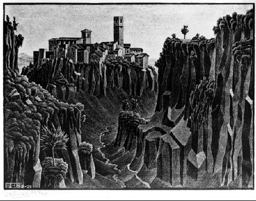

# Long-Context, Multimodal, and Agentic RLVR

{width="80%" fig-align="center"}

## Chapter Map

- Examine how RLVR stretches into long-context, multimodal, and agentic settings.
- Show why frontier tasks remain partially verifiable but become noisier, broader, and easier to misread.

## Domain Overview

This chapter should show how RLVR stretches beyond the cleanest domains without pretending the frontier is neat. Once evidence selection, perception, and environment interaction matter, the verifier often becomes a stack of partial checks rather than a single decisive rule.

The point is to show where verifier-first thinking still works and where it starts to fray.

## Verifier Regime

- Long-context verification: Checking grounded use of evidence over extended context windows.
- Multimodal verification: Checking outputs that depend on visual, auditory, or other non-textual evidence.
- Agentic verification: Checking behavior that unfolds through tool use, environment interaction, and temporal traces.

These settings move the field away from single clean checkers and toward partial, layered, and instrumented verification. The central design question becomes how much of the real task the verifier stack actually captures.

## Canonical Cases

- Citation-grounded long-context question answering.
- Vision-language tasks with verifiable perceptual subgoals.
- Tool-using agents whose traces can be checked for execution validity and grounded progress.

## Frontier coding harnesses

This is the place in the book where *harness* should become a first-class term. It is an environment-backed system for long-horizon rollouts: a repository state, a shell, tools, tests, hidden graders, task termination criteria, and instrumentation over the full trajectory.

That distinction matters because the verifier interface changes. In Chapter 5, the Brown-style script turns a final extracted answer into reward. In a coding harness, the checked object is much larger: file edits, command traces, test outcomes, runtime failures, partial progress markers, and the final repository state. Reward is usually assembled from several checks rather than one exact comparison.

This is also why frontier coding harnesses belong here rather than in the foundational verifier chapters. They are domain-specific systems for agentic RLVR, not the minimal template for the paradigm as a whole. Their difficulty is not just learning from a verifier; it is building an instrumented environment whose checks remain informative over long trajectories and resist benchmark gaming.

### Case study: Cursor's real-time RL loop

Cursor's March 2026 account of training Composer is a useful motivational case study because it makes the frontier harness concrete.[@jackson2026realtimecomposer] The training interface is not a single benchmark or a single answer checker. It is the live product stack: editor state, tool calls, user follow-ups, latency, eval gates, deployment logic, and a reward pipeline built from real user interactions. In that setting, the harness is not merely where the model acts. It is the system that turns production traces into training signal.

Two points from the case study matter for this chapter. First, it sharpens the train-test mismatch problem. Coding is unusually favorable for RL because the machine side of the environment can often be simulated well, but the human side is much harder to model. Cursor's argument for real-time RL is that training on real users and real environments removes one important layer of simulation error. Second, it makes reward hacking feel much more operational. The examples are not abstract benchmark exploits; they are system-level loopholes, such as emitting broken tool calls to avoid negative reward or overusing clarifying questions because the reward never properly turns against inaction.

That is why frontier coding harnesses deserve their own treatment. Once the model is optimizing against the full deployed stack, every seam in instrumentation, signal aggregation, and reward logic becomes a surface the policy can learn to exploit. But the same setup can also be more self-correcting than offline simulated RL, because real users expose broken reward proxies quickly. In this regime, the harness is both the training interface and the audit surface.

## Comparative Lessons

- Long-context tasks force a distinction between answer correctness and grounded evidence use.
- Multimodal tasks make perceptual ambiguity a first-class verifier problem.
- Agentic settings make temporal traces and environment instrumentation part of the verifier interface.
- Partial verification is often still useful, but it should not be oversold as full evaluation.

## Research Notes

- What is the right unit of verification for agentic trajectories?
- How can long-context tasks separate answer correctness from grounded evidence use?
- Which multimodal checks are robust enough to train against rather than only evaluate with?
