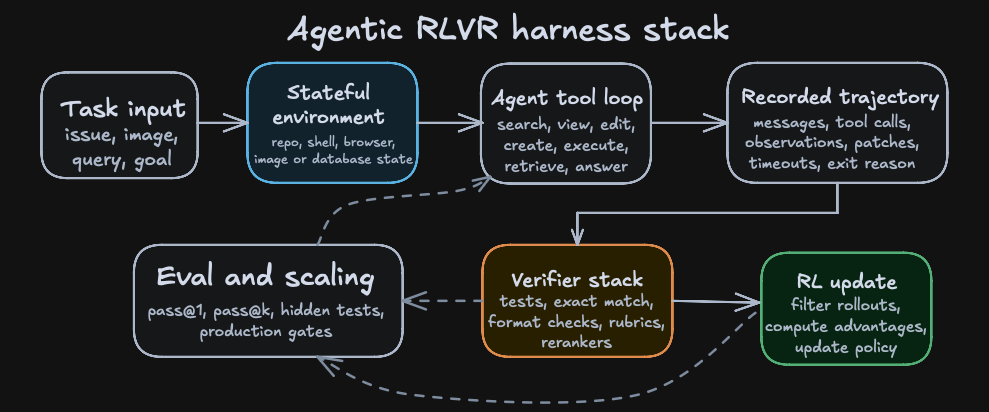

# Long-context, multimodal, and agentic RLVR

{width="80%" fig-align="center"}

## Chapter Map

- Move from single reward functions to harnesses.

## From reward functions to harnesses

Agents break the picture of the clean RLVR examples in earlier chapters, where a compact GRPO script could show the whole loop thanks to the task interface's narrowness. When dealing with agents, the output of a rollout may include any of a repository state, a browser state, an image, a shell transcript, tool arguments, observations, generated files, runtime failures, partial progress markers, and a termination decision.

Prime Intellect's Verifiers library gives a compact abstraction of an agentic environment which contains a dataset of task inputs, a model harness with tools, sandboxes, and context management, and a reward function or rubric.[@brown2025verifiers] rLLM describes the same idea from the training side: run the agent, collect traces, compute rewards, and update the model.[@tan2025rllm]

::: {#fig-ch9-agentic-harness-stack fig-cap="An agentic RLVR harness makes the trajectory, environment state, and verifier stack part of the training interface."}

::: {.content-visible when-format="html"}
{.light-content}

{.dark-content}
:::

::: {.content-visible when-format="pdf"}

:::

:::

## DeepSWE

DeepSWE is a software coding agent trained with the rLLM platform that uses Qwen3-32B as the brains of the harness and is trained with GRPO, resulting in 42.2% Pass@1, 71.0% Pass@16, and 59.2% when using a verifier to select between the 16 rollouts.[@rllm2026deepswe]

The training environment is a subset of R2E-Gym (an alternative to Verifiers), i.e. dockerized and executable software-engineering tasks with natural-language task descriptions, repositories, unit tests, and reward calculation by running tests; 512 parallel Docker containers are used for training.[@jain2025r2egym]

A DeepSWE-style rollout has this shape:

1. The task is a natural-language issue against a repository at a fixed commit.
2. The model searches for relevant symbols and files.
3. The model views code and accumulates local evidence in a long context window.
4. The model edits or creates files.
5. The model executes commands or tests and observes failures.
6. The model revises the patch until it stops or hits the step limit.
7. The harness records the trajectory, output patch, exit reason, timeout state, and reward.
8. The RL trainer filters unusable trajectories and updates the policy from successful or informative rollouts.

The crux here is that the harness itself shapes the policy (the Qwen model we are post-training) through returned its observations, unique tools, valid action syntax, and timeout rules. That is to say furthermore, that putting that post-trained model in an equivalent harness that only had different tool names or action syntax would lead to worse results, since the model learns the traces of the harness it's trained on.

Agentic coding is a great example of RL over long-context, because the model needs to decide which parts of a repository matter, which files to inspect, which error messages to remember, and which earlier edits constrain the next action. The context acts as working memory over a changing environment. With that being said, the verifier still sees the task through its narrow field of view. In other words, we can check that tests passed, but we can't readily verify that the model understood the codebase, found the minimal fix, preserved maintainability, or didn't cause untested regressions.

Conventional RLVR becomes brittle in agentic settings because terminal rewards are sparse: long multi-step tasks fail at almost every attempt, and most trajectories collapse to the same zero signal.[@da2025agentrlvr] Agent-RLVR proposes guidance as a fix. The agent attempts a software-engineering task, unit tests grade the trajectory, cues such as plans, error messages, and environment observations are fed back into the context, and the agent reattempts the task before the gradient step. On SWE-Bench Verified, the method lifts Qwen-2.5-72B-Instruct from 9.4% to 22.4% Pass@1.[@da2025agentrlvr]
