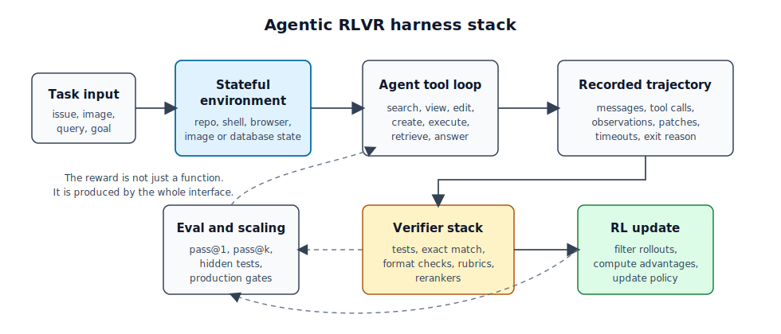

# Long-context, multimodal, and agentic RLVR

{width="80%" fig-align="center"}

## Chapter Map

- Move from single reward functions to harnesses.

## From reward functions to harnesses

Agents break the picture of cleanest RLVR examples in earlier chapters had a small checked artifact. A math model writes a final answer, the extractor normalizes it, and the reward function compares it to a gold answer. A compact GRPO script can show the whole loop because the task interface is narrow.

. The checked object expands beyond the final answer. It may include a repository state, a browser state, an image, a shell transcript, tool arguments, observations, generated files, runtime failures, partial progress markers, and a termination decision. The reward function remains important. The **harness** becomes the central object.

Here, a harness means the environment-backed interface that turns a model rollout into something trainable and auditable. Prime Intellect's Verifiers library gives a compact version of the abstraction: an environment contains a dataset of task inputs, a model harness with tools, sandboxes, and context management, and a reward function or rubric.[@brown2025verifiers] rLLM describes the same idea from the training side: run the agent, collect traces, compute rewards, and update the model.[@tan2025rllm] Chapter 9 uses that conceptual jump.

::: {#fig-ch9-agentic-harness-stack fig-cap="An agentic RLVR harness makes the trajectory, environment state, and verifier stack part of the training interface."}

::: {.content-visible when-format="html"}

:::

::: {.content-visible when-format="pdf"}

:::

:::

The harness brings long context, multimodality, and agency into one training interface. Long context forces evidence selection. Multimodality forces grounded perception. Agency forces action sequencing. In all three cases, the verifier sees the records and checks that the harness exposes.

## The running example: DeepSWE and R2E-Gym

DeepSWE in rLLM, evaluated through R2E-Gym, gives this chapter its strongest open running example. It sits close to the current open frontier, uses an environment-backed software task, runs long-context multi-turn trajectories, and reports rewards plus test-time scaling.

rLLM's DeepSWE example trains a software-engineering agent on top of Qwen3-32B, using GRPO with compact filtering on an R2E-Gym subset and evaluating on SWE-Bench Verified.[@rllm2026deepswe] The public example reports a 65,536-token maximum context, Docker and Kubernetes environment isolation, 512 parallel Docker containers for training, and a SWE agent action space consisting of search, view, edit, create, and execute. It reports DeepSWE-Preview at 42.2% Pass@1, 71.0% Pass@16, and 59.2% after test-time scaling on SWE-Bench Verified.[@rllm2026deepswe]

R2E-Gym supplies the environment side: executable software-engineering tasks with natural-language task descriptions, repositories, unit tests, and reward calculation by running tests.[@jain2025r2egym] The repository describes R2E-Gym as more than 8.1K problems across 13 repositories, with generated executable environments and hybrid verifier support. The hard part is producing enough environments where the model can act, fail, recover, and receive a signal coupled to real software behavior.

An illustrative DeepSWE-style rollout has this shape:

1. The task is a natural-language issue against a repository at a fixed commit.
2. The model searches for relevant symbols and files.
3. The model views code and accumulates local evidence in a long context window.
4. The model edits or creates files.
5. The model executes commands or tests and observes failures.
6. The model revises the patch until it stops or hits the step limit.
7. The harness records the trajectory, output patch, exit reason, timeout state, and reward.
8. The RL trainer filters unusable trajectories and updates the policy from successful or informative rollouts.

The setup remains RLVR, with the verifier moved outward. The final unit-test reward forms one endpoint of a larger interface. The harness also shapes the policy through returned observations, exposed tools, valid action syntax, timeout rules, and compact filtering.

## DeepSWE as long-context RLVR

DeepSWE works better as a long-context case than a synthetic "needle in a haystack" task because the long context is operational. The model needs to decide which parts of a repository matter, which files to inspect, which error messages to remember, and which earlier edits constrain the next action. The context acts as working memory over a changing environment.

The verifier still sees the task through a narrow aperture. It can check whether tests pass. It can record tool calls and timeouts. It can compare candidate patches at test time. It cannot certify that the model understood the codebase, found the minimal fix, preserved maintainability, or avoided every untested regression. Chapter 2's outcome-reward limitation now spans a longer and more expensive trajectory.

Software engineering works as a bridge domain. It has more structure than open-ended web tasks because code can be executed. It has less structure than formal proof because unit tests are incomplete. The harness gives the model a live environment, while the reward remains a partial proxy for the software property we care about.

## Why sparse agentic rewards need help

Agent-RLVR makes the sparse-reward problem explicit. Da et al. start from the observation that conventional RLVR becomes brittle in agentic settings because long multi-step tasks have high failure rates and sparse rewards.[@da2025agentrlvr] Their proposed fix is guidance: the agent first attempts a software-engineering task, unit tests validate the trajectory, guidance is added from cues such as plans, error feedback, and environment interactions, and the agent reattempts the task before the policy update. On SWE-Bench Verified, they report improving Qwen-2.5-72B-Instruct from 9.4% to 22.4% Pass@1, with an additional test-time reward-model boost to 27.8%.[@da2025agentrlvr]

rLLM plus R2E-Gym carries the main example because it exposes more of the harness. Agent-RLVR still teaches a useful lesson: when almost all unguided rollouts fail, a terminal pass/fail reward can be too sparse to train against. Guidance, curriculum, filtering, or test-time reranking can become part of the practical RLVR system, even when the final reward comes from the environment.

Each helper adds another proxy surface. A guidance generator can leak solution structure. A learned reranker can reward plausible patches. A compact filter can discard hard but useful trajectories. Ask which parts of the harness shape the policy.

## Multimodal bridge: MMSearch-R1

MMSearch-R1 is the multimodal bridge case. It trains a large multimodal model to decide when to search, what to search, and how to use retrieved evidence in multi-turn visual question answering.[@wu2025mmsearchr1] The tools are simple enough to explain: an image search tool retrieves image-relevant web pages, and a text search pipeline retrieves and summarizes pages for a query. The rollout continues until the model answers or reaches the turn limit.

MMSearch-R1's reward gives a good teaching case. It uses an outcome-based accuracy score with a search penalty, plus a format score. Exact answer matching gives the base correctness signal. For correct answers, using search incurs a penalty, which encourages the model to search when needed. The paper reports that this combination, together with search-balanced data, reduces unnecessary search and improves performance relative to fixed RAG workflows of the same model size.[@wu2025mmsearchr1]

MMSearch-R1 gives a different kind of partial verification from software engineering. In DeepSWE, the harness can run tests against a patch. In MMSearch-R1, the harness can check a concise final answer and whether the model followed the search/action format, while perception and evidence use remain underchecked. The image may have been useful, irrelevant, or correlated with the answer by accident. The search trace may look reasonable without causal necessity. The verifier can train useful behavior without certifying visual grounding.

The multimodal lesson is direct: a verifiable final answer can improve a multimodal agent without verifying the modality. To train vision-grounded behavior rather than answer-matching behavior, the harness needs better grounding checks, balanced data, or tasks where the visual information is necessary for reward.

## Production harnesses: Cursor's real-time RL loop

Cursor's March 2026 account of training Composer gives a useful production contrast because it makes the frontier harness concrete.[@jackson2026realtimecomposer] The training interface is the live product stack: editor state, tool calls, user follow-ups, latency, eval gates, deployment logic, and a reward pipeline built from real user interactions. In that setting, the harness turns production traces into training signal.

Two points from the case study matter here. First, it sharpens train-test mismatch. Coding gives RL a favorable machine-side environment because tests and repositories can often be simulated, while the human side remains harder to model. Cursor argues that training on real users and real environments removes one layer of simulation error. Second, the case study makes reward hacking operational. The examples are system-level loopholes, such as emitting broken tool calls to avoid negative reward or overusing clarifying questions because the reward never turned against inaction.[@jackson2026realtimecomposer]

DeepSWE shows the open benchmark-harness version. Cursor shows the product-harness version. Once the model optimizes against the full deployed stack, every interface in the harness becomes part of the reward surface.

## Systems comparison

Read the current open ecosystem as a set of complementary harness designs.

| System | Domain | Harness role | Reward or verifier signal | Why it matters here |
| --- | --- | --- | --- | --- |
| rLLM DeepSWE / R2E-Gym | Software engineering | Main running example | Unit-test and SWE environment reward, plus test-time scaling | Strongest open case for long-context multi-turn agentic RLVR.[@rllm2026deepswe; @jain2025r2egym] |
| Prime Intellect Verifiers | General RL environments | Abstraction layer | Dataset plus harness plus reward/rubric | Cleanest public vocabulary for the harness object.[@brown2025verifiers] |
| Agent-RLVR | Software engineering | Sparse-reward bridge | Unit tests plus guided reattempts | Shows why terminal rewards need help in hard agentic tasks.[@da2025agentrlvr] |
| MMSearch-R1 | Multimodal search VQA | Multimodal bridge | Exact answer, search penalty, format score | Shows how simple rewards can shape on-demand tool use without verifying all grounding.[@wu2025mmsearchr1] |
| SkyRL-Agent | Multi-turn agents | Scalable systems foil | SWE and agent-task environment rewards | Emphasizes async dispatch, tool-enhanced training, and backend interoperability.[@cao2025skyrlagent] |
| Agent Lightning | General agents | Decoupling architecture | Unified transition interface and hierarchical RL | Shows how existing agents can be connected to RL training without rewriting the agent runtime.[@luo2025agentlightning] |
| ART | General Python agents | Ergonomic trainer | User-defined trajectory reward with GRPO | Shows the small-API version of agent RL integration.[@openpipe2025art] |
| AgentFly | Multi-turn and multimodal agents | Tool/reward framework | Decorator-defined tools and rewards, async execution | Shows a veRL-based alternative with multimodal support.[@wang2025agentfly] |

"Open-source RL harness" is underspecified. For a high-value textbook example, choose rLLM DeepSWE/R2E-Gym. For a general environment vocabulary, use Verifiers. For multimodal search, use MMSearch-R1. For systems scalability, compare SkyRL-Agent and AgentFly. For integration into existing agents, compare Agent Lightning, ART, and rLLM.

## What the verifier sees and misses

In these frontier domains, the verifier sees more than a final answer but still less than the task.

For long-context SWE agents, it sees the issue statement, tool trajectory, file edits, command outputs, timeout state, and test results. It may miss untested behavior, maintainability, security, user intent, and whether the model found the fix for the right reason.

For multimodal search agents, it sees the image input, search calls, retrieved snippets, final answer, and action format. It may miss whether the visual evidence played a causal role, whether the retrieved page was trustworthy, and whether the model learned grounded perception or answer priors.

For production coding agents, it sees a much richer stream: real user interactions, editor state, tool calls, latency, follow-up behavior, eval gates, and deployment outcomes. It may still miss long-run user satisfaction, rare side effects, organizational context, and reward loopholes introduced by instrumentation.

The frontier lesson: RLVR becomes systems engineering. The reward depends on the harness that makes the task legible.

## Comparative lessons

- Long-context RLVR depends on which evidence the harness makes available, remembers, and checks.
- Multimodal RLVR depends on whether the visual or multimodal channel is necessary for reward.
- Agentic RLVR depends on which parts of the trajectory become optimization targets.
- Open benchmark harnesses and production harnesses have different failure modes. Benchmarks risk overfitting to task distributions and test suites. Production systems risk instrumenting the wrong user behavior.
- Test-time verification and train-time RL are coupled. DeepSWE's Pass@1 and Pass@16 numbers should be read as different points in the same verifier-mediated system, not as interchangeable model-quality claims.

## Research notes

- Unit of verification: final state, patch, command trace, tool call, subgoal, or complete episode?
- Multimodal grounding: can harnesses verify grounding with enough strength to train perception, rather than answer accuracy alone?
- Guidance limits: how much guidance or filtering can a recipe add before the method becomes distillation through a hidden teacher?
- Benchmark reports: what should a report include to separate policy quality, harness quality, test-time scaling, and reward-model reranking?
- Production signals: which signals are robust enough to train against without teaching models to exploit users, latency budgets, or instrumentation gaps?
