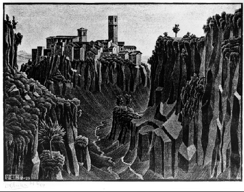
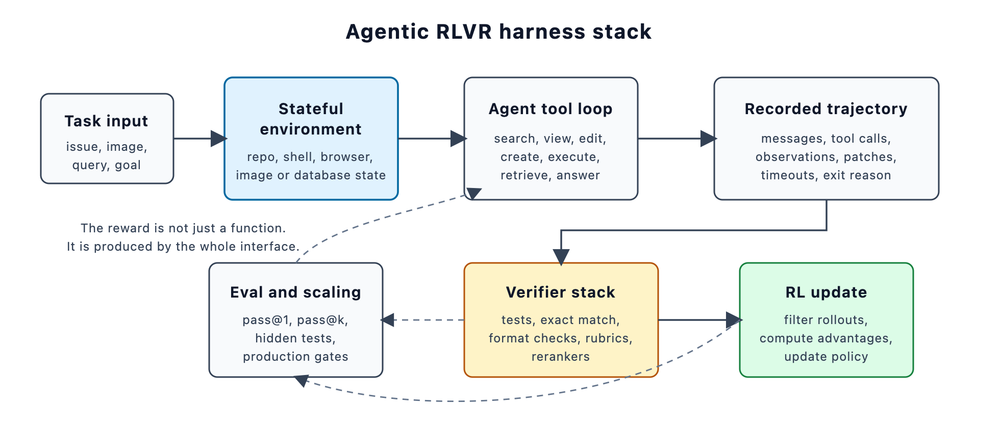

# Long-context, multimodal, and agentic RLVR

{width="80%" fig-align="center"}

## Chapter Map

- Move from single reward functions to harnesses.

## From reward functions to harnesses

Long-context and tool-using settings break the clean RLVR picture from earlier chapters. A rollout may now include repository state, browser state, images, shell transcripts, tool arguments, observations, generated files, runtime failures, partial progress markers, and a termination decision.

The harness decides what the policy is allowed to observe, what actions it can take, what state changes get logged, and which artifacts become reward-bearing. In a math problem, this surface can be tiny: prompt in, final answer out, exact checker at the end. In long-context, multimodal, and agentic tasks, the harness becomes sacrosanct. It may log evidence spans, retrieved images, browser actions, shell output, patches, timeouts, and tool failures.

::: {#fig-ch9-agentic-harness-stack fig-cap="An agentic RLVR harness makes the trajectory, environment state, and verifier stack part of the training interface."}

::: {.content-visible when-format="html"}
{.light-content}

{.dark-content}
:::

::: {.content-visible when-format="pdf"}

:::

:::

## DeepSWE

DeepSWE is a software coding agent trained with the rLLM platform. It uses Qwen3-32B as the policy inside the harness and is trained with GRPO, resulting in 42.2% Pass@1, 71.0% Pass@16, and 59.0% when hybrid test-time scaling selects among 16 rollouts.[@agentica2025deepswe]

The training environment is a subset of R2E-Gym (an alternative to Verifiers), i.e. dockerized and executable software-engineering tasks with natural-language task descriptions, repositories, unit tests, and reward calculation by running tests; 512 parallel Docker containers are used for training.[@jain2025r2egym]

A DeepSWE-style rollout has this shape:

1. The task is a natural-language issue against a repository at a fixed commit.
2. The model searches for relevant symbols and files.
3. The model views code and accumulates local evidence in a long context window.
4. The model edits or creates files.
5. The model executes commands or tests and observes failures.
6. The model revises the patch until it stops or hits the step limit.
7. The harness records the trajectory, output patch, exit reason, timeout state, and reward.
8. The RL trainer filters unusable trajectories and updates the policy from successful or informative rollouts.

The crux here is that the harness itself shapes the policy (the Qwen model we are post-training) through the observations it returns, unique tools, valid action syntax, and timeout rules. That is to say, putting the post-trained model in an equivalent harness that only had different tool names would lead to worse results, since the tokens the model would need to generate in order call tools would be farther out of distribution.
