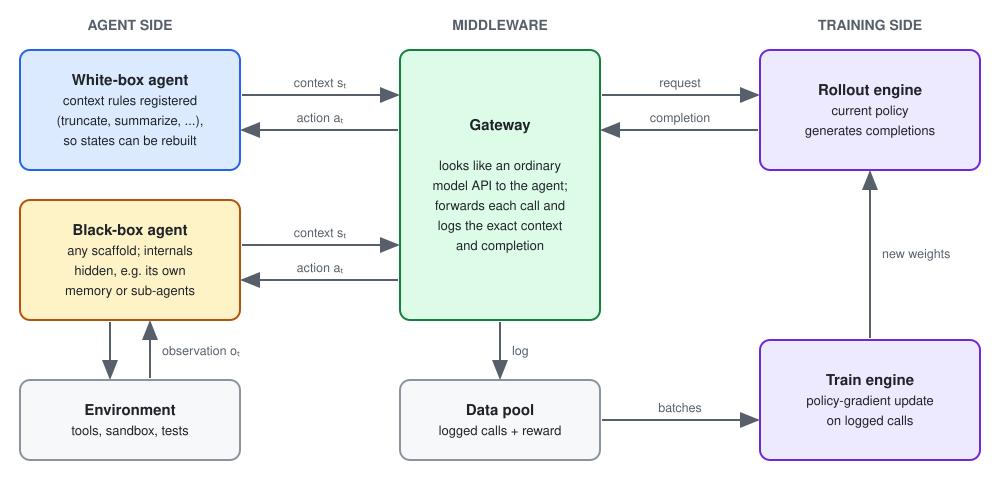
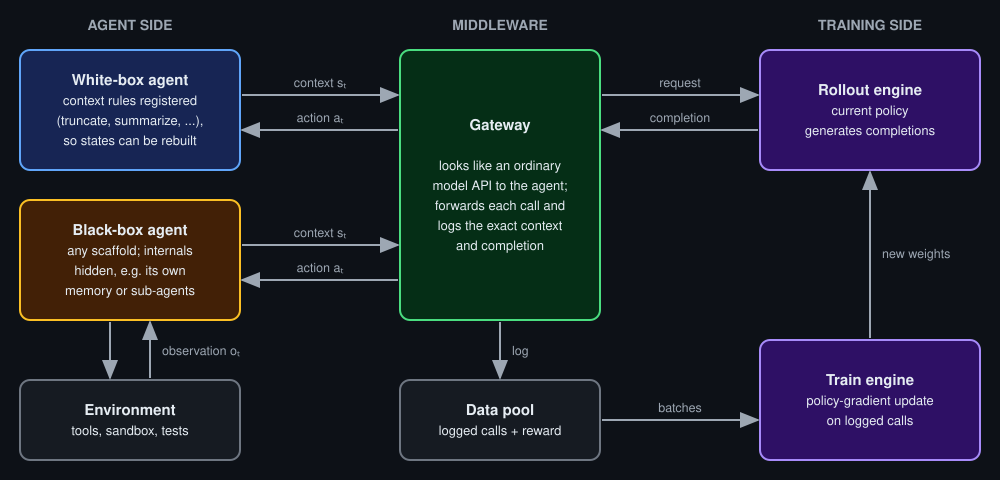

# Long-context, multimodal, and agentic RLVR

{width="80%" fig-align="center"}

## Chapter Map

- Move from single reward functions to harnesses.
- What long context and multimodality change in RLVR.
- Why frontier labs now train across many harnesses and generate their own environments.

## From reward functions to harnesses

Long-context and tool-using settings break the clean RLVR picture from earlier chapters. A rollout may now include repository state, browser state, images, shell transcripts, tool arguments, observations, generated files, runtime failures, partial progress markers, and a termination decision.

The harness decides what the policy is allowed to observe, what actions it can take, what state changes get logged, and which artifacts become reward-bearing. In a math problem, this surface can be tiny: prompt in, final answer out, exact checker at the end. In long-context, multimodal, and agentic tasks, the harness becomes sacrosanct. It may log evidence spans, retrieved images, browser actions, shell output, patches, timeouts, and tool failures. @fig-ch10-agentic-harness-stack shows how these pieces stack.

::: {#fig-ch10-agentic-harness-stack fig-cap="An agentic RLVR harness makes the trajectory, environment state, and verifier stack part of the training interface."}

::: {.content-visible when-format="html"}
{.light-content}

{.dark-content}
:::

::: {.content-visible when-format="pdf"}

:::

:::

## Long context

Long-context RLVR keeps the verifier unchanged, since final-answer verification is independent of context length; nevertheless, it stretches everything before the check, as the evidence the model needs sits somewhere in tens of thousands of input tokens. QwenLong-L1 found that applying RL directly to long inputs trains inefficiently and unstably, so it adapts a short-context reasoning model in stages: a supervised warm-up, then RL phases on progressively longer inputs, with hard examples from earlier phases sampled again later [@wan2025qwenlongl1]. Kimi K3 grows its context window in stages during pre-training, from 8K to 1M tokens, and its RL environments then run agents over hundreds or thousands of tool calls and millions of accumulated context tokens [@kimiteam2026k3].

Long rollouts also affect batching, since they finish anywhere from seconds to hours after starting, and a trainer that greedily takes whichever rollouts finish first fills its early batches with short, easy tasks and its later batches with hard ones. MiniMax reports that this shift in the training distribution causes gradient oscillation and instability in its M2 models and fixes it with what they call windowed FIFO, which lets the trainer take completed rollouts in any order only within a sliding window over the generation queue, about 30% of the queue in practice, and never beyond it [@minimax2026m2]. @fig-ch10-windowed-fifo shows the rule. DeepSeek-V4.1-Flash handles the same bias by discarding early short samples, as Chapter 9 describes.

::: {#fig-ch10-windowed-fifo fig-cap="Windowed FIFO. Rollouts enter the queue in the order they start, and rabbits, dogs, and turtles finish quickly, moderately, and slowly. The trainer may take any completed rollout inside the window (blue), in any order, but nothing beyond it (red cross), even if it has finished. The window advances only as its oldest rollouts are consumed, so fast rollouts cannot crowd slow ones out of the early batches."}

::: {.content-visible when-format="html"}
{.light-content}

{.dark-content}
:::

::: {.content-visible when-format="pdf"}

:::

:::

## Multimodal

Multimodal RLVR tends to keep the verifier textual: the image is part of the prompt, and the reward still checks a final answer. Vision-R1 first fine-tuned on 200K multimodal chain-of-thought examples, then trained with GRPO and a strict format-and-answer reward on 10K multimodal math problems, reaching 73.5% on MathVista with a 7B model [@huang2025visionr1]. The harder cases put vision inside the loop, either as something the policy acts on or as something the verifier looks at.

**Vision in the policy's loop.** Kimi K3 trains visual reasoning over STEM problems, visual puzzles, and charts as an agentic task where each trajectory runs in a Python interpreter sandbox, and the model writes and executes code to crop, zoom, transform, compute, or check intermediate results, and the outputs, including any images it generates, come back as new observations. The reward is still a checkable final answer, but the image is now an environment the model manipulates over many steps rather than a fixed input [@kimiteam2026k3]. The payoff shows up at evaluation: K3 scores 94.3% on Math-Vision without tools and 97.8% with Python, and 23.0% on ZeroBench-main (pass@5) without tools and 41.0% with Python [@kimiteam2026k3].

**Vision in the verifier.** Kimi K3's web-development environments combine deterministic checks with model judges such that the deterministic checks test application behavior and, for tasks that replicate a reference, score structural and pixel-level similarity. The judges then inspect the source code or look at and interact with the rendered output. The reward is zeroed when the project fails to build, runs with errors, or fakes the artifact instead of implementing it, a hard gate against the reward hacking of Chapter 7 [@kimiteam2026k3]. MiniMax takes the same approach further for its M2 models, as its Agent-as-a-Verifier deploys a generated application in a sandbox, then has a verifier agent drive it with Playwright, clicking buttons and completing workflows, before judging visual quality. For slides, a visual scorer renders the deck and judges it, and trajectories built with several different slide libraries are mixed in so that the policy does not overfit to one rendering toolkit [@minimax2026m2]. In both reports the verifier is a hybrid stack in the sense of Chapter 4, with hard execution gates first, followed by learned visual judgment.

## DeepSWE

DeepSWE is a software coding agent trained with the rLLM platform. It uses Qwen3-32B as the policy inside the harness and is trained with GRPO++, Agentica's modified GRPO that drops the KL loss, raises the upper clip bound, and uses a leave-one-out baseline. Training took six days on 64 H100 GPUs, and on SWE-Bench-Verified the result is 42.2% Pass@1, 71.0% Pass@16, and 59.0% when hybrid test-time scaling selects among 16 rollouts [@agentica2025deepswe].

The training environment is a subset of R2E-Gym, i.e. dockerized and executable software-engineering tasks with natural-language task descriptions, repositories, unit tests, and reward calculation by running tests [@jain2025r2egym]. DeepSWE used 4,500 of these tasks, after removing any drawn from the same repositories as SWE-Bench-Verified to avoid contamination, and each RL iteration spawned 512 Docker containers in parallel: a batch of 64 tasks with 8 rollouts each [@agentica2025deepswe].

A DeepSWE-style rollout has this shape:

1. The task is a natural-language issue against a repository at a fixed commit.
2. The model searches for relevant symbols and files.
3. The model views code and accumulates local evidence in a long context window.
4. The model edits or creates files.
5. The model executes commands or tests and observes failures.
6. The model revises the patch until it stops or hits the step limit.
7. The harness records the trajectory, output patch, exit reason, timeout state, and reward.
8. The RL trainer masks the loss for trajectories that hit the maximum context length, a 20-minute generation timeout, or the step limit, and updates the policy from the rest.

The crux here is that the harness itself shapes the policy (the Qwen model we are post-training) through the observations it returns, unique tools, valid action syntax, and timeout rules. That is to say, putting the post-trained model in an equivalent harness that only had different tool names would lead to worse results, since the tokens the model would need to generate in order to call tools would be farther out of distribution. Kimi K3's report makes the same observation: training in a single fixed harness can make a model overfit to its tool schema, system prompt, context management, and interaction protocol. Given Kimi is a model which is used across many third-party harnesses and cannot afford to be overfit to one harness in the same sense that a model trained mainly for its lab's own harness, such as Claude Code or Codex, can, K3 is therefore trained across many harness configurations, including ones that mimic Claude Code and Codex [@kimiteam2026k3].

The other two Chinese frontier labs reach the same conclusion. MiniMax routes model calls through a gateway so that it can train on agents whose internals it cannot see, as @fig-ch10-minimax-gateway shows. The gateway sits where a model API would normally be: an agent, whether MiniMax's own or an off-the-shelf scaffold, sends each request to the gateway as if it were calling any hosted model, and the gateway forwards the request to the policy being trained, returns the completion, and logs both. What matters is what the log contains, namely the exact context the policy saw at that call. Agents routinely rewrite their own history by dropping old tool outputs, summarizing, or handing work to sub-agents, so the transcript a user sees is not what the model saw at each step, and training on the transcript would update the policy on inputs it never received.

The two kinds of agent differ in how much the trainer knows about that rewriting. A white-box agent registers its context-management logic, such as sliding-window truncation or periodic summarization, so the trainer can rebuild the exact states the policy saw. A black-box agent is treated as an opaque producer of trajectories, and the trainer learns only from the requests it sends and the responses it receives. Either way, every request passes through the gateway, so the trainer never needs to know how the scaffold works, which is how MiniMax reports training across hundreds of scaffolds and thousands of tool-call formats [@minimax2026m2].

::: {#fig-ch10-minimax-gateway fig-cap="MiniMax's gateway. Agents call the gateway as if it were an ordinary model API; the gateway forwards each call to the policy, returns the completion, and logs the exact context and completion for training. A white-box agent also registers how it rewrites its context, while a black-box agent is known only through its calls."}

::: {.content-visible when-format="html"}
{.light-content}

{.dark-content}
:::

::: {.content-visible when-format="pdf"}

:::

:::

DeepSeek reaches the same conclusion from the other direction. It scales RL along two axes, training compute and the number of scaffolds, and then measures the result. On DeepSWE v1.1, DeepSeek-V4.1-Flash resolves between 65.5% and 74.2% of tasks across eight scaffolds, including Claude Code, Codex, and OpenCode, a spread DeepSeek attributes to the diversity of tool schemas and interaction formats in its training environments [@deepseekai2026v41flash].

## Where environments come from

Ilya Sutskever argued at NeurIPS 2024 that "pre-training as we know it will unquestionably end", because compute keeps growing while "we have but one internet": data, in his phrase, is "the fossil fuel of AI" [@sutskever2024neurips]. Environments are the RL counterpart of that data, and they are scarce in the same way, since each one needs a task, a sandbox, and a verifier that someone has to build. DeepSWE trained on 4,500 environments that people had built, and although expert data will only become more important, automating environment construction will grow as well. DeepSeek defines each training task as a triplet: a problem, an environment, and a verification system. They score each task on difficulty, so that it is not trivial, and on correctness, so that none of the three parts has a critical flaw, using those two scores as rewards to train the model to build better tasks [@deepseekai2026v41flash]. For coding, specialized agents check whether a repository can be built and run in a container, choose a starting commit, design implementation directions, and write fail-to-pass and pass-to-pass tests. For general agents, mocked tools reproduce the interfaces of real software, and failure cases reported by employees are replayed as new environments [@deepseekai2026v41flash]. Anchoring task generation in real workflows and real failures is, in one sense, how the process avoids the usual fate of models that learn from their own output: model collapse, in which a model trained on its own generated data progressively loses the tails of the original distribution [@shumailov2023curse].

If the verifier matters more than the optimizer, and the model can write verifiers, then the quality of the verifiers the model writes becomes a training target in its own right, and every failure mode of Chapter 7 applies to the task generator as well as to the policy.
