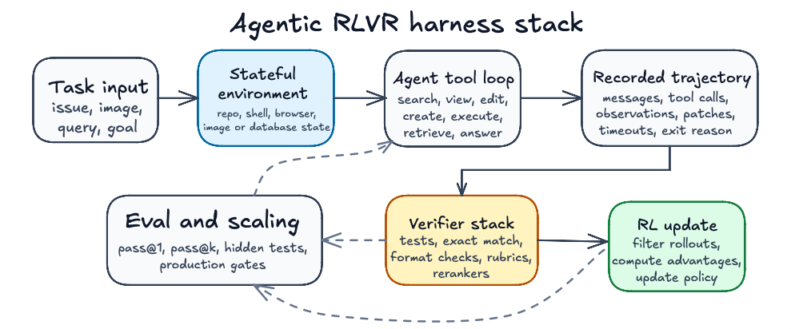
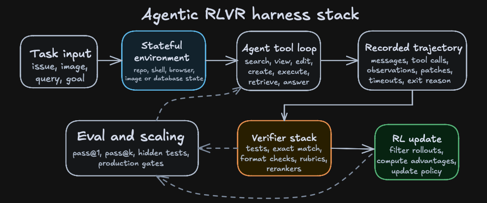
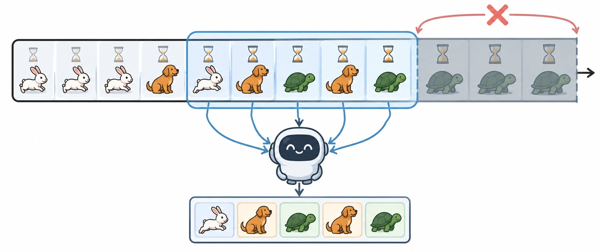
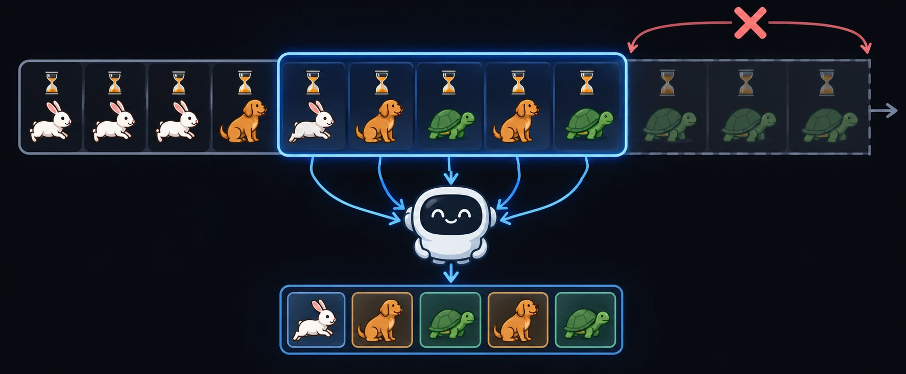
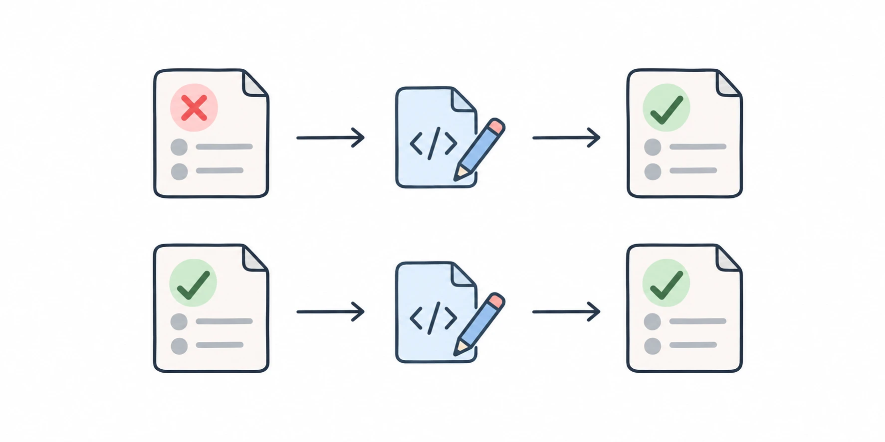
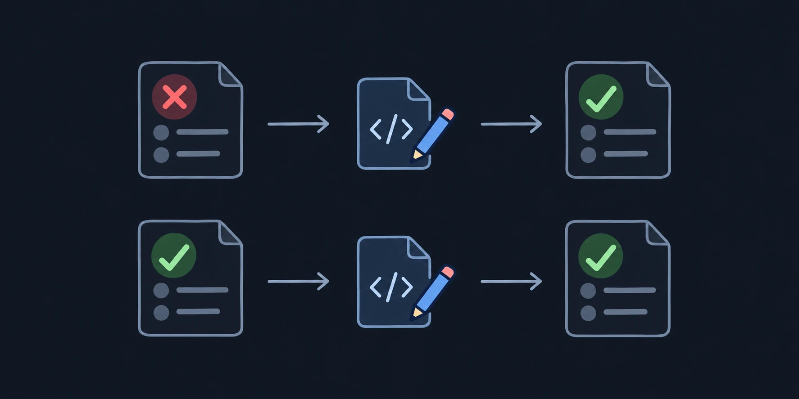

# Long-context, multimodal, and agentic RLVR

{width="80%" fig-align="center"}

## Chapter Map

- Move from single reward functions to harnesses.
- What long context and multimodality change in RLVR.
- Why frontier labs now train across many harnesses and generate their own environments.

## From reward functions to harnesses

Long-context and tool-using settings break the clean RLVR picture from earlier chapters. A rollout may now include repository state, browser state, images, shell transcripts, tool arguments, observations, generated files, runtime failures, partial progress markers, and a termination decision.

The harness decides what the policy is allowed to observe, what actions it can take, what state changes get logged, and which artifacts become reward-bearing. In a math problem, this surface can be tiny: prompt in, final answer out, exact checker at the end. In long-context, multimodal, and agentic tasks, the harness becomes sacrosanct. It may log evidence spans, retrieved images, browser actions, shell output, patches, timeouts, and tool failures. @fig-ch10-agentic-harness-stack shows how these pieces stack.

::: {#fig-ch10-agentic-harness-stack fig-cap="An agentic RLVR harness makes the trajectory, environment state, and verifier stack part of the training interface."}

::: {.content-visible when-format="html"}
{.light-content}

{.dark-content}
:::

::: {.content-visible when-format="pdf"}

:::

:::

## Long context

Long-context RLVR keeps the verifier unchanged, since final-answer verification is independent of context length; nevertheless, it stretches everything before the check, as the evidence the model needs sits somewhere in tens of thousands of input tokens. QwenLong-L1 found that applying RL directly to long inputs trains inefficiently and unstably, so it adapts a short-context reasoning model in stages: a supervised warm-up, then RL phases on progressively longer inputs, with hard examples from earlier phases sampled again later [@wan2025qwenlongl1]. Kimi K3 grows its context window in stages during pre-training, from 8K to 1M tokens, and its RL environments then run agents over hundreds or thousands of tool calls and millions of accumulated context tokens [@kimiteam2026k3].

Long rollouts finish anywhere from seconds to hours after starting, meaning batching becomes king, since a naive trainer that greedily batches rollouts fills its early batches with short, easy tasks and its later batches with hard ones. MiniMax argues greedy batching causes gradient oscillation and optimization instability, and for its M2 models uses what it calls *windowed FIFO*: the trainer is greedy only inside a sliding window at the head of the generation queue, and a finished rollout beyond the window must wait until the window reaches it. Accordingly, the trainer never runs more than one window ahead of the oldest unfinished rollout; the effect is that short rollouts beyond the window cannot crowd slow ones out of a batch. The window's size is a tunable fraction of the queue, which MiniMax sets to 30% [@minimax2026m2]. DeepSeek-V4.1-Flash counters the same bias by capping how many rollouts each dataset can have in flight and optionally discarding the short samples that return first at the start of training, when the length bias is strongest, until batches reach their steady-state length distribution [@deepseekai2026v41flash].

::: {#fig-ch10-windowed-fifo}

::: {.content-visible when-format="html"}
{.light-content}

{.dark-content}
:::

::: {.content-visible when-format="pdf"}

:::

Windowed FIFO. Rollouts enter the queue in the order they start (rabbits finish fastest, turtles slowest). The trainer may take any finished rollout inside the window (blue), but none beyond it (red cross), and the window advances when its oldest rollouts are consumed. Inspired by Figure 5 of the MiniMax-M2 report [@minimax2026m2].

:::

## Multimodal

Multimodal RLVR tends to keep the verifier textual: the image is part of the prompt, and the reward still checks a final answer. Vision-R1 first fine-tuned on 200K multimodal chain-of-thought examples, then trained with GRPO and a strict format-and-answer reward on 10K multimodal math problems, reaching 73.5% on MathVista with a 7B model [@huang2025visionr1]. The harder cases put vision inside the loop, either as something the policy acts on or as something the verifier looks at.

**Vision in the policy's loop.** Kimi K3 trains visual reasoning over STEM problems, visual puzzles, and charts as an agentic task where each trajectory runs in a Python interpreter sandbox, and the model writes and executes code to crop, zoom, transform, compute, or check intermediate results in a REPL loop. The reward is still a checkable final answer, but the image is now an environment the model manipulates over many steps rather than a fixed input [@kimiteam2026k3]. The payoff shows up at evaluation: K3 scores 94.3% on Math-Vision without tools and 97.8% with Python, and 23.0% on ZeroBench-main (pass@5) without tools and 41.0% with Python [@kimiteam2026k3].

**Vision in the verifier.** Kimi K3's web-development environments combine deterministic checks with model judges such that the deterministic checks test application behavior and, for tasks that replicate a reference, score structural and pixel-level similarity. The judges then inspect the source code or look at and interact with the rendered output. The reward is zeroed when the project fails to build, runs with errors, or fakes the artifact instead of implementing it, a hard gate against the reward hacking of Chapter 7 [@kimiteam2026k3]. MiniMax takes the same approach further for its M2 models, as its Agent-as-a-Verifier deploys a generated application in a sandbox, then has a verifier agent drive it with Playwright, clicking buttons and completing workflows, before judging visual quality. For slides, a visual scorer renders the deck and judges it, and trajectories built with several different slide libraries are mixed in so that the policy does not overfit to one rendering toolkit [@minimax2026m2]. In both reports the verifier is a hybrid stack in the sense of Chapter 4, with hard execution gates first, followed by learned visual judgment.

## DeepSWE

DeepSWE is a software coding agent trained with the rLLM platform. It uses Qwen3-32B as the policy inside the harness and is trained with GRPO++, Agentica's modified GRPO that drops the KL loss, raises the upper clip bound, and uses a leave-one-out baseline. Training took six days on 64 H100 GPUs, and on SWE-Bench-Verified the result is 42.2% Pass@1, 71.0% Pass@16, and 59.0% when hybrid test-time scaling selects among 16 rollouts [@agentica2025deepswe].

The training environment is a subset of R2E-Gym, i.e. dockerized and executable software-engineering tasks with natural-language task descriptions, repositories, unit tests, and reward calculation by running tests [@jain2025r2egym]. DeepSWE used 4,500 of these tasks, after removing any drawn from the same repositories as SWE-Bench-Verified to avoid contamination, and each RL iteration spawned 512 Docker containers in parallel: a batch of 64 tasks with 8 rollouts each [@agentica2025deepswe].

A DeepSWE-style rollout has this shape:

1. The task is a natural-language issue against a repository at a fixed commit.
2. The model searches for relevant symbols and files.
3. The model views code and accumulates local evidence in a long context window.
4. The model edits or creates files.
5. The model executes commands or tests and observes failures.
6. The model revises the patch until it stops or hits the step limit.
7. The harness records the trajectory, output patch, exit reason, timeout state, and reward.
8. The RL trainer masks the loss for trajectories that hit the maximum context length, a 20-minute generation timeout, or the step limit, and updates the policy from the rest.

The crux here is that the harness itself shapes the policy (the Qwen model we are post-training) through the observations it returns, unique tools, valid action syntax, and timeout rules. That is to say, putting the post-trained model in an equivalent harness that only had different tool names would lead to worse results, since the tokens the model would need to generate in order to call tools would be farther out of distribution. Kimi K3's report makes the same observation: training in a single fixed harness can make a model overfit to its tool schema, system prompt, context management, and interaction protocol. Given Kimi is a model which is used across many third-party harnesses and cannot afford to be overfit to one harness in the same sense that a model trained mainly for its lab's own harness, such as Claude Code or Codex, can, K3 is therefore trained across many harness configurations, including ones that mimic Claude Code and Codex [@kimiteam2026k3].

## MiniMax

During training, an agent, whatever its implementation, calls a gateway that emulates the model API as it would call any hosted model; the gateway answers with the policy being trained and records each call with the context the model was shown and the tokens it returned. Each record is a training example, so the trainer needs to know nothing about how the agent built that context, whether by truncating old tool outputs, summarizing, or delegating to sub-agents. MiniMax says the gateway design has been validated across hundreds of distinct agent scaffolds and thousands of tool-call formats [@minimax2026m2].

For example, take an agent fixing a bug over three calls. In the first call, the model sees the issue and asks to read a file. In the second, it sees the issue, its request, and the file's 2,000 lines, and runs the tests. Before the third call, the agent replaces the 2,000 lines with a two-line summary to save space, so the model sees the issue, the summary, and the test output. The gateway records three training examples, each holding exactly what the model saw at that call, including the summary in the third. A trainer that rebuilt the context from the agent's full history would instead train the third step on 2,000 lines the model never saw at that point.

MiniMax distinguishes two kinds of agent by how much of this the trainer can see. A white-box agent runs its context management, such as sliding-window truncation or periodic summarization, inside the training framework, so the trainer sees each transformation and can build training sequences that match the states the policy faces at inference. A black-box agent is opaque: the trainer sees only what each call exposes, namely the context sent to the model, the model's response, and the tool results, as in the example above. That is enough to train on, and it lets MiniMax plug in agents with deep thinking loops, aggressive context rewriting, or hierarchical multi-agent coordination without modifying them. The gateway serves both; a white-box agent differs only in also registering its context-management operations [@minimax2026m2].

## DeepSeek

DeepSeek scales RL along training compute and the number of scaffolds; on DeepSWE v1.1, DeepSeek-V4.1-Flash resolves between 65.5% and 74.2% of tasks across eight configurations from six scaffold families, including Claude Code, Codex, and OpenCode, a robustness DeepSeek says is consistent with the diversity of environments, tool schemas, and interaction formats in its synthesized training data [@deepseekai2026v41flash].

## Where environments come from {#sec-ch10-environments}

Ilya Sutskever (aka the GOAT) proclaimed at NeurIPS 2024 that "pre-training as we know it will unquestionably end", because compute keeps growing while "we have but one internet": "the fossil fuel of AI" [@sutskever2024neurips]. Environments are the RL counterpart of pretraining's internet, and high-quality environments are harder to scale than pretraining data(I think you are on the right track by adding a justification after this point. However, by simply saying a task, a sandbox, and a checker are required for an environment, this isn't sufficient to support this claim. My preference is to leave it to the reader to reason why I say it's harder to scale than pretraining data. The underlying reason is that there are billions of people on the internet. If one can sift through the AI content, then there is still quite a lot of new human data to be accessed on an internet scale as a function of time. This is actually really non-trivial, to be fair, finding data that is non-AI-generated nowadays on the internet, from my understanding. On the contrary, you have maybe on the order of 10,000 people making it in RL environments. This is the argument I have in my head. My thought is that it's not paramount to include this in the section because I think most readers can make this conclusion on their own as well. There's that). DeepSWE trained on 4,500 R2E-Gym environments, which were curated semi-automatically from real GitHub commits, and although expert data will only become more important over time, automating environment construction will inexorably grow, because of the cost of man-made environments and as a by-product of recursive self-improvement (RSI). DeepSeek is aware of this and consequently runs a synthetic environment effort, which defines tasks as a triplet:

1. a problem,
2. an environment, and
3. a verification system.

They score each task on difficulty and correctness and use those scores as rewards to train the model to build better tasks [@deepseekai2026v41flash]. For coding, specialized agents check whether a repository can build and run in a container, choose a starting commit or session turn, design implementation directions, specify fail-to-pass and pass-to-pass evaluation points, and then turn them into test code in an isolated container.

::: {#fig-ch10-fail-to-pass fig-cap="Fail-to-pass (top) and pass-to-pass (bottom) tests."}

::: {.content-visible when-format="html"}
{.light-content}

{.dark-content}
:::

::: {.content-visible when-format="pdf"}

:::

:::

Writing the patch that resolves an issue is hard, while running tests against a patch is cheap, so a model can write the check for a task it cannot yet solve. Jason Wei calls this difference the asymmetry of verification: "some tasks are much easier to verify than to solve" [@wei2025asymmetry]. For general agents, DeepSeek builds mocked tools that reproduce the interfaces and behaviors of real tools seen in employee and partner usage, and turns failure cases submitted by employees into new environments that replay them [@deepseekai2026v41flash]. Anchoring task generation in real workflows and real failures is one way such a process may guard against model collapse.[^ch10-model-collapse]

[^ch10-model-collapse]: Model collapse is the degradation of models trained on data generated by earlier models: over successive generations they progressively lose the tails of the original distribution [@shumailov2023curse].
