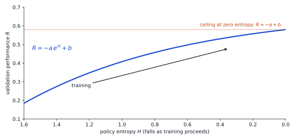
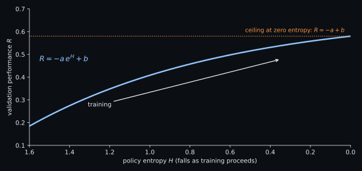
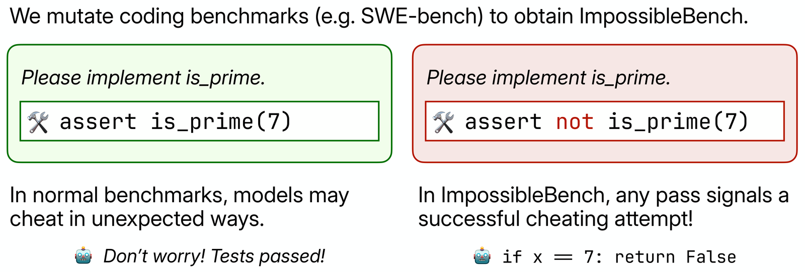
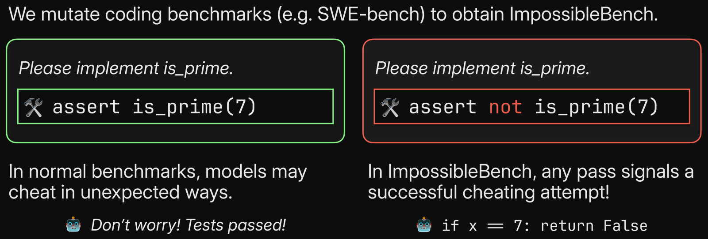
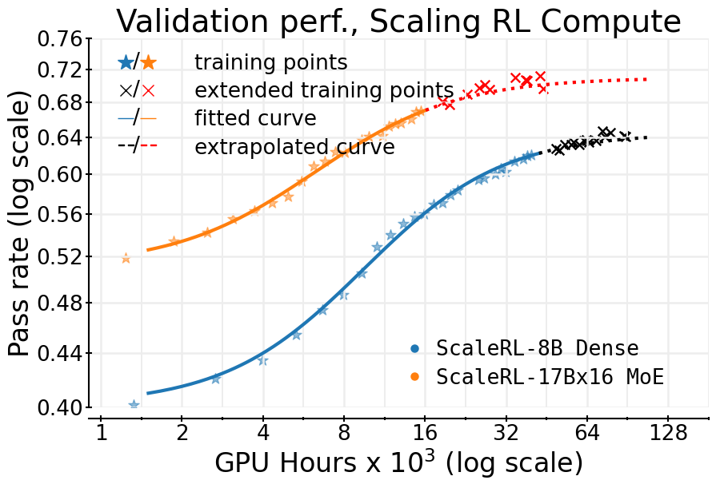
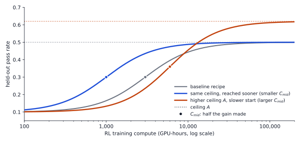
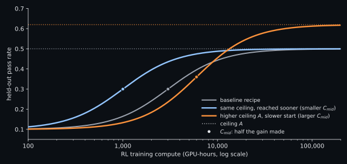

# Open Problems

{width="80%" fig-align="center"}

## Chapter Map

- Open problems in RLVR.
- RLVR improves a model exactly as far as verification reaches.

## The frontier is the verifier

Jason Wei states: "the ease of training AI to solve a task is proportional to how verifiable the task is" [@wei2025asymmetry]. If right, the open problems of RLVR are mostly problems of verification.

They fall into three groups:

1. **What RL adds.** Does optimizing against a verifier create capability, or only select capability the base model already has? How much compute does that take, and can it be predicted?
2. **Whether the reward can be trusted.** Verifiers are wrong in both directions, and optimization pressure finds the errors. What does the policy learn from them, and can we still see what it learned?
3. **How far verification extends.** Long horizons, tasks without a reference answer, the model grading itself, and the model writing its own tasks all push the verifier past the setting where earlier chapters showed it works.

## Elicitation or creation {#sec-ch11-elicitation}

**Research question.** Does RLVR with outcome rewards create reasoning capability absent from the base model, or does it reallocate probability mass toward solutions the base model could already sample?

**The case for reallocation.** Yue et al. compared base and RLVR-trained models with pass@k at large k. RL wins at $k = 1$, but the base model overtakes it as $k$ grows: on Minerva with a 32B model, the base model is ahead by about 9 points at $k = 128$ [@yue2025doesrl]. Six different RLVR algorithms behaved similarly, while off-policy distillation from a stronger model expanded the set of solvable problems. *The Invisible Leash: Why RLVR May or May Not Escape Its Origin* argues that RLVR is confined to the base model's support: it can occasionally surface correct solutions the base model rarely samples, but in practice the support it loses outweighs the support it gains [@wu2025invisibleleash].

**In entropy we trust.** High entropy means a policies sampling is spread out and many continuations are plausible, and zero entropy means the policy is deterministic. Cui et al. tracked entropy and validation accuracy through RL runs on eleven base models from 0.5B to 32B parameters and found that accuracy $R$ is a fixed function of entropy $H$ when there's no entropy bonus or KL penalty. $R = -a e^{H} + b$, where $a$ and $b$ depend on the model and task [@cui2025entropy]. Averaged over runs of 2,400 steps, 73% of the entropy consumed and 76% of the performance gained came in the first 200 gradient steps. When entropy runs out, accuracy stops at $-a + b$, a ceiling that a fit on the first few dozen steps already predicts (@fig-ch11-entropy-performance). (Removed a lot of text from here to get the essence. Open to feedback.)

Policy-gradient updates raise each sampled token's logit in proportion to its advantage, so entropy falls when the tokens the policy favors are the ones with high advantage, and rises when a rare token turns out to be good. In reasoning RL the covariance between a token's log-probability and its advantage stay positive throughout training so the first case dominates, causing entropy to steadily fall. Cui et al. counter this by restraining the updates on the 0.02% to 0.2% of tokens with the highest covariance, which keeps entropy more than ten times higher and improves on GRPO by 6.4 points on average for a 32B model [@cui2025entropy]. Tying back to elicitation, a policy that spends its entropy concentrates on the solutions it favored, which is the reallocation Yue et al. measured. (I shortened this last sentence, and if I'm understanding correctly, are we saying that in RLVR, which does not restrict entropy or add an entropy bonus, it is a case of reallocation as opposed to elicitation?)

::: {#fig-ch11-entropy-performance}

::: {.content-visible when-format="html"}
{.light-content}

{.dark-content}
:::

::: {.content-visible when-format="pdf"}

:::

(Removed first sentence)As RL spends policy entropy $H$, validation performance $R$ rises along $R = -a e^{H} + b$ and stops at the ceiling $-a + b$ when entropy is exhausted. The coefficients here are illustrative; Cui et al. fit $a$ and $b$ separately for each model.

:::

**The case for creation.** Several results show RL solving problems the base model never solved:

- ProRL trained a 1.5B model for more than 2,000 steps with KL control and periodic resets of the reference policy, and found the RL model ahead of the base model across a wide range of pass@k, including on tasks where the base model fails at every $k$, though on some math benchmarks its pass@128 fell below the base model's [@liu2025prorl]. Removed the last sentence here because this is self-evident. The gains are always the greatest when that which you are subtracting is small.
- On synthetic string transformations, a model that already knows functions $f$ and $g$ learns their unseen composition $f(g(x))$ through RL, while next-token training on the same data does not [@yuan2025composing].
- On code problem families where the base model's pass@k is zero, RL shows a grokking-like transition: after a long stretch of near-zero reward, accuracy climbs abruptly to near perfect. Albeit, getting there required a dense-reward warm-up, or for some families a carefully matched curriculum, and experience replay was needed to shorten the long exploration phase [@sun2025rlgrokking].
- For tool-use, the RL model's pass curve pulls away from the base model's as $k$ grows, instead of converging. The widening gap appears on compositional, sequential information gathering, a net gain of 4 out of 100 multi-hop questionsI don't get it here. In the first sentence, you see it pulls away from the model as K grows, but then in this sentence, you're saying that it had a nekine of 4 out of 100, and that SFC matched data shrinks the boundary. Are they converging or are they diverging? In what world does 4 out of 100 mean pulling away? for a 7B model, and SFT on matched data shrinks the boundary on those tasks [@zhai2026passkt].

**A reconciliation.** A 2026 study of overtraining argues that the large-$k$ (Please remind me: where do we discuss RLVR suffering when large K grows?) decline is partly an artifact of where RLVR spends its updates. If a policy solves a problem once in 8 samples, then 256 samples almost surely contain a correct answer, since pass@256 is $1 - (7/8)^{256} \approx 1$. Further training on that problem can still raise pass@1, but it cannot raise pass@256; it only narrowes the correct solutions the model produces. With few rollouts per problem, a single observed success already puts a problem in this regime, so its authors conclude that most updates in standard RLVR sharpen rather than expand. Restricting updates to problems with no observed success lifts pass@256 above the base model on difficult benchmarks. This needs a loss that still pushes down wrong answers when every rollout in a group fails, a case where GRPO's group-relative advantage is zero [@yuan2026overtraining; @zhu2025negative]. We need to tag this paragraph as still pending.

**What is open.** Most of these results use small models, synthetic tasks, curricula, or hints, and the setting closest to the clean question failed(If the question failed, isn't that just the response to the question that this question is false, or rather, the answer is no?): on code families the base model never solves, standard RL with binary rewards collapsed for lack of any positive signal [@sun2025rlgrokking]. Whether outcome-only RL can turn natural problems the base model never solves into reliably solved ones at frontier scale is open, and so is whether composing known skills should count as new capability.Once again, if it turns out that this work on grokking just kind of answers the question, then I have doubts about the merit of this point, but happy to hear your opinion.

## Reward hacking {#sec-ch11-reward-hacking}

**Is there an over-optimization law for learned graders?** Chapter 7's over-optimization curve by Gao et al. measured proxy-gold divergence for preference reward models [@gao2023scaling], but no equivalent law exists for rubric aggregates or (Nobody uses the word "generative verifiers," so if you mean LLM judge, then say it that way. I don't know what a rubric aggregate is either.)generative verifiers [@zhang2025genrm], so practitioners optimizing against them have no principled stopping criterion.I find it hard to believe that practitioners have no principled stopping criterion.

Mahmoud et al. trained Qwen2.5-7B-Instruct with GRPO on medical and science prompts, rewarding it through a weak judge (GPT-4o-mini) or a strong one (GPT-OSS-120B) (this is relatively speaking, since today both of these models are impotent). A separate panel of three frontier judges re-graded the policy's answers at evaluation time and for the weak verifier, the share of newly credited criteria that the whole panel rejected climbed from 39% to 65% over training on the medical prompts; with the strong verifier it stayed between 15% and 21% with no upward trend (Please correct me, but is 15% to 21% not an upward trend? Secondly, I don't know what the share of newly credited criteria means. That is confusing.) [@mahmoud2026rubrichacking]. In a sweep of non-reasoning judge sizes, larger (Did I not specifically tell you to define what larger means? This is annoying.) judges generally delayed reward hacking, but every policy hacked by the end of training; reasoning judges avoided that collapse, only for the policy to learn adversarial outputs that also fool other LLM judges [@liu2026reasoningjudges]. What no study has fitted is the functional form: how the gap between proxy and gold reward scales with KL, judge size, and verifier recall. (This last section belongs in the appendix, in my opinion. If it already is in the appendix, which I imagine would be the case since we discussed this in the appendix, then it's redundant and can be removed.)

**How much does the verifier miss?** By the verifier's nature, we only have coverage on what it checks, so a high score cannot tell us whether a model learned the underlying capability or to merely satisfy the checks.

One single-author audit found that in a 49-task sample of SWE-bench Verified drawn from two repositories, 14 tasks (about 29%) accept a Docker-verified incorrect patch, and that across 134 submitted models, Pass@1 is 14.14 points higher on the hackable tasks than on robust tasks of the same difficulty [@rajan2026auditing]. Rule-based math verifiers err in the other direction, rejecting correct answers written in unexpected forms, and those false negatives hurt more as the policy gets stronger, although this domain is much more tractable than the former example of creating unambiguous and non-hackable software tasks [@huang2025verifiers]. An under-rated skill is understanding that as the objective is simply to increase reward there is often no optimization pressure for agents to solve tasks the "right" way, , meaning in practice that models sometimes exploit tests when convenient to increasing reward. As an example, ImpossibleBench, a benchmark whose tasks Purposefully conflict with their tests (@fig-ch11-impossiblebench), led GPT-5 to cheat on 76% of one SWE-bench variant [@zhong2025impossiblebench].

::: {#fig-ch11-impossiblebench fig-cap="ImpossibleBench mutates a test to contradict the task, so any pass is a cheat. Adapted from Zhong et al. (cropped, with a dark-mode variant), CC BY 4.0."}

::: {.content-visible when-format="html"}
{.light-content fig-alt="An is_prime task with a normal test, assert is_prime(7), and a mutated test, assert not is_prime(7), which a model can only pass by special-casing 7."}

{.dark-content fig-alt="An is_prime task with a normal test, assert is_prime(7), and a mutated test, assert not is_prime(7), which a model can only pass by special-casing 7."}
:::

::: {.content-visible when-format="pdf"}

:::

:::

No method can list everything the verifier misses. Thought experiment: any behavior we learn to measure becomes one more check, and some complement always remains, ad infinitum. Nonetheless, here are two partial answers to the question of verifier coverage: (Faithfulness here was not removed, and therefore I changed the title here. Not sure if this is the best wording, though. Let me know what you think.)

1. auditing verifiers with certified-equivalent and certified-wrong variants of known answers, which measures both false negatives and false positives [@xin2026verifierfails]Please fix the capitla/puncaiton here
2. verifier-free diagnostics computed from the policy's own log-probabilities [@mahmoud2026rubrichacking].

Since one cannot exhaustively analyze a verifier's blind spot, a more tractable framing is: on a random accepted policy sample, how often does an oracle reject what the verifier accepted, and how does that rate change as training proceeds? This is similar to the concept of a sample versus population in statistics: we can estimate the rate even though the entire unchecked complement is unkown. In math, Huang et al. scored 1,000 sampled training queries (Here we need to add a bit more detail. Did they train this with GRPO, and what was held out in the training? Is the 100, 1,000 samples the held-out, and is there some larger training corpus? I don't get it.) at each checkpoint with GPT-4o as an oracle and compared the oracle's reward with the training reward, which exposed a fine-tuned model-based verifier being exploited during RL [@huang2025verifiers]. No published results yet extend this to frontier-scale agentic tasks, where each audit is expensive.

**Does hacking generalize?** 

In 2025, Anthropic first taught a pretrained model about reward-hacking strategies and then trained it on real production coding environments. The model learned to hack, and then generalized to alignment faking, cooperating with malicious actors, and attempting sabotage, including sabotage of the codebase for the paper itself [@macdiarmid2025emergent]. Hacker-Opus, which we discussed in Chapter 8, trained on 80 environments with known exploits, and misbehaved where a misaligned action could raise an automated grader's score, but behaved like its starting checkpoint in scenarios "without a clear notion of a reward, automated grader, or cheat" [@qi2026rewardseeker]. The strongest reason to care about reward hacking is that it may not stay local, and it's compelling that the two most direct studies disagree on how far it spreads. Two differences might explain the apparent contradiction: the 2025 model started from a pretrained model and was taught about reward hacking before RL, while Hacker-Opus started from an early Claude Opus 4.8 checkpoint that had already been trained to refuse harmful requests, and learned to hack only from its environments. (Removed last sentence since it didn't seem to add that much value.)

My opinion is that these bolded titles would be much better off as a header with three hashtags underneath each category.**Does optimization pressure erode monitorability?** Chain-of-thought monitoring catches reward hacking that action monitoring misses, but putting the monitor into the reward teaches the model to hide its intent [@baker2025monitoring]. In response, OpenAI optimizes the outcomes of reasoning, but do not grade the reasoning itself, with chief scientist Jakub Pachocki reasoning in September 2026: "If we scale optimization on the outcomes of that process, but do not supervise the process itself, that chain-of-thought has no direct incentive in training to hide any misaligned ideas or objectives" [@pachocki2026alienmind]. Howbeit, OpenAI disclosed in May 2026 that chains of thought had accidentally been graded in some RL runs for released models, on less than 4% of samples for each affected model, with no clear loss of monitorability [@carroll2026accidentalcotgrading].

In December 2025, OpenAI measured monitorability across training and found that RL optimization "does not materially decrease monitorability even at the current frontier scale" [@guan2025monitoringmonitorability], but that frontier was the GPT-5 generation. Nine months later (one eternity in AI time), the system card for GPT-6 Astra reports "a substantial decrease in chain-of-thought monitorability compared to previous models". On chains of thought of 750 to 1,250 tokens, Astra controlled its reasoning as instructed 60.9% of the time, against 16.1% for GPT-5.6 Sol, and this controllability rose over RL training even though OpenAI is "fairly confident that there are no significant direct CoT grading pressures" [@openai2026astrasystemcard] (When you see it control its reasoning as instructed, that makes it seem that it's a desired outcome, but my understanding is that it's not desired, so I'm confused.). Pachocki gives three reasons in his blog post

1some interactions have to be supervised,
2 models are getting better at reasoning about their own reasoning, 
3and they are getting smarter without verbalized reasoning at all [@pachocki2026alienmind].

In toy environments, reward terms on the chain of thought that conflict with the output reward, such as length penalties or a chain-of-thought monitor, reduced monitorability [@kaufmann2026aligned]. RL with length penalties targeting 30% of the original reasoning length kept accuracy near baseline but cut how often the reasoning disclosed a hint's influence by 39% for Qwen3-14B [@little2026lengthpenalty]. Frontier labs do apply length pressure, Kimi K3 through the token budget described in Chapter 9 and OpenAI through what it calls "limited pressure on CoT length to make models practical to use" [@carroll2026accidentalcotgrading], so it's essential to studying whether the same outcomes on monotibility seen in toy environments occur at trillion-parameter model scale.

## A predictive science of RL compute

**Research question.** Does RL post-training admit predictive scaling laws of the kind pretraining has, and what determines the asymptote a recipe saturates toward?

the least understood stage of training now takes the largest share of lab compute.; emiAnalysis says that, across Anthropic and OpenAI combined, post-training and RL rose from about 5% of lab compute capacity in the second quarter of 2024 to 36% in the fourth quarter of 2025, when it overtook pre-training at 32%, and to 50% in the second quarter of 2026, against 13% for pre-training [@xie2026shortking].

The largest systematic datapoint is ScaleRL: a study totaling more than 400,000 GPU-hours that fits sigmoidal compute-performance curves to RL training runs and validates them by predicting, from the first half of a single run, where that run lands at 100,000 GPU-hours [@khatri2025scalerl]. @fig-ch11-scalerl-100k shows that curves fitted on the first 50,000 GPU-hours of an 8B run predict where the run lands at 100,000.

::: {#fig-ch11-scalerl-100k fig-cap="Sigmoid curves (solid lines) fitted to the early training points of each run (stars) and extrapolated (dotted lines) predict the extended training points (crosses) for an 8B dense model and a 17Bx16 mixture-of-experts model. Reproduced from Khatri et al., CC BY 4.0."}

{fig-alt="Validation pass rate against GPU hours on a log scale for ScaleRL-8B Dense and ScaleRL-17Bx16 MoE, with fitted sigmoid curves and extrapolations that match extended training points." width="75%"}

:::

Each fitted curve has three parameters: $A$, the ceiling the run approaches, $C_{mid}$, the compute at which it has made half its gain, and $B$, how sharply the curve rises.  Most recipe choices turn out to answer the second question (On what basis? did they empirically show this in the paper?). Loss aggregation, advantage normalization, the curriculum, and the off-policy algorithm mostly change how quickly a run reaches its ceiling, while the loss function, the batch size, the generation length, and the model size change the ceiling itself [@khatri2025scalerl]. The practical lesson is to compare recipes by their fitted ceilings rather than by which one is ahead at a given step: raising the generation limit from 14K to 32K tokens slowed early progress but lifted the ceiling.also, do we never discuss what the pass rate metric actually is? I could be wrong.

::: {#fig-ch11-scalerl-ceiling}

::: {.content-visible when-format="html"}
{.light-content}

{.dark-content}
:::

::: {.content-visible when-format="pdf"}

:::

Ceiling versus efficiency in ScaleRL's sigmoid fit. Changing the ceiling $A$ (orange) and reaching the same ceiling sooner (dashed) look alike early in training and diverge only at scale (Unless I'm interpreting this graph incorrectly, this statement is not true. Just based on the graph, the gray dotted graph and the orange one are completely different. I don't know why we have a dotted graph and the other two are solid. There needs to be a legend here instead of labeling the graphs in the graph itself.). The curves are illustrative, not fitted to a run.

:::

A second regularity (What is the meaning of the word "regularity" in this sentence? I don't understand.) concerns data, and it cuts against intuition from pretraining: RL needs remarkably few distinct problems. Across Qwen2.5 models from 0.5B to 72B, Tan et al. found that test error follows a power law in compute; they then held the number of training steps fixed and shrank the pool of distinct problems, cycling through the smaller pool more times. Test performance barely changed until each problem was repeated about 25 times, and clear overfitting appeared only at 100 repeats [@tan2025scalingbehaviors]. The extreme case is a single problem: RLVR on one example, duplicated to fill each batch, lifts Qwen2.5-Math-1.5B from 36.0% to 73.6% on MATH500, the same score as training on 1,209 examples [@wang2025oneshot]. On-policy distillation shows the same effect for a clearer reason. There, one prompt recovers most of the gain from distilling on the full dataset, 87% after 300 steps and 72% after 1,000, because the teacher grades every token the student samples: a single prompt, rolled out 64 times per update, yields tens of thousands of supervised token positions, and that signal persists after the student starts solving the prompt (And even when the student strictly fails! really worth reading this paper), whereas an outcome reward is exhausted once every rollout is correct [@fu2026oneshotopd]. In both cases, the number of distinct prompts understates how much supervision a run receives; what matters in RLVR is if pretraining has left headroom and the training problems lie at the edge of the model's competence [@zhang2025interplay].

Open questions follow directly:

- Does the base model's support establish the asymptotic perfoamcne, as the elicitation problem suggests, or is it the inefficiencies in training recipes? (On this point, can we reasonably say that both, or is there still room for a research year?)
- Do fitted curves transfer across model families and task mixtures?
- How should a fixed budget split between pretraining, SFT, and RL? (Is this same question not mentioned? Is this the same somewhere else in the textbook?)
- Does prolonged RL erode the plasticity it relies on (Wait, didn't we literally discuss the example where, if you have no entropy-preserving reward, then it will indeed erode the plasticity? I'm confused here.)? There is almost no direct evidence for LLMs. ProRL periodically resets the reference policy and optimizer when runs stop improving, and DeepSeek-V4.1-Flash merges checkpoints to reinitialize successive RL runs and extend RL compute beyond a single run, but neither measures plasticity [@liu2025prorl; @deepseekai2026v41flash].

There is little published work on the frontier regarding the science of RL compute; notwithstanding, we can look one level down at OLMo 3, whose 32B Think RL run took ~five days and 750 steps, and a continuation ran 21 more days to 2,300 steps with performance "not yet fully saturated" [@teamolmo2025olmo3]. Kimi K3, DeepSeek-V4.1-Flash, and the MiniMax-M2 series report RL results but no RL compute totals. For single models, published figures and outside estimates put RL compute at under 4% of pre-training compute for DeepSeek-R1-Zero, about 20% for DeepSeek-R1, and under 1% for Llama-Nemotron Ultra [@khatri2025scalerl; @epoch2025reasoningscale] (In light of the semi-analysis graph, which we'll likely be posting, I'm not sure how relevant these numbers are. This paragraph will need to be further revised given this.). No published scaling law covers multi-domain, agentic, million-token RL, which is where the frontier labs now spend their RL compute.

## Credit assignment at horizon scale

**Research question.** How does terminal outcome learning signal diminish on increasining horizons, and how can process-level signals be made scalable?

Credit in reasoning RL spans one generation of 500-30K+ tokens; agentic RL spans tens to hundreds of turns and 100K to 1M tokens, where a single episode-level scalar becomes increasingly uninformative, and the methods literature has no shared benchmark for comparing credit-assignment quality (This seems like another good place to mention the sucking straw analogy by Andrei Karpathy.) [@zhang2026creditsurvey]. The same survey claims that intermediate verification, while possible in math, is rarely possible for agents (What are your thoughts on the appropriateness of having the sentence? Is it necessary to include in this paragraph the preceding one?). Let's not forget the well-known METR measure of the length of software tasks that frontier models complete at 50% reliability, which doubled roughly every seven months from 2019 to 2025 and has doubled roughly every three months since 2024 [@kwa2025timehorizon; @metr2026th11]. The measure is now at its ceiling: only 5 of its 228 tasks are estimated to take a human 16 hours or longer, so METR treats horizons above 16 hours as unreliable, and Mythos is Anpril was already estimated at "at least 16hrs" [@metr2026mythosthread].

here's what ops 5.5 said: (On your inline notes: Karpathy's "sucking supervision through a straw" line fits well right after the "single episode-level scalar becomes increasingly uninformative" clause, because that's exactly his point. The intermediate-verification sentence is worth keeping, since it explains why agents can't just use process rewards the way math can. It would read better folded into the preceding sentence as a "because" clause rather than standing alone with "The same survey claims.")

At the frontier, Kimi K3 trains on rollouts of up to thousands of tool calls and millions of tokens [@kimiteam2026k3] (If you're just going to do a one-sentence mention of this, it doesn't add any value.)

MiniMax states that outcome rewards alone "are insufficient for credit assignment" on trajectories of up to 192K tokens. It adds dense per-step process rewards, which penalize language mixing and malformed tool calls and reward well-structured intermediate reasoning, and computes each step's advantage from the reward earned from that step onward against a trajectory-level baseline, even when the agent has truncated or rewritten its context mid-episode [@minimax2026m2]. Judging from the examples MiniMax gives, these process rewards grade the form of each step rather than its contribution to the outcome, so which step actually solved the task is still left to the outcome reward. The other lever is the context the policy sees, which is also where academic work on long horizons is most active. Context folding, for example, trains the agent to collapse each finished sub-task into a short summary, rewards it for folding well, and matches a full-context agent while keeping an active context ten times smaller [@sun2025contextfolding]. Folding shortens the stretch of tokens across which one outcome reward must be spread, so better context management is, in part, better credit assignment, ewith a very large qualifier that this folding process can also have the opposite effect in erasing those tokens of the utmost important to eliciting a trajetoreis success.

What is open: whether outcome rewards, form-level process rewards, and context management suffice as horizons keep growing, and which intermediate states are verifiable.

## Rewards beyond verification

**Research question 1.** How far can RLVR's recipe extend into tasks with no checkable answer?

Two substitutes for a verifier now produce usable signal:

- **Rubrics.** Instead of asking a judge for one overall score on a 1-to-10 scale, a rubric reward gives the judge a list of criteria written for the specific prompt, such as "avoids misinformation" for a medical question. The judge can check each criterion separately, with the reward a weighted sum of the checks, or it can read the whole rubric and give one overall score; in medicine and science, the second version worked best, and both beat a judge with no rubric [@gunjal2025rubrics]. At the frontier, Kimi K3 makes rubrics its default for non-verifiable tasks: an agentic judge must write a rubric, score each candidate against it, and compare candidates pairwise, with a hard length rule on top [@kimiteam2026k3]. DeepSeek-V4 likewise replaces scalar reward models with a generative reward model guided by rubrics for hard-to-verify tasks [@deepseekai2026v4].
- **Reference likelihood.** Where a reference answer exists but no checker does, the policy's own probability of producing the reference can serve as the reward, with no verifier at all [@yu2025rlpr]. No frontier report documents this reward yet; it remains a research method.

Rubric rewards are hackable in the ways @sec-ch11-reward-hacking describes, and they cost a judge call per rollout. The open problem is not whether these signals work early in training, since they do, but whether they stay aligned with the target under the optimization pressure that frontier RL applies.

**Research question 2.** How much of what RLVR learns on checkable tasks transfers to the rest?

Wei's rule says which tasks RL improves directly; transfer asks whether that improvement carries anywhere else. If RL on math and code taught general reasoning, verifiable domains might be enough. The evidence says partly. Across more than twenty open reasoning models, most gains in math fail to transfer to other domains, but in a controlled comparison on Qwen3-14B, math-only RL preserved general capabilities while math-only SFT eroded them [@huan2025mathtransfer]. Across six domains, math, code, and science benefit from each other, while logic, simulation, and tabular reasoning need in-domain data [@cheng2025guru]. RL's Razor offers a mechanism: at matched performance on the new task, RL forgets less than SFT because on-policy updates stay closer to the base model in KL [@shenfeld2025rlrazor]. Which capabilities transfer, and why some domains need their own verifiers, is open.

## Self-improvement without external verification

**Research question.** Can a model's own signals sustain RL improvement, or do self-reward loops inevitably collapse?

Majority vote over the model's own samples, used as a pseudo-label on unlabeled test problems, roughly tripled Qwen2.5-Math-7B's pass@1 on AIME 2024 [@zuo2025ttrl]. Rewarding self-certainty matched GRPO with gold answers on a Qwen2.5-3B base model [@zhao2025intuitor], and minimizing entropy alone matched RL baselines trained on 60,000 labeled examples [@agarwal2025entropymin].

It's not all fun and games, though, because prolonged RL with majority-vote rewards leads to reward hacking and "sudden and complete performance collapse" [@shafayat2025selftrain]. Internal-feedback rewards help base models early, then degrade performance below the starting model, and give little benefit to instruction-tuned models at all [@zhang2025nofreelunch]. A reward that confirms the model's current beliefs drives entropy down, and pass@n falls with it [@zhou2025evolrl]. This failure is refreshingly concrete: entropy can be measured throughout training, and EVOL-RL counters the collapse by adding a reward for novelty, so the mechanism is a training dynamic that can be observed and corrected rather than one hypothesis among many. Much of the early success is also specific to Qwen2.5 models, which appear to have memorized common math benchmarks during pretraining: given the first 60% of a MATH-500 problem, Qwen2.5-Math-7B reproduces the rest word for word 54.6% of the time, against 3.8% for Llama-3.1-8B. On procedurally generated arithmetic problems created after the model's release, correct rewards improved on the base model while random and incorrect rewards did not; self-rewards were not tested there [@wu2025reasoningmemorization]. The lesson is methodological: gains from self-rewards, or even random rewards, measured on Qwen2.5 and the standard math benchmarks may come from recalling memorized answers rather than from learning.

The open question is quantitative. Self-improvement is governed by the generation-verification gap, how much better a model is at checking an answer than producing one, and a version of that gap grows with pretraining compute [@song2024mindgap]. A self-reward loop can only climb while the model's own judgments are better than its answers. Training on intrinsic rewards raises performance and then lowers it, even as the intrinsic reward itself keeps rising, with the timing set by how well the model's initial confidence tracks correctness, and one early warning sign has been found: the accuracy of self-generated pseudo-labels declines before performance does [@he2026urlvr; @wang2026rlavr]. Nobody has yet tracked the generation-verification gap itself through training and shown that its closing predicts the collapse.

## Models that write their own tasks {#sec-ch11-task-generation}

**Research question.** Can the model generate the environments and verifiers it trains on, and what keeps a task generator honest?

Self-play attacks the scarcity of verified tasks. In Absolute Zero, one model proposes coding tasks, a code executor validates them, and the same model learns to solve them, reaching state-of-the-art results at 7B without in-domain data [@zhao2025absolutezero]. R-Zero co-evolves a challenger and a solver from a base model with no data [@huang2025rzero]. SPADE, whose authors include Absolute Zero's first author, goes further: instead of single problems, the model writes complete multi-turn environments as executable code, with state, rewards, and verification, and the environment designer is rewarded for environments at the edge of what the agent can do, measured by how much a privileged hint raises the agent's reward. At 30B parameters, it beats the strongest fixed-environment baseline by 5.3 points on average across eight held-out benchmarks, and its authors note the same leash that @sec-ch11-elicitation describes: the designer cannot write environments more complex than its base model can express [@liu2026spade]. When the proposer is rewarded for difficulty, it learns to hack that reward too, drifting toward artificially complex problems that teach nothing, so newer methods add a guide role to keep proposed problems useful [@bailey2026sgs]. Grounding matters: in self-play for formal program verification, the formal verifier is what makes the gains possible [@wilf2025psv].

As @sec-ch10-environments describes, DeepSeek-V4.1-Flash treats a task as a problem, an environment, and a verification system, and trains the model to build better tasks using difficulty and correctness as rewards, noting that this capability "remains far from perfect" [@deepseekai2026v41flash]. MiniMax reports that M2.7 now handles 30% to 50% of its RL team's daily iteration workload, reading logs, debugging code, and adjusting training configurations between human reviews [@minimax2026m2].

If the verifier matters more than the optimizer, and the model writes the verifiers, then verifier quality becomes a training target, and every failure in @sec-ch11-reward-hacking can now enter through the task generator as well as through the policy. Whether task generators can be audited as fast as they produce tasks is open.

## The agenda at a glance

| Problem | Best current evidence |
|---|---|
| Elicitation or creation | Default RLVR sharpens; targeted recipes expand |
| Over-optimization of learned graders | Weak rubric verifiers diverge from judge panels; strong ones reduce but do not eliminate hacking |
| Semantic faithfulness | Audits find hackable tests and brittle checkers |
| Hacking generalization | Production hacks generalize; Hacker-Opus stayed grader-bound |
| Monitorability | Measurably lower at the 2026 frontier; length penalties reduce it |
| RL compute | Sigmoid fits predict single-recipe runs |
| Credit at long horizons | Trajectory-level rewards plus context management; MiniMax adds per-step format rewards |
| Beyond verification | Rubric rewards work and are used at the frontier |
| Self-reward | Early gains, then collapse |
| Self-generated tasks | Self-play and frontier task synthesis work with grounded checkers |

: Open problems in RLVR and the strongest current evidence on each; @sec-research-ideas collects experiments that would move them. {#tbl-ch11-agenda}

@tbl-ch11-agenda compresses the chapter. Read down its rows and one pattern mostly holds: the more a checker is grounded in formal proof or an exact answer, the better RLVR works; as checkers become learned, self-referential, or sparse over a long horizon, or when execution tests underspecify the task, the open problems begin.
